# ARM SMMU 架构与设计

## 1. 概述

ARM SMMU（System Memory Management Unit）是 ARM 架构中的系统级内存管理单元，负责将设备发起的 DMA 地址翻译为物理地址，实现 IO 虚拟化。本文档覆盖从 SMMUv2 到 SMMUv3.2 的架构演进、核心数据结构及 Linux 驱动设计。

### 1.1 演进历史

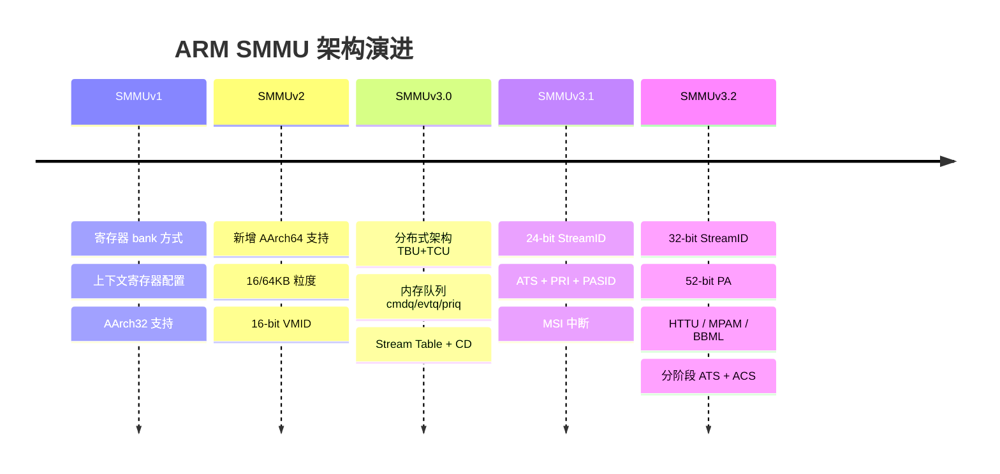
```mermaid
timeline
    title ARM SMMU 架构演进
    SMMUv1 : 寄存器 bank 方式
           : 上下文寄存器配置
           : AArch32 支持
    SMMUv2 : 新增 AArch64 支持
            : 16/64KB 粒度
            : 16-bit VMID
    SMMUv3.0 : 分布式架构 TBU+TCU
              : 内存队列 cmdq/evtq/priq
              : Stream Table + CD
    SMMUv3.1 : 24-bit StreamID
              : ATS + PRI + PASID
              : MSI 中断
    SMMUv3.2 : 32-bit StreamID
              : 52-bit PA
              : HTTU / MPAM / BBML
              : 分阶段 ATS + ACS
```

### 1.2 核心参考资料

| 文档 | 版本 | 说明 |
|------|------|------|
| IHI0062D | SMMUv2 | ARM SMMU 架构规范 v2.0 |
| MMU-600AE TRM | SMMUv3.1 | CoreLink MMU-600AE 技术参考手册 |
| MMU-700 TRM | SMMUv3.2 | CoreLink MMU-700 SMMU 技术参考手册 |
| Linux Kernel | arm-smmu-v3 | Linux SMMUv3 驱动实现 |

---

## 2. 总体架构

### 2.1 SMMUv2 架构（IHI0062D）

SMMUv2 采用单体设计，一个 SMMU 实例通过寄存器映射接口进行配置，设备通过上游总线连接，内存系统通过下游总线连接。

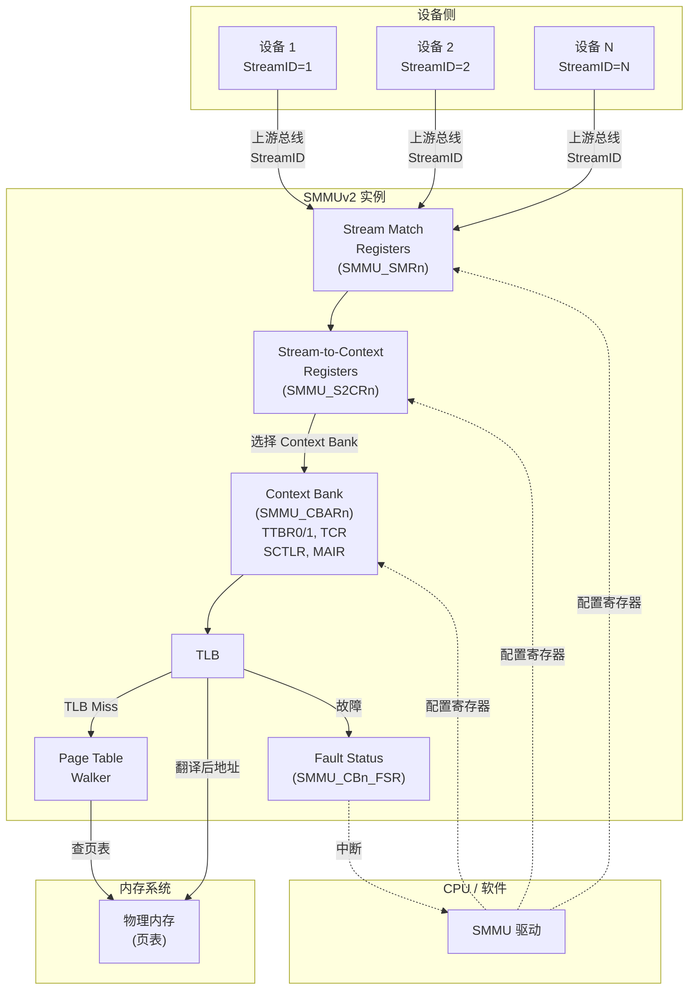
```mermaid
graph TB
    subgraph DeviceSide["设备侧"]
        DEV1["设备 1<br/>StreamID=1"]
        DEV2["设备 2<br/>StreamID=2"]
        DEVN["设备 N<br/>StreamID=N"]
    end

    subgraph SMMU["SMMUv2 实例"]
        direction TB
        SMR["Stream Match<br/>Registers<br/>(SMMU_SMRn)"]
        S2CR["Stream-to-Context<br/>Registers<br/>(SMMU_S2CRn)"]
        CB["Context Bank<br/>(SMMU_CBARn)<br/>TTBR0/1, TCR<br/>SCTLR, MAIR"]
        TLB["TLB"]
        PTW["Page Table<br/>Walker"]
        FS["Fault Status<br/>(SMMU_CBn_FSR)"]
    end

    subgraph Memory["内存系统"]
        MEM["物理内存<br/>(页表)"]
    end

    subgraph CPU["CPU / 软件"]
        DRV["SMMU 驱动"]
    end

    DEV1 & DEV2 & DEVN -->|"上游总线<br/>StreamID"| SMR
    SMR --> S2CR
    S2CR -->|"选择 Context Bank"| CB
    CB --> TLB
    TLB -->|"TLB Miss"| PTW
    PTW -->|"查页表"| MEM
    TLB -->|"翻译后地址"| MEM
    TLB -->|"故障"| FS
    FS -.->|"中断"| DRV
    DRV -.->|"配置寄存器"| SMR & S2CR & CB
```

### 2.2 SMMUv3 分布式架构（MMU-600AE / MMU-700）

SMMUv3 采用分布式架构，由三个关键组件构成：TBU（Translation Buffer Unit）、TCU（Translation Control Unit）和 DTI（Distributed Translation Interface）。

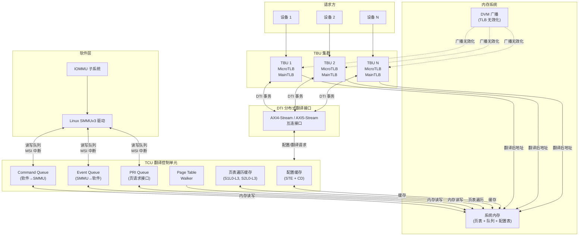
```mermaid
graph TB
    subgraph Requesters["请求方"]
        DEV1["设备 1"]
        DEV2["设备 2"]
        DEVN["设备 N"]
    end

    subgraph TBU_Cluster["TBU 集群"]
        TBU1["TBU 1<br/>MicroTLB<br/>MainTLB"]
        TBU2["TBU 2<br/>MicroTLB<br/>MainTLB"]
        TBUN["TBU N<br/>MicroTLB<br/>MainTLB"]
    end

    subgraph DTI_Layer["DTI 分布式翻译接口"]
        DTI["AXI4-Stream / AXI5-Stream<br/>互连接口"]
    end

    subgraph TCU_Block["TCU 翻译控制单元"]
        direction TB
        CFG_C["配置缓存<br/>(STE + CD)"]
        WALK_C["页表遍历缓存<br/>(S1L0-L3, S2L0-L3)"]
        CMDQ["Command Queue<br/>(软件→SMMU)"]
        EVTQ["Event Queue<br/>(SMMU→软件)"]
        PRIQ["PRI Queue<br/>(页请求接口)"]
        PTW["Page Table<br/>Walker"]
    end

    subgraph MemorySys["内存系统"]
        DRAM["系统内存<br/>(页表 + 队列 + 配置表)"]
        DVM["DVM 广播<br/>(TLB 无效化)"]
    end

    subgraph Software["软件层"]
        DRV["Linux SMMUv3 驱动"]
        IOMMU["IOMMU 子系统"]
    end

    DEV1 --> TBU1
    DEV2 --> TBU2
    DEVN --> TBUN

    TBU1 & TBU2 & TBUN <-->|"DTI 事务"| DTI
    DTI <-->|"配置/翻译请求"| TCU_Block

    CMDQ <-->|"内存读写"| DRAM
    EVTQ <-->|"内存读写"| DRAM
    PRIQ <-->|"内存读写"| DRAM
    PTW -->|"页表遍历"| DRAM
    WALK_C <-->|"缓存"| DRAM
    CFG_C <-->|"缓存"| DRAM

    DVM -.->|"广播无效化"| TBU1 & TBU2 & TBUN

    DRV <-->|"读写队列<br/>MSI 中断"| CMDQ & EVTQ & PRIQ
    IOMMU --> DRV

    TBU1 & TBU2 & TBUN -->|"翻译后地址"| DRAM
```

---

## 3. 地址翻译阶段

### 3.1 翻译阶段模型

SMMU 支持单阶段（Stage 1 或 Stage 2）和嵌套双阶段（Stage 1 + Stage 2）地址翻译。

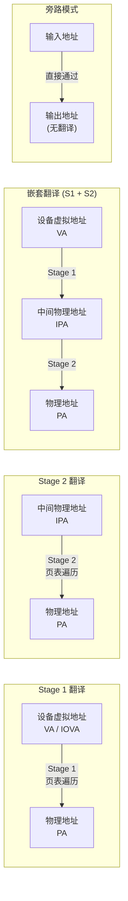
```mermaid
graph LR
    subgraph S1_Only["Stage 1 翻译"]
        direction TB
        VA1["设备虚拟地址<br/>VA / IOVA"] -->|"Stage 1<br/>页表遍历"| PA1["物理地址<br/>PA"]
    end

    subgraph S2_Only["Stage 2 翻译"]
        direction TB
        IPA1["中间物理地址<br/>IPA"] -->|"Stage 2<br/>页表遍历"| PA2["物理地址<br/>PA"]
    end

    subgraph Nested["嵌套翻译 (S1 + S2)"]
        direction TB
        VA2["设备虚拟地址<br/>VA"] -->|"Stage 1"| IPA2["中间物理地址<br/>IPA"] -->|"Stage 2"| PA3["物理地址<br/>PA"]
    end

    subgraph Bypass["旁路模式"]
        direction TB
        ADDR["输入地址"] -->|"直接通过"| OUT["输出地址<br/>(无翻译)"]
    end
```

### 3.2 翻译阶段与 Domain 类型

Linux 驱动中通过 `arm_smmu_domain_stage` 枚举定义四种域类型（`arm-smmu-v3.h:702-707`）：

| 枚举值 | 说明 | 翻译行为 |
|--------|------|----------|
| `ARM_SMMU_DOMAIN_S1` | Stage 1 | VA -> PA，使用进程页表 |
| `ARM_SMMU_DOMAIN_S2` | Stage 2 | IPA -> PA，用于虚拟化 |
| `ARM_SMMU_DOMAIN_NESTED` | 嵌套 | VA -> IPA -> PA |
| `ARM_SMMU_DOMAIN_BYPASS` | 旁路 | 直接透传，不翻译 |

### 3.3 页表遍历过程

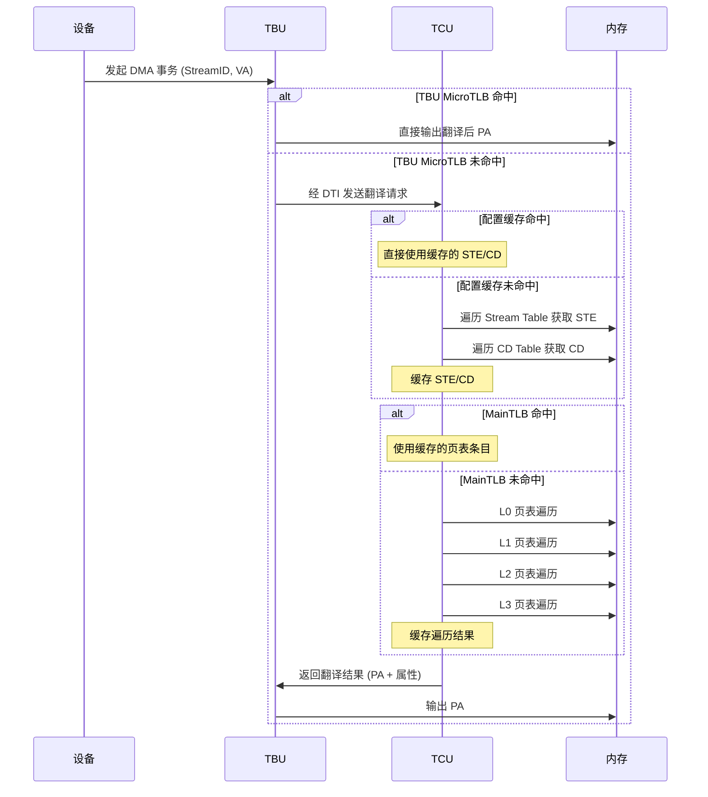
```mermaid
sequenceDiagram
    participant DEV as 设备
    participant TBU as TBU
    participant TCU as TCU
    participant MEM as 内存

    DEV->>TBU: 发起 DMA 事务 (StreamID, VA)

    alt TBU MicroTLB 命中
        TBU->>MEM: 直接输出翻译后 PA
    else TBU MicroTLB 未命中
        TBU->>TCU: 经 DTI 发送翻译请求

        alt 配置缓存命中
            Note over TCU: 直接使用缓存的 STE/CD
        else 配置缓存未命中
            TCU->>MEM: 遍历 Stream Table 获取 STE
            TCU->>MEM: 遍历 CD Table 获取 CD
            Note over TCU: 缓存 STE/CD
        end

        alt MainTLB 命中
            Note over TCU: 使用缓存的页表条目
        else MainTLB 未命中
            TCU->>MEM: L0 页表遍历
            TCU->>MEM: L1 页表遍历
            TCU->>MEM: L2 页表遍历
            TCU->>MEM: L3 页表遍历
            Note over TCU: 缓存遍历结果
        end

        TCU->>TBU: 返回翻译结果 (PA + 属性)
        TBU->>MEM: 输出 PA
    end
```

### 3.4 支持的地址和粒度

由 IDR0 和 IDR5 寄存器定义（`arm-smmu-v3.h:17-68`）：

| 参数 | SMMUv2 | MMU-600AE (v3.1) | MMU-700 (v3.2) |
|------|--------|-------------------|-----------------|
| StreamID 位宽 | 最多 16-bit | 24-bit | 32-bit |
| SubstreamID (SSID/PASID) | N/A | 20-bit | 20-bit |
| 输出地址 (OAS/PA) | 最多 48-bit | 48-bit | 最多 52-bit |
| 虚拟地址 (VA/VAX) | 最多 49-bit | 48-bit | 52-bit |
| 页表粒度 | 4K, 16K, 64K | 4K, 16K, 64K | 4K, 16K, 64K |
| ASID 位宽 | 8/16-bit | 16-bit | 16-bit |
| VMID 位宽 | 8/16-bit | 16-bit | 16-bit |

---

## 4. 核心数据结构

### 4.1 SMMUv2 寄存器模型 vs SMMUv3 内存表模型

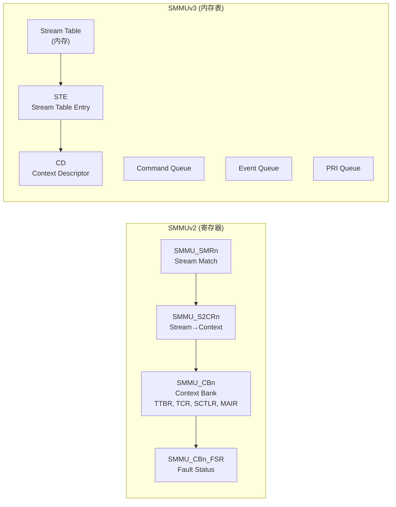
```mermaid
graph LR
    subgraph V2["SMMUv2 (寄存器)"]
        direction TB
        V2_SM["SMMU_SMRn<br/>Stream Match"]
        V2_S2["SMMU_S2CRn<br/>Stream→Context"]
        V2_CB["SMMU_CBn<br/>Context Bank<br/>TTBR, TCR, SCTLR, MAIR"]
        V2_F["SMMU_CBn_FSR<br/>Fault Status"]
    end

    subgraph V3["SMMUv3 (内存表)"]
        direction TB
        V3_ST["Stream Table<br/>(内存)"]
        V3_STE["STE<br/>Stream Table Entry"]
        V3_CD["CD<br/>Context Descriptor"]
        V3_CMD["Command Queue"]
        V3_EVT["Event Queue"]
        V3_PRI["PRI Queue"]
    end

    V2_SM --> V2_S2 --> V2_CB --> V2_F

    V3_ST --> V3_STE --> V3_CD
    V3_CMD & V3_EVT & V3_PRI
```

### 4.2 Stream Table（流表）

Stream Table 是 SMMUv3 的核心查找结构，由 StreamID 索引，支持线性和两级格式。

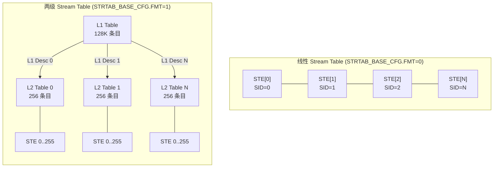
```mermaid
graph TB
    subgraph Linear["线性 Stream Table (STRTAB_BASE_CFG.FMT=0)"]
        direction LR
        L0["STE[0]<br/>SID=0"] --- L1["STE[1]<br/>SID=1"] --- L2["STE[2]<br/>SID=2"] --- LN["STE[N]<br/>SID=N"]
    end

    subgraph TwoLevel["两级 Stream Table (STRTAB_BASE_CFG.FMT=1)"]
        direction TB
        L1T["L1 Table<br/>128K 条目"]
        L2T0["L2 Table 0<br/>256 条目"]
        L2T1["L2 Table 1<br/>256 条目"]
        L2TN["L2 Table N<br/>256 条目"]

        L1T -->|"L1 Desc 0"| L2T0
        L1T -->|"L1 Desc 1"| L2T1
        L1T -->|"L1 Desc N"| L2TN

        L2T0 --- ST0["STE 0..255"]
        L2T1 --- ST1["STE 0..255"]
        L2TN --- STN["STE 0..255"]
    end
```

**Linux 驱动定义**（`arm-smmu-v3.h:195-257`）：

| 字段 | 说明 |
|------|------|
| `STRTAB_L1_SZ_SHIFT` = 20 | L1 表大小 |
| `STRTAB_SPLIT` = 8 | 两级表的分割位 |
| `STRTAB_STE_DWORDS` = 8 | 每个 STE 占 8 个 DWORD（64 字节） |

**STE 配置模式**（`STRTAB_STE_0_CFG`）：

| 值 | 含义 |
|----|------|
| 0 (ABORT) | 中止所有事务 |
| 4 (BYPASS) | 旁路，不做翻译 |
| 5 (S1_TRANS) | Stage 1 翻译 |
| 6 (S2_TRANS) | Stage 2 翻译 |

### 4.3 Context Descriptor（上下文描述符）

CD 包含进程的完整翻译上下文，类似于 CPU 的 TTBR/TCR 寄存器组。

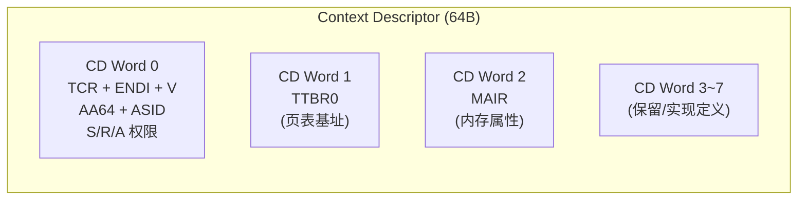
```mermaid
graph LR
    subgraph CD_Entry["Context Descriptor (64B)"]
        direction TB
        CD0["CD Word 0<br/>TCR + ENDI + V<br/>AA64 + ASID<br/>S/R/A 权限"]
        CD1["CD Word 1<br/>TTBR0<br/>(页表基址)"]
        CD2["CD Word 2<br/>MAIR<br/>(内存属性)"]
        CD3["CD Word 3~7<br/>(保留/实现定义)"]
    end
```

**Linux 驱动定义**（`arm-smmu-v3.h:266-301`）：

| 字段 | 说明 |
|------|------|
| `CTXDESC_CD_DWORDS` = 8 | 每个 CD 占 8 个 DWORD（64 字节） |
| `CTXDESC_SPLIT` = 10 | 两级 CD 表分割位（1024 L2 条目/表） |
| `CTXDESC_LINEAR_CDMAX` | 线性 CD 表最大条目数 |

**CD 中的关键字段**（`arm-smmu-v3.h:273-295`）：

| 字段 | 说明 |
|------|------|
| `TCR_T0SZ` | VA 地址空间大小 |
| `TCR_TG0` | 页表粒度 (4K/16K/64K) |
| `TCR_IRGN0 / ORGN0` | 内/外缓存属性 |
| `TCR_SH0` | Shareability |
| `TCR_IPS` | IPA/PA 大小 |
| `ASID` | 地址空间标识符 |
| `TTBR0` | 页表基地址 |
| `MAIR` | 内存属性间接寄存器 |

### 4.4 S1 和 S2 配置结构

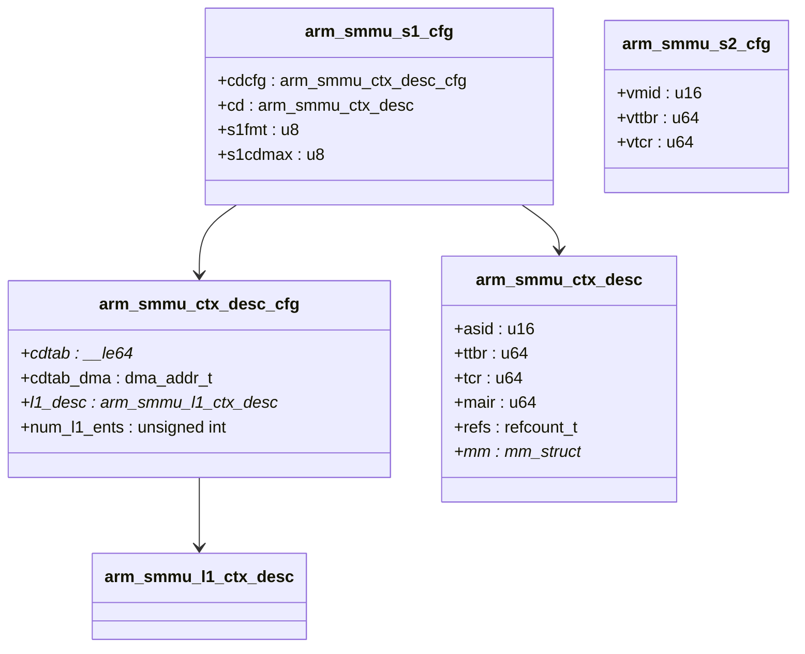
```mermaid
classDiagram
    class arm_smmu_s1_cfg {
        +cdcfg : arm_smmu_ctx_desc_cfg
        +cd : arm_smmu_ctx_desc
        +s1fmt : u8
        +s1cdmax : u8
    }

    class arm_smmu_s2_cfg {
        +vmid : u16
        +vttbr : u64
        +vtcr : u64
    }

    class arm_smmu_ctx_desc_cfg {
        +cdtab : __le64*
        +cdtab_dma : dma_addr_t
        +l1_desc : arm_smmu_l1_ctx_desc*
        +num_l1_ents : unsigned int
    }

    class arm_smmu_ctx_desc {
        +asid : u16
        +ttbr : u64
        +tcr : u64
        +mair : u64
        +refs : refcount_t
        +mm : mm_struct*
    }

    arm_smmu_s1_cfg --> arm_smmu_ctx_desc_cfg
    arm_smmu_s1_cfg --> arm_smmu_ctx_desc
    arm_smmu_ctx_desc_cfg --> arm_smmu_l1_ctx_desc
```

### 4.5 Domain 结构

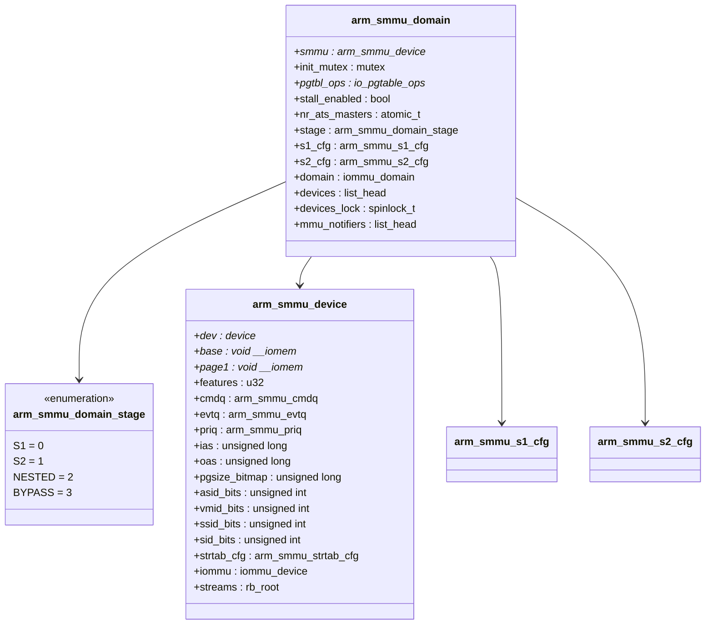
```mermaid
classDiagram
    class arm_smmu_domain {
        +smmu : arm_smmu_device*
        +init_mutex : mutex
        +pgtbl_ops : io_pgtable_ops*
        +stall_enabled : bool
        +nr_ats_masters : atomic_t
        +stage : arm_smmu_domain_stage
        +s1_cfg : arm_smmu_s1_cfg
        +s2_cfg : arm_smmu_s2_cfg
        +domain : iommu_domain
        +devices : list_head
        +devices_lock : spinlock_t
        +mmu_notifiers : list_head
    }

    class arm_smmu_domain_stage {
        <<enumeration>>
        S1 = 0
        S2 = 1
        NESTED = 2
        BYPASS = 3
    }

    class arm_smmu_device {
        +dev : device*
        +base : void __iomem*
        +page1 : void __iomem*
        +features : u32
        +cmdq : arm_smmu_cmdq
        +evtq : arm_smmu_evtq
        +priq : arm_smmu_priq
        +ias : unsigned long
        +oas : unsigned long
        +pgsize_bitmap : unsigned long
        +asid_bits : unsigned int
        +vmid_bits : unsigned int
        +ssid_bits : unsigned int
        +sid_bits : unsigned int
        +strtab_cfg : arm_smmu_strtab_cfg
        +iommu : iommu_device
        +streams : rb_root
    }

    arm_smmu_domain --> arm_smmu_domain_stage
    arm_smmu_domain --> arm_smmu_device
    arm_smmu_domain --> arm_smmu_s1_cfg
    arm_smmu_domain --> arm_smmu_s2_cfg
```

---

## 5. 队列系统

SMMUv3 使用内存驻留的环形缓冲区队列进行软件与硬件之间的通信，替代了 SMMUv2 的寄存器直接访问方式。

### 5.1 队列总体结构

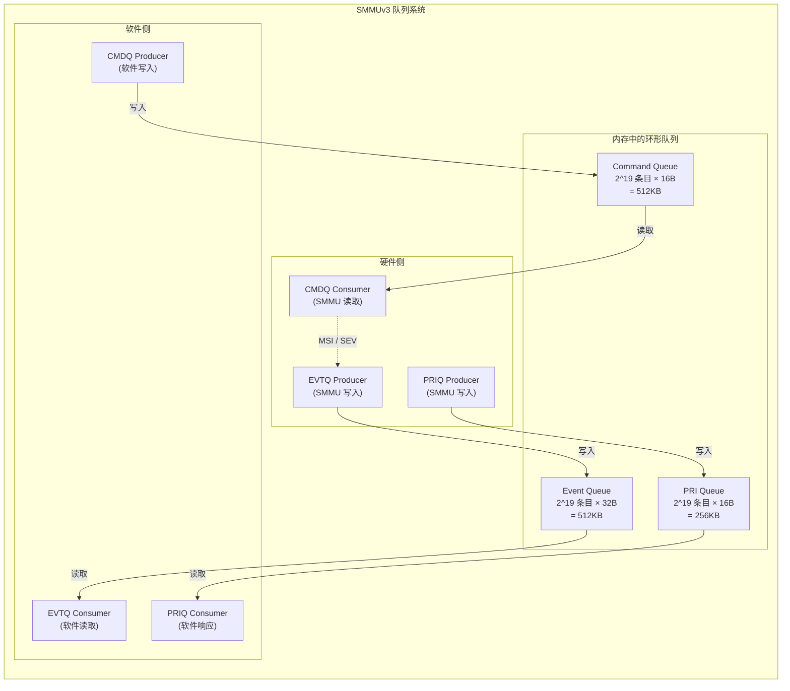
```mermaid
graph TB
    subgraph Queues["SMMUv3 队列系统"]
        direction TB

        subgraph SW["软件侧"]
            CMD_PROD["CMDQ Producer<br/>(软件写入)"]
            EVT_CONS["EVTQ Consumer<br/>(软件读取)"]
            PRI_CONS["PRIQ Consumer<br/>(软件响应)"]
        end

        subgraph QMem["内存中的环形队列"]
            CMDQ["Command Queue<br/>2^19 条目 × 16B<br/>= 512KB"]
            EVTQ["Event Queue<br/>2^19 条目 × 32B<br/>= 512KB"]
            PRIQ["PRI Queue<br/>2^19 条目 × 16B<br/>= 256KB"]
        end

        subgraph HW["硬件侧"]
            CMD_CONS["CMDQ Consumer<br/>(SMMU 读取)"]
            EVT_PROD["EVTQ Producer<br/>(SMMU 写入)"]
            PRI_PROD["PRIQ Producer<br/>(SMMU 写入)"]
        end
    end

    CMD_PROD -->|"写入"| CMDQ -->|"读取"| CMD_CONS
    EVT_PROD -->|"写入"| EVTQ -->|"读取"| EVT_CONS
    PRI_PROD -->|"写入"| PRIQ -->|"读取"| PRI_CONS

    CMD_CONS -.->|"MSI / SEV"| EVT_PROD
```

### 5.2 Command Queue 操作

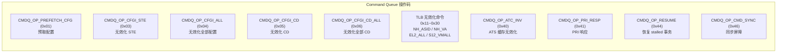
```mermaid
graph LR
    subgraph Ops["Command Queue 操作码"]
        direction TB
        OP1["CMDQ_OP_PREFETCH_CFG (0x01)<br/>预取配置"]
        OP3["CMDQ_OP_CFGI_STE (0x03)<br/>无效化 STE"]
        OP4["CMDQ_OP_CFGI_ALL (0x04)<br/>无效化全部配置"]
        OP5["CMDQ_OP_CFGI_CD (0x05)<br/>无效化 CD"]
        OP6["CMDQ_OP_CFGI_CD_ALL (0x06)<br/>无效化全部 CD"]
        TLBI["TLB 无效化命令<br/>0x11~0x30<br/>NH_ASID / NH_VA<br/>EL2_ALL / S12_VMALL"]
        ATC["CMDQ_OP_ATC_INV (0x40)<br/>ATS 缓存无效化"]
        PRI["CMDQ_OP_PRI_RESP (0x41)<br/>PRI 响应"]
        RES["CMDQ_OP_RESUME (0x44)<br/>恢复 stalled 事务"]
        SYNC["CMDQ_OP_CMD_SYNC (0x46)<br/>同步屏障"]
    end
```

### 5.3 Event Queue 事件类型

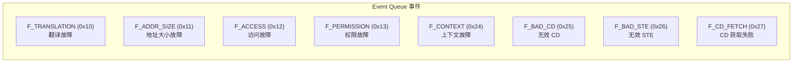
```mermaid
graph TB
    subgraph Events["Event Queue 事件"]
        direction TB
        F_TRANS["F_TRANSLATION (0x10)<br/>翻译故障"]
        F_ADDR["F_ADDR_SIZE (0x11)<br/>地址大小故障"]
        F_ACC["F_ACCESS (0x12)<br/>访问故障"]
        F_PERM["F_PERMISSION (0x13)<br/>权限故障"]
        F_CTX["F_CONTEXT (0x24)<br/>上下文故障"]
        F_BAD_CD["F_BAD_CD (0x25)<br/>无效 CD"]
        F_BAD_STE["F_BAD_STE (0x26)<br/>无效 STE"]
        F_CD_FETCH["F_CD_FETCH (0x27)<br/>CD 获取失败"]
    end
```

### 5.4 队列数据结构

Linux 驱动中的队列实现（`arm-smmu-v3.h:505-562`）：

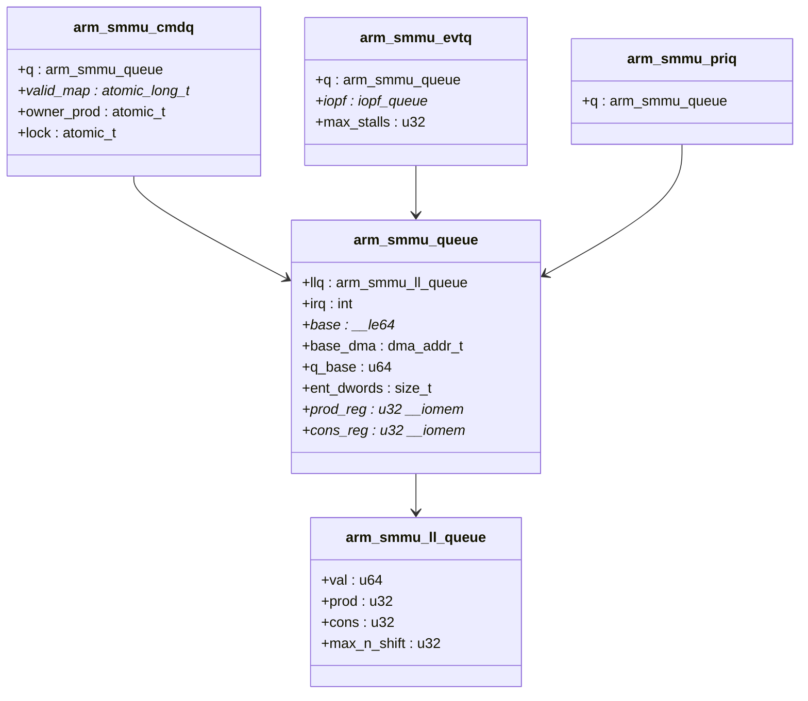
```mermaid
classDiagram
    class arm_smmu_queue {
        +llq : arm_smmu_ll_queue
        +irq : int
        +base : __le64*
        +base_dma : dma_addr_t
        +q_base : u64
        +ent_dwords : size_t
        +prod_reg : u32 __iomem*
        +cons_reg : u32 __iomem*
    }

    class arm_smmu_ll_queue {
        +val : u64
        +prod : u32
        +cons : u32
        +max_n_shift : u32
    }

    class arm_smmu_cmdq {
        +q : arm_smmu_queue
        +valid_map : atomic_long_t*
        +owner_prod : atomic_t
        +lock : atomic_t
    }

    class arm_smmu_evtq {
        +q : arm_smmu_queue
        +iopf : iopf_queue*
        +max_stalls : u32
    }

    class arm_smmu_priq {
        +q : arm_smmu_queue
    }

    arm_smmu_cmdq --> arm_smmu_queue
    arm_smmu_evtq --> arm_smmu_queue
    arm_smmu_priq --> arm_smmu_queue
    arm_smmu_queue --> arm_smmu_ll_queue
```

---

## 6. TLB 与缓存体系

### 6.1 SMMUv3 缓存层次

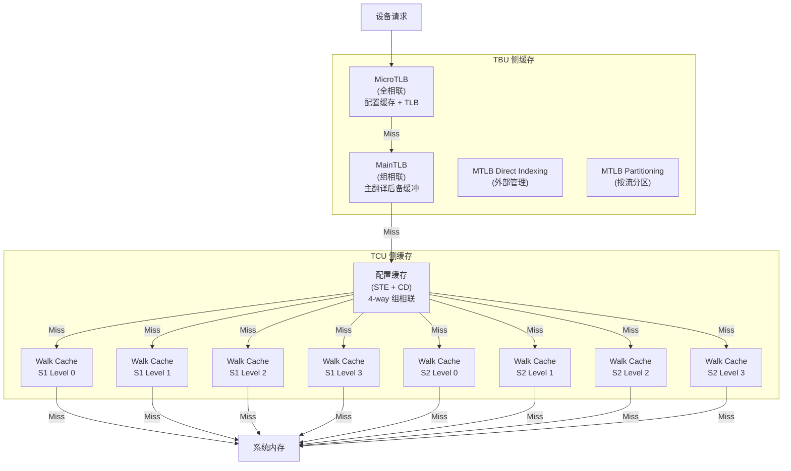
```mermaid
graph TB
    subgraph TBU_Side["TBU 侧缓存"]
        uTLB["MicroTLB<br/>(全相联)<br/>配置缓存 + TLB"]
        MTLB["MainTLB<br/>(组相联)<br/>主翻译后备缓冲"]
        MTLB_IDX["MTLB Direct Indexing<br/>(外部管理)"]
        MTLB_PART["MTLB Partitioning<br/>(按流分区)"]
    end

    subgraph TCU_Side["TCU 侧缓存"]
        CFG_C["配置缓存<br/>(STE + CD)<br/>4-way 组相联"]
        WC_S1L0["Walk Cache<br/>S1 Level 0"]
        WC_S1L1["Walk Cache<br/>S1 Level 1"]
        WC_S1L2["Walk Cache<br/>S1 Level 2"]
        WC_S1L3["Walk Cache<br/>S1 Level 3"]
        WC_S2L0["Walk Cache<br/>S2 Level 0"]
        WC_S2L1["Walk Cache<br/>S2 Level 1"]
        WC_S2L2["Walk Cache<br/>S2 Level 2"]
        WC_S2L3["Walk Cache<br/>S2 Level 3"]
    end

    DEV_REQ["设备请求"] --> uTLB
    uTLB -->|"Miss"| MTLB
    MTLB -->|"Miss"| CFG_C
    CFG_C -->|"Miss"| WC_S1L0 & WC_S1L1 & WC_S1L2 & WC_S1L3 & WC_S2L0 & WC_S2L1 & WC_S2L2 & WC_S2L3
    WC_S1L0 & WC_S1L1 & WC_S1L2 & WC_S1L3 & WC_S2L0 & WC_S2L1 & WC_S2L2 & WC_S2L3 -->|"Miss"| MEM["系统内存"]
```

### 6.2 TLB 无效化

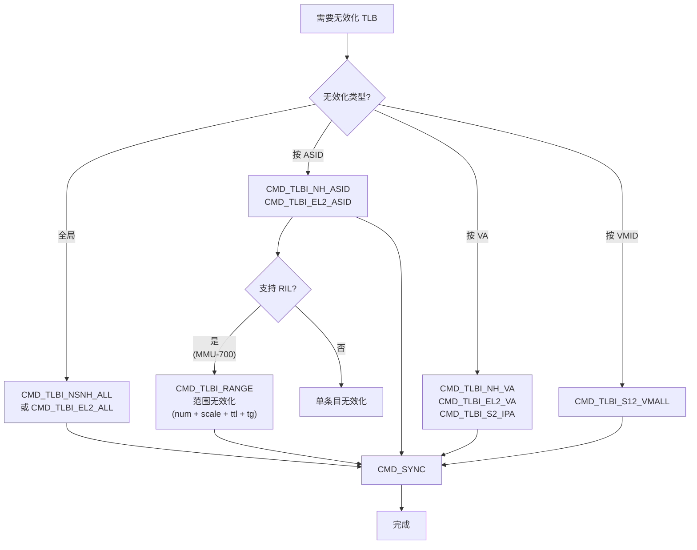
```mermaid
flowchart TD
    START["需要无效化 TLB"] --> TYPE{"无效化类型?"}

    TYPE -->|"全局"| ALL["CMD_TLBI_NSNH_ALL<br/>或 CMD_TLBI_EL2_ALL"]
    TYPE -->|"按 ASID"| ASID["CMD_TLBI_NH_ASID<br/>CMD_TLBI_EL2_ASID"]
    TYPE -->|"按 VA"| VA["CMD_TLBI_NH_VA<br/>CMD_TLBI_EL2_VA<br/>CMD_TLBI_S2_IPA"]
    TYPE -->|"按 VMID"| VMID["CMD_TLBI_S12_VMALL"]

    ASID --> RANGE{"支持 RIL?"}
    RANGE -->|"是<br/>(MMU-700)"| RIL["CMD_TLBI_RANGE<br/>范围无效化<br/>(num + scale + ttl + tg)"]
    RANGE -->|"否"| SINGLE["单条目无效化"]

    VA --> SYNC["CMD_SYNC"]
    ASID --> SYNC
    ALL --> SYNC
    VMID --> SYNC
    RIL --> SYNC
    SYNC --> DONE["完成"]
```

---

## 7. SVA（Shared Virtual Addressing）

### 7.1 SVA 架构

SVA 允许设备直接使用进程的虚拟地址进行 DMA 访问，无需软件维护独立的 IOVA 映射。它依赖 PASID、PRI、ATS 和 Stall 模式的协同工作。

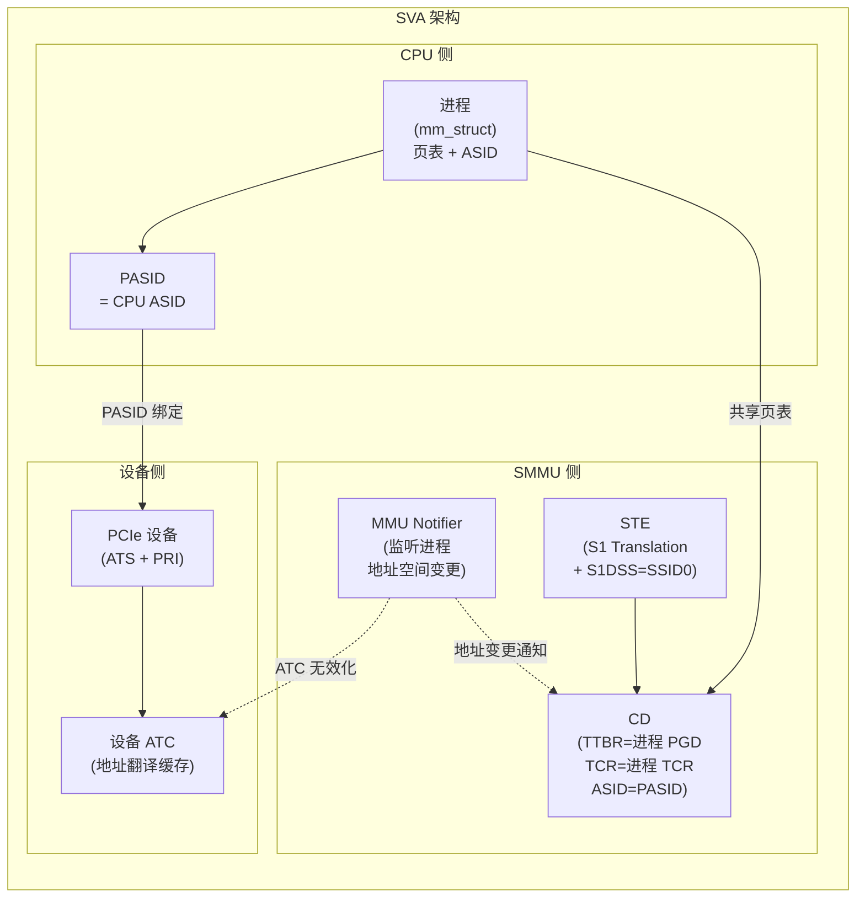
```mermaid
graph TB
    subgraph SVA_Arch["SVA 架构"]
        direction TB

        subgraph CPU_Side["CPU 侧"]
            PROC["进程<br/>(mm_struct)<br/>页表 + ASID"]
            PASID_C["PASID<br/>= CPU ASID"]
        end

        subgraph SMMU_Side["SMMU 侧"]
            STE_SVA["STE<br/>(S1 Translation<br/>+ S1DSS=SSID0)"]
            CD_SVA["CD<br/>(TTBR=进程 PGD<br/>TCR=进程 TCR<br/>ASID=PASID)"]
            MN["MMU Notifier<br/>(监听进程<br/>地址空间变更)"]
        end

        subgraph Device_Side["设备侧"]
            DEV["PCIe 设备<br/>(ATS + PRI)"]
            ATC_C["设备 ATC<br/>(地址翻译缓存)"]
        end
    end

    PROC -->|"共享页表"| CD_SVA
    PROC --> PASID_C
    PASID_C -->|"PASID 绑定"| DEV
    STE_SVA --> CD_SVA
    MN -.->|"地址变更通知"| CD_SVA
    MN -.->|"ATC 无效化"| ATC_C
    DEV --> ATC_C
```

### 7.2 SVA 绑定流程

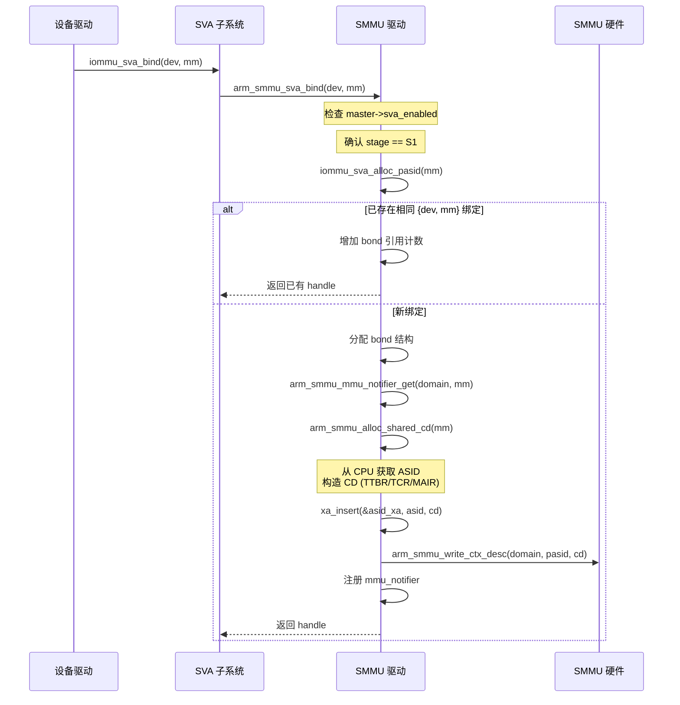
```mermaid
sequenceDiagram
    participant DRV as 设备驱动
    participant SVA as SVA 子系统
    participant SMMU as SMMU 驱动
    participant HW as SMMU 硬件

    DRV->>SVA: iommu_sva_bind(dev, mm)
    SVA->>SMMU: arm_smmu_sva_bind(dev, mm)

    Note over SMMU: 检查 master->sva_enabled
    Note over SMMU: 确认 stage == S1

    SMMU->>SMMU: iommu_sva_alloc_pasid(mm)

    alt 已存在相同 {dev, mm} 绑定
        SMMU->>SMMU: 增加 bond 引用计数
        SMMU-->>SVA: 返回已有 handle
    else 新绑定
        SMMU->>SMMU: 分配 bond 结构

        SMMU->>SMMU: arm_smmu_mmu_notifier_get(domain, mm)
        SMMU->>SMMU: arm_smmu_alloc_shared_cd(mm)
        Note over SMMU: 从 CPU 获取 ASID<br/>构造 CD (TTBR/TCR/MAIR)
        SMMU->>SMMU: xa_insert(&asid_xa, asid, cd)

        SMMU->>HW: arm_smmu_write_ctx_desc(domain, pasid, cd)
        SMMU->>SMMU: 注册 mmu_notifier
        SMMU-->>SVA: 返回 handle
    end
```

### 7.3 MMU Notifier 与 TLB 同步

当进程地址空间发生变化时（如 munmap、mprotect），MMU Notifier 负责 SMMU 侧的同步。

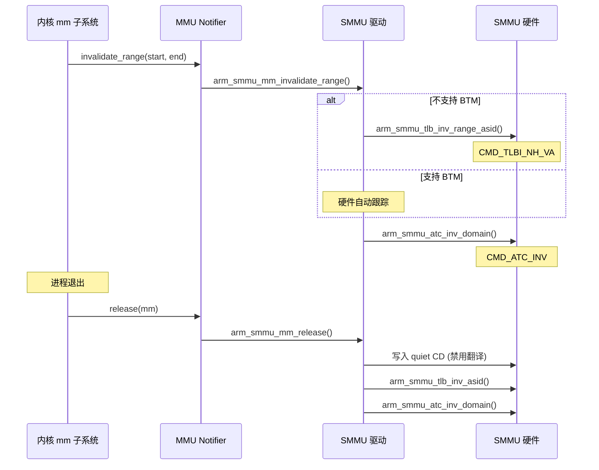
```mermaid
sequenceDiagram
    participant MM as 内核 mm 子系统
    participant MN as MMU Notifier
    participant SMMU as SMMU 驱动
    participant HW as SMMU 硬件

    MM->>MN: invalidate_range(start, end)
    MN->>SMMU: arm_smmu_mm_invalidate_range()

    alt 不支持 BTM
        SMMU->>HW: arm_smmu_tlb_inv_range_asid()
        Note over HW: CMD_TLBI_NH_VA
    else 支持 BTM
        Note over SMMU: 硬件自动跟踪
    end

    SMMU->>HW: arm_smmu_atc_inv_domain()
    Note over HW: CMD_ATC_INV

    Note over MM: 进程退出
    MM->>MN: release(mm)
    MN->>SMMU: arm_smmu_mm_release()
    SMMU->>HW: 写入 quiet CD (禁用翻译)
    SMMU->>HW: arm_smmu_tlb_inv_asid()
    SMMU->>HW: arm_smmu_atc_inv_domain()
```

### 7.4 SVA 驱动核心结构

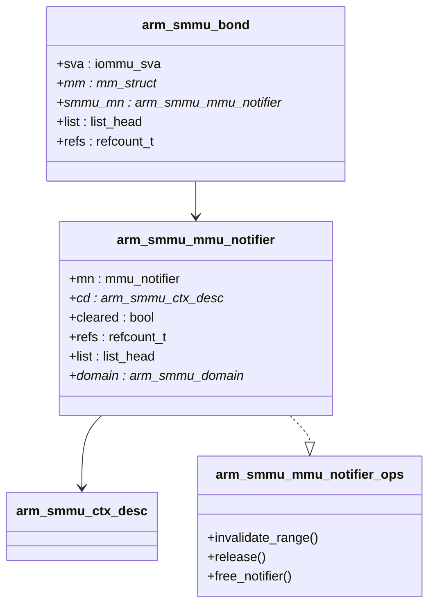
```mermaid
classDiagram
    class arm_smmu_bond {
        +sva : iommu_sva
        +mm : mm_struct*
        +smmu_mn : arm_smmu_mmu_notifier*
        +list : list_head
        +refs : refcount_t
    }

    class arm_smmu_mmu_notifier {
        +mn : mmu_notifier
        +cd : arm_smmu_ctx_desc*
        +cleared : bool
        +refs : refcount_t
        +list : list_head
        +domain : arm_smmu_domain*
    }

    class arm_smmu_mmu_notifier_ops {
        +invalidate_range()
        +release()
        +free_notifier()
    }

    arm_smmu_bond --> arm_smmu_mmu_notifier
    arm_smmu_mmu_notifier --> arm_smmu_ctx_desc
    arm_smmu_mmu_notifier ..|> arm_smmu_mmu_notifier_ops
```

---

## 8. ATS 与 PRI

### 8.1 ATS（Address Translation Service）

ATS 允许 PCIe 设备在发起 DMA 之前预先查询地址翻译结果并缓存到设备本地的 ATC（Address Translation Cache）中。

```mermaid
sequenceDiagram
    participant DEV as PCIe 设备
    participant RC as Root Complex
    participant TCU as TCU
    participant TBU as TBU
    participant MEM as 内存

    Note over DEV: 设备需要 DMA 访问某个 IOVA

    DEV->>RC: ATS Translation Request<br/>(PASID, IOVA)
    RC->>TCU: 经 DTI-ATS 转发
    TCU->>TCU: 查找 STE + CD
    TCU->>MEM: 页表遍历

    alt 翻译成功
        TCU-->>RC: 返回 PA + 属性
        RC-->>DEV: ATS Completion (Success)
        Note over DEV: 缓存到 ATC
        DEV->>TBU: DMA 事务 (使用缓存的 PA)
    else 翻译失败
        TCU-->>RC: 返回故障码
        RC-->>DEV: ATS Completion (Failure)
    end
```

**分阶段 ATS（MMU-700, SMMUv3.2）**：

```mermaid
graph LR
    subgraph FullATS["全阶段 ATS"]
        VA["VA"] -->|"S1+S2"| PA_F["PA"]
    end

    subgraph SplitATS["分阶段 ATS (MMU-700)"]
        VA2["VA"] -->|"S1 only"| IPA["IPA"]
        Note right of IPA: RC 返回 IPA<br/>S2 在 TBU 完成
        IPA -->|"S2 (TBU)"| PA_S["PA"]
    end
```

### 8.2 PRI（Page Request Interface）

PRI 支持 PCIe 设备在遇到页表未命中时向软件发起页请求，实现按需分页（Demand Paging）。

```mermaid
sequenceDiagram
    participant DEV as PCIe 设备
    participant TBU as TBU
    participant EVTQ as Event Queue
    participant SW as 软件驱动

    DEV->>TBU: DMA 事务 (ATS 缓存中的 PA)

    alt PA 对应的页已换出或未映射
        Note over TBU: 检测到 Stall 模式
        TBU->>TBU: Stall 事务 (不中止)
        TBU->>EVTQ: 写入 F_TRANSLATION 事件
        TBU->>SW: MSI 中断
        SW->>SW: 读取 EVTQ
        SW->>SW: 处理缺页异常
        SW->>SW: 填充页表
        SW->>TBU: CMD_RESUME (Resume, Retry)
        TBU->>TBU: 重新翻译
        TBU->>DEV: 恢复事务
    end
```

---

## 9. 故障处理

### 9.1 故障模型

SMMU 支持两种故障处理模型（`arm-smmu-v3.h:21-23`）：

```mermaid
graph TB
    subgraph FaultModels["故障模型"]
        direction TB

        subgraph Stall["Stall 模型 (IDR0_STALL_MODEL=0)"]
            direction TB
            S_FAULT["检测到故障"] --> S_STALL["Stall 事务"]
            S_STALL --> S_EVT["写入 EVTQ"]
            S_EVT --> S_INT["触发 MSI 中断"]
            S_INT --> S_SW["软件处理"]
            S_SW -->|"CMD_RESUME<br/>Resume/Retry"| S_RETRY["重试事务"]
            S_SW -->|"CMD_RESUME<br/>Resume/Abort"| S_ABORT["中止事务"]
            S_SW -->|"CMD_RESUME<br/>Terminate"| S_TERM["终止事务"]
        end

        subgraph Force["Force 模型 (IDR0_STALL_MODEL=2)"]
            direction TB
            F_FAULT["检测到故障"] --> F_EVT["写入 EVTQ"]
            F_EVT --> F_INT["触发 MSI 中断"]
            F_INT --> F_SW["软件处理"]
        end
    end
```

### 9.2 Event Queue 条目格式

Linux 驱动中的事件定义（`arm-smmu-v3.h:378-397`）：

```mermaid
graph LR
    subgraph EvtEntry["Event Queue 条目 (32B)"]
        direction TB
        subgraph Word0
            E_ID["ID (bits 7:0)<br/>事件类型"]
            E_SSV["SSV (bit 11)<br/>Substream Valid"]
            E_SSID["SSID (bits 31:12)<br/>SubstreamID"]
            E_SID["SID (bits 63:32)<br/>StreamID"]
        end
        subgraph Word1
            E_STAG["STAG (bits 15:0)<br/>Stream Tag"]
            E_STALL["STALL (bit 31)"]
            E_PnU["PnU (bit 33)<br/>Privilege"]
            E_InD["InD (bit 34)<br/>Instruction"]
            E_RnW["RnW (bit 35)<br/>Read/Write"]
            E_S2["S2 (bit 39)<br/>Stage 2"]
            E_TT_R["TT_READ (bit 44)<br/>Table Walk"]
        end
        subgraph Word2
            E_ADDR["ADDR (bits 63:0)<br/>输入地址"]
        end
        subgraph Word3
            E_IPA["IPA (bits 51:12)<br/>中间物理地址"]
        end
    end
```

### 9.3 Global Error 处理

由 `GERROR` 寄存器和 `GERRORN` 寄存器管理（`arm-smmu-v3.h:109-124`）：

| 错误位 | 说明 |
|--------|------|
| `GERROR_CMDQ_ERR` | Command Queue 错误 |
| `GERROR_EVTQ_ABT_ERR` | Event Queue 中止错误 |
| `GERROR_PRIQ_ABT_ERR` | PRI Queue 中止错误 |
| `GERROR_MSI_CMDQ_ABT_ERR` | CMDQ MSI 中止错误 |
| `GERROR_MSI_EVTQ_ABT_ERR` | EVTQ MSI 中止错误 |
| `GERROR_MSI_PRIQ_ABT_ERR` | PRIQ MSI 中止错误 |
| `GERROR_MSI_GERROR_ABT_ERR` | GERROR MSI 中止错误 |
| `GERROR_SFM_ERR` | System Fatal Error |

---

## 10. 设备与 SMMU 的关联

### 10.1 Master 与 Stream 的关系

```mermaid
graph TB
    subgraph DeviceMaster["Master (设备)"]
        MASTER["arm_smmu_master<br/>smmu, dev, domain<br/>streams[], num_streams<br/>ats_enabled, stall_enabled<br/>sva_enabled, iopf_enabled"]
    end

    subgraph Streams["Stream 集合"]
        S1["Stream 0<br/>SID=100"]
        S2["Stream 1<br/>SID=101"]
        S3["Stream 2<br/>SID=102"]
    end

    subgraph StreamTable["Stream Table"]
        STE100["STE[100]"]
        STE101["STE[101]"]
        STE102["STE[102]"]
    end

    MASTER -->|"streams 数组"| S1 & S2 & S3
    S1 -->|"SID=100"| STE100
    S2 -->|"SID=101"| STE101
    S3 -->|"SID=102"| STE102
```

### 10.2 设备初始化与附加流程

```mermaid
flowchart TD
    PROBE["设备探测<br/>(ACPI/IORT 或 Device Tree)"]
    PROBE --> PROBE_SMMU["探测 SMMU 实例<br/>arm_smmu_device_probe()"]
    PROBE_SMMU --> INIT_HW["硬件初始化<br/>解析 IDR0/1/3/5<br/>特性检测"]
    INIT_HW --> INIT_Q["队列初始化<br/>分配 CMDQ/EVTQ/PRIQ<br/>写入基地址寄存器"]
    INIT_Q --> INIT_STRTAB["Stream Table 初始化<br/>分配 Stream Table<br/>写入 STRTAB_BASE"]
    INIT_STRTAB --> ENABLE["使能 SMMU<br/>CR0: CMDQEN|EVTQEN|SMMUEN"]
    ENABLE --> IDLE["等待就绪<br/>CR0ACK"]

    IDLE --> DEV_PROBE["设备侧探测<br/>of_iommu_configure()"]
    DEV_PROBE --> DEV_ADD["arm_smmu_add_device()"]
    DEV_ADD --> PARSE_SIDS["解析 StreamID<br/>IORT/OF 属性"]
    PARSE_SIDS --> ALLOC_MASTER["分配 arm_smmu_master"]
    ALLOC_MASTER --> ATTACH["iommu_attach_device()<br/>将 master 附加到 domain"]
    ATTACH --> CFG_STE["配置 STE<br/>写入 Stream Table"]
    CFG_STE --> READY["设备就绪"]
```

---

## 11. MMIO 寄存器映射

### 11.1 SMMUv3 寄存器布局

Linux 驱动中定义的寄存器偏移（`arm-smmu-v3.h:17-155`）：

```mermaid
graph TB
    subgraph Page0["Page 0: 寄存器空间 (0x000 - 0xDFF)"]
        direction TB
        IDR0["IDR0 (0x00)<br/>特性寄存器 0<br/>S1P/S2P/ATS/PRI/COHACC"]
        IDR1["IDR1 (0x04)<br/>特性寄存器 1<br/>SIDSIZE/SSIDSIZE<br/>CMDQS/EVTQS"]
        IDR3["IDR3 (0x0C)<br/>特性寄存器 3<br/>RIL"]
        IDR5["IDR5 (0x14)<br/>特性寄存器 5<br/>OAS/GRAN4K/16K/64K"]
        CR0["CR0 (0x20)<br/>控制寄存器 0<br/>SMMUEN/CMDQEN/EVTQEN"]
        CR1["CR1 (0x28)<br/>控制寄存器 1<br/>缓存属性"]
        CR2["CR2 (0x2C)<br/>控制寄存器 2<br/>PTM/E2H"]
        GBPA["GBPA (0x44)<br/>全局 Bypass 控制"]
        IRQ_CTRL["IRQ_CTRL (0x50)<br/>中断控制"]
        GERROR["GERROR (0x60)<br/>全局错误状态"]
        STBASE["STRTAB_BASE (0x80)<br/>Stream Table 基址"]
        STCFG["STRTAB_BASE_CFG (0x88)<br/>Stream Table 配置"]
        CQBASE["CMDQ_BASE (0x90)<br/>Command Queue 基址"]
        EQBASE["EVTQ_BASE (0xA0)<br/>Event Queue 基址"]
        PQBASE["PRIQ_BASE (0xC0)<br/>PRI Queue 基址"]
    end

    subgraph Page1["Page 1: 队列寄存器 (0xE00+)"]
        CQ_PROD["CMDQ_PROD (Page1+0x00)"]
        CQ_CONS["CMDQ_CONS (Page1+0x04)"]
        EQ_PROD["EVTQ_PROD (Page1+0x08)"]
        EQ_CONS["EVTQ_CONS (Page1+0x0C)"]
        PQ_PROD["PRIQ_PROD (Page1+0x10)"]
        PQ_CONS["PRIQ_CONS (Page1+0x14)"]
    end
```

---

## 12. 特性支持矩阵

### 12.1 跨版本特性对比

| 特性 | SMMUv2 | MMU-600AE (v3.1) | MMU-700 (v3.2) |
|------|--------|-------------------|-----------------|
| AArch32 短描述符 | Yes | Yes | Yes |
| AArch32 长描述符 | Yes | Yes | Yes |
| AArch64 | Yes | Yes | Yes |
| Stage 1 翻译 | Yes | Yes | Yes |
| Stage 2 翻译 | Yes | Yes | Yes |
| 嵌套翻译 (S1+S2) | Yes | Yes | Yes |
| 旁路模式 | Yes | Yes | Yes |
| ATS | No | Yes | Yes |
| 分阶段 ATS | No | No | Yes |
| PRI (页请求) | No | Yes | Yes |
| PASID/SSID | No | 20-bit | 20-bit |
| Stall 模型 | 仅 Fault | Stall + Force | Stall + Force |
| MSI 中断 | No | Yes | Yes |
| HTTU (HW 更新页表) | No | No | Yes |
| MPAM | No | No | Yes |
| Secure-EL2 | No | No | Yes |
| RAS | No | Yes | Yes |
| DVM | N/A | DVMv8.1 | DVMv8.4 |
| 范围无效化 (RIL) | No | No | Yes |
| BBML | No | No | Yes (Level 2) |
| FWB (S2 内存类型) | No | No | Yes |
| 小页表 (STT) | No | No | Yes |
| 52-bit PA | No | No | Yes |
| 52-bit VA (VAX) | No | No | Yes |
| LTI 协议 | No | No | Yes |
| 专用 GIC MSI | No | No | Yes |
| 功能安全 (FuSa) | No | Yes | No |

### 12.2 Linux 驱动特性标志

定义于 `arm-smmu-v3.h:623-641`：

| 标志 | 说明 |
|------|------|
| `ARM_SMMU_FEAT_2_LVL_STRTAB` | 两级 Stream Table |
| `ARM_SMMU_FEAT_2_LVL_CDTAB` | 两级 CD Table |
| `ARM_SMMU_FEAT_PRI` | Page Request Interface |
| `ARM_SMMU_FEAT_ATS` | Address Translation Service |
| `ARM_SMMU_FEAT_SEV` | SEV 事件通知 |
| `ARM_SMMU_FEAT_MSI` | MSI 中断支持 |
| `ARM_SMMU_FEAT_COHERENCY` | 硬件缓存一致性 |
| `ARM_SMMU_FEAT_TRANS_S1` | Stage 1 翻译 |
| `ARM_SMMU_FEAT_TRANS_S2` | Stage 2 翻译 |
| `ARM_SMMU_FEAT_STALLS` | Stall 模式 |
| `ARM_SMMU_FEAT_HYP` | 虚拟化支持 |
| `ARM_SMMU_FEAT_VAX` | VA 扩展 (52-bit) |
| `ARM_SMMU_FEAT_RANGE_INV` | 范围无效化 |
| `ARM_SMMU_FEAT_BTM` | Broadcast TLB Maintenance |
| `ARM_SMMU_FEAT_SVA` | Shared Virtual Addressing |
| `ARM_SMMU_FEAT_E2H` | EL2 Host (E2H) |

---

## 13. Linux 驱动模块结构

### 13.1 文件组织

```
arm-smmu-v3/
├── Makefile              # 构建配置
├── arm-smmu-v3.h         # 头文件：寄存器定义、数据结构
├── arm-smmu-v3.c         # 主驱动：探测、初始化、翻译管理
└── arm-smmu-v3-sva.c     # SVA 扩展：PASID 绑定、MMU Notifier
```

### 13.2 模块依赖

```mermaid
graph TB
    subgraph Module["arm_smmu_v3 模块"]
        MAIN["arm-smmu-v3.c<br/>CONFIG_ARM_SMMU_V3"]
        SVA["arm-smmu-v3-sva.c<br/>CONFIG_ARM_SMMU_V3_SVA"]
    end

    subgraph Deps["内核依赖"]
        IOMMU["IOMMU 子系统"]
        DMA_IOMMU["dma-iommu"]
        SVA_LIB["iommu-sva-lib"]
        IO_PT["io-pgtable<br/>(页表格式)"]
        IO_PT_ARM["io-pgtable-arm<br/>(ARM 页表)"]
        ACPI_IORT["acpi_iort<br/>(ACPI 表解析)"]
        OF["of_platform<br/>(Device Tree)"]
        MSI["MSI 子系统"]
        PCI["PCIe 子系统<br/>ATS 支持"]
        MMU_NOTIF["mmu_notifier<br/>(MMU 通知机制)"]
    end

    MAIN --> IOMMU
    MAIN --> DMA_IOMMU
    MAIN --> SVA_LIB
    MAIN --> IO_PT
    MAIN --> ACPI_IORT
    MAIN --> OF
    MAIN --> MSI
    MAIN --> PCI
    SVA --> SVA_LIB
    SVA --> IO_PT_ARM
    SVA --> MMU_NOTIF
    SVA --> MAIN
```

### 13.3 关键函数调用关系

```mermaid
flowchart TD
    PROBE["arm_smmu_device_probe()"] --> HW_INIT["arm_smmu_device_hw_init()<br/>解析 IDR 寄存器<br/>检测特性"]
    HW_INIT --> RESET["arm_smmu_device_reset()<br/>全局复位"]
    RESET --> Q_INIT["arm_smmu_init_queues()<br/>初始化 CMDQ/EVTQ/PRIQ"]
    Q_INIT --> STRTAB["arm_smmu_init_strtab()<br/>初始化 Stream Table"]
    STRTAB --> IRQ["arm_smmu_setup_unique_irqs()<br/>配置 MSI 中断"]
    IRQ --> ENABLE["arm_smmu_device_enable()<br/>CR0 使能"]

    ENABLE --> DEV_ADD["arm_smmu_add_device()<br/>设备添加"]
    DEV_ADD --> PROBE_FINAL["arm_smmu_probe_finalize()<br/>设备探测完成"]

    PROBE_FINAL --> ATTACH["arm_smmu_attach_dev()<br/>设备附加到 domain"]
    ATTACH --> STE_CFG["arm_smmu_write_strtab_ent()<br/>配置 STE"]

    ATTACH --> MAP["arm_smmu_map()<br/>IOVA 映射"]
    MAP --> UNMAP["arm_smmu_unmap()<br/>IOVA 取消映射"]
```

---

## 14. 安全特性

### 14.1 安全/非安全分区

```mermaid
graph TB
    subgraph SecureWorld["安全世界 (Secure)"]
        S_DEV["安全设备"]
        S_SMMU["SMMU Secure<br/>寄存器空间"]
        S_MEM["安全内存<br/>安全页表"]
    end

    subgraph NonSecureWorld["非安全世界 (Non-Secure)"]
        NS_DEV["非安全设备"]
        NS_SMMU["SMMU Non-Secure<br/>寄存器空间"]
        NS_MEM["非安全内存<br/>非安全页表"]
    end

    S_DEV --> S_SMMU
    S_SMMU --> S_MEM
    NS_DEV --> NS_SMMU
    NS_SMMU --> NS_MEM

    S_SMMU -.->|"Banked 寄存器<br/>(SMMUv2)"| NS_SMMU
    S_SMMU -.->|"Secure-EL2<br/>(MMU-700)"| NS_SMMU
```

### 14.2 RAS（可靠性、可用性、可服务性）

MMU-600AE 支持 SECDED 纠错码，MMU-700 增加了 DED（Double Error Detect），提供更强的错误检测能力。

---

## 15. 性能优化机制

### 15.1 DVM（Distributed Virtual Memory）广播

```mermaid
sequenceDiagram
    participant CPU as CPU Core
    participant INTERCONNECT as 互联
    participant TBU1 as TBU 1
    participant TBU2 as TBU 2
    participant TBUN as TBU N

    CPU->>INTERCONNECT: TLB 无效化操作<br/>(TLBI 指令)
    INTERCONNECT->>TBU1: DVM 同步消息
    INTERCONNECT->>TBU2: DVM 同步消息
    INTERCONNECT->>TBUN: DVM 同步消息
    TBU1->>TBU1: 无效化匹配 TLB 条目
    TBU2->>TBU2: 无效化匹配 TLB 条目
    TBUN->>TBUN: 无效化匹配 TLB 条目
    TBU1-->>CPU: 完成
    TBU2-->>CPU: 完成
    TBUN-->>CPU: 完成
```

### 15.2 配置预取

SMMUv3 支持配置预取（`CMDQ_OP_PREFETCH_CFG`），可提前将 Stream Table Entry 和 Context Descriptor 加载到配置缓存中，减少首次访问延迟。

### 15.3 Hit-Under-Miss

TBU 支持 Hit-Under-Miss（HUM），当一次翻译未命中时，TBU 可以继续处理来自不同 AXI ID 的事务，避免全局阻塞。

---

## 16. 中断机制

### 16.1 MSI 中断配置

```mermaid
graph TB
    subgraph MSI["MSI 中断配置"]
        direction TB
        subgraph CFG["配置寄存器组"]
            EVT_CFG0["EVTQ_IRQ_CFG0<br/>(MSI 地址低32位)"]
            EVT_CFG1["EVTQ_IRQ_CFG1<br/>(MSI 地址高32位)"]
            EVT_CFG2["EVTQ_IRQ_CFG2<br/>(MSI 数据+属性)"]
            GE_CFG0["GERROR_IRQ_CFG0/1/2<br/>(全局错误 MSI)"]
            PRI_CFG0["PRIQ_IRQ_CFG0/1/2<br/>(PRI MSI)"]
        end

        subgraph CTRL["中断控制"]
            IRQ_EN["IRQ_CTRL<br/>EVTQ_IRQEN<br/>PRIQ_IRQEN<br/>GERROR_IRQEN"]
            IRQ_ACK["IRQ_CTRLACK<br/>(使能确认)"]
        end
    end

    EVT_CFG0 & EVT_CFG1 & EVT_CFG2 -->|"配置"| EVT_INT["Event Queue<br/>MSI 中断"]
    GE_CFG0 -->|"配置"| GERR_INT["Global Error<br/>MSI 中断"]
    PRI_CFG0 -->|"配置"| PRI_INT["PRI Queue<br/>MSI 中断"]
    IRQ_EN -->|"使能"| EVT_INT & GERR_INT & PRI_INT
```

### 16.2 中断处理流程

```mermaid
flowchart TD
    IRQ["MSI 中断触发"] --> CHECK{"中断来源?"}

    CHECK -->|"GERROR"| GERR["arm_smmu_gerror_handler()"]
    GERR --> GERR_READ["读取 GERROR 寄存器"]
    GERR_READ --> GERR_CLEAR["写入 GERRORN 清除"]
    GERR_CLEAR --> GERR_HANDLE["处理具体错误"]

    CHECK -->|"EVTQ"| EVT["arm_smmu_evtq_handler()"]
    EVT --> EVT_READ["循环读取 EVTQ 条目"]
    EVT_READ --> EVT_TYPE{"事件类型?"}
    EVT_TYPE -->|"翻译故障"| EVT_TRANS["处理翻译故障"]
    EVT_TYPE -->|"配置故障"| EVT_CFG["处理配置故障"]
    EVT_TYPE -->|"Bad STE/CD"| EVT_BAD["处理无效条目"]
    EVT_TRANS & EVT_CFG & EVT_BAD --> EVT_CONS["更新 evtq.cons"]
    EVT_CONS --> EVT_MORE{"更多事件?"}
    EVT_MORE -->|"是"| EVT_READ
    EVT_MORE -->|"否"| EVT_DONE["完成"]

    CHECK -->|"PRIQ"| PRI["arm_smmu_priq_handler()"]
    PRI --> PRI_READ["循环读取 PRIQ 条目"]
    PRI_READ --> PRI_RESP["发送 PRI 响应<br/>CMD_PRI_RESP"]
    PRI_RESP --> PRI_CONS["更新 priq.cons"]
    PRI_CONS --> PRI_DONE["完成"]
```

---

## 17. 总结

ARM SMMU 从 v2 到 v3.2 经历了从单体寄存器架构到分布式内存表架构的根本性转变。核心设计理念包括：

1. **分布式设计**：TBU+TCU+DTI 的分离使 SMMU 能更好地适配片上系统（SoC）布局
2. **内存驻留数据结构**：Stream Table 和 Context Descriptor 替代了寄存器 Bank，支持数百万活跃翻译上下文
3. **队列化通信**：Command/Event/PRI 三个环形队列实现了高效的软硬件交互
4. **SVA 支持**：PASID + PRI + ATS + MMU Notifier 的组合使设备可直接使用进程虚拟地址
5. **多层级缓存**：MicroTLB → MainTLB → 配置缓存 → 页表遍历缓存，逐层减少内存访问
6. **向后兼容**：SMMUv3 保持对 AArch32 和 AArch64 的完整支持
