# ARM SMMU SVA（Shared Virtual Addressing）专题

## 1. 概述

SVA（Shared Virtual Addressing，共享虚拟地址）允许设备直接使用 CPU 进程的虚拟地址发起 DMA 访问，消除了为设备维护独立 IOVA 映射的需要。这是通过 PCIe ATS + PASID + PRI 和 SMMU Stall 模式的协同工作实现的。

### 1.1 SVA 要解决的核心问题

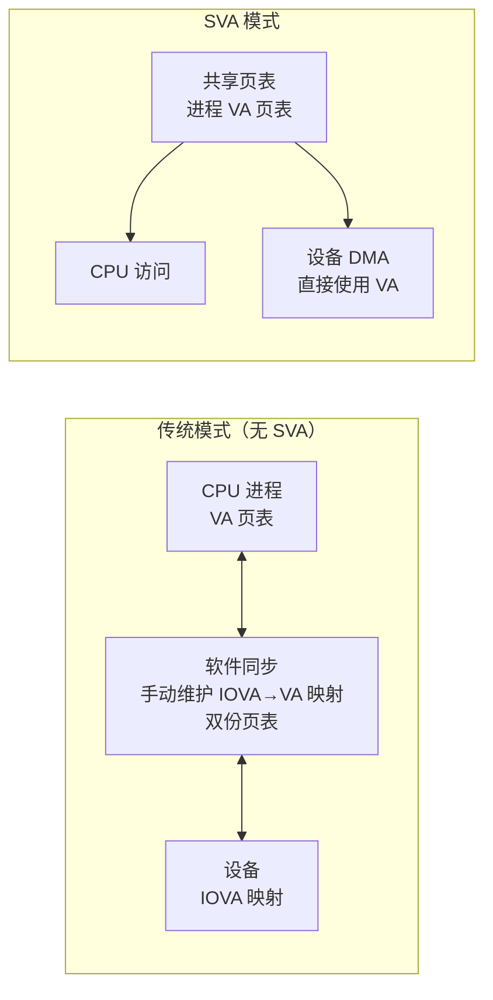
```mermaid
graph LR
    subgraph WithoutSVA["传统模式（无 SVA）"]
        direction TB
        CPU_PROC["CPU 进程<br/>VA 页表"]
        DEV_IOVA["设备<br/>IOVA 映射"]
        SW_SYNC["软件同步<br/>手动维护 IOVA→VA 映射<br/>双份页表"]
        CPU_PROC <--> SW_SYNC <--> DEV_IOVA
    end

    subgraph WithSVA["SVA 模式"]
        direction TB
        SHARED_PG["共享页表<br/>进程 VA 页表"]
        CPU_ACC["CPU 访问"]
        DEV_ACC["设备 DMA<br/>直接使用 VA"]
        SHARED_PG --> CPU_ACC
        SHARED_PG --> DEV_ACC
    end
```

### 1.2 SVA 的技术基石

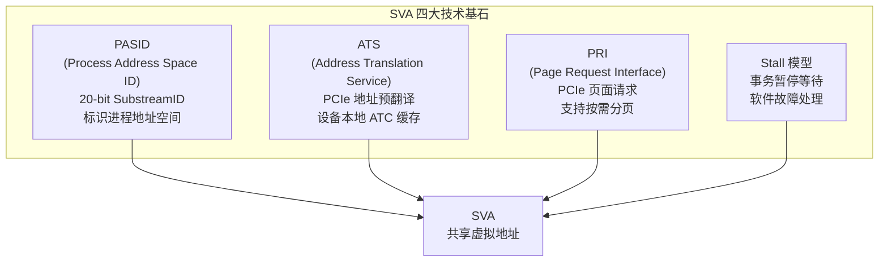
```mermaid
graph TB
    subgraph Foundations["SVA 四大技术基石"]
        PASID["PASID<br/>(Process Address Space ID)<br/>20-bit SubstreamID<br/>标识进程地址空间"]
        ATS["ATS<br/>(Address Translation Service)<br/>PCIe 地址预翻译<br/>设备本地 ATC 缓存"]
        PRI["PRI<br/>(Page Request Interface)<br/>PCIe 页面请求<br/>支持按需分页"]
        STALL["Stall 模型<br/>事务暂停等待<br/>软件故障处理"]
    end

    PASID & ATS & PRI & STALL --> SVA["SVA<br/>共享虚拟地址"]
```

### 1.3 版本支持

| 特性 | SMMUv2 (IHI0062D) | MMU-600AE (v3.1) | MMU-700 (v3.2) |
|------|-------------------|-------------------|-----------------|
| PASID / SubstreamID | 不支持 | 20-bit SSID | 20-bit SSID |
| ATS | 不支持 | Full ATS | Full + Split-stage ATS |
| PRI | 不支持 | 支持 | 支持 |
| Stall 模型 | 仅故障模型 | Stall + Force | Stall + Force |
| HTTU (访问/脏位) | 可选 (HAFDBS) | 不支持 | 支持 (sup_httu) |
| CD2L (两级 CD 表) | 不支持 | 支持 | 支持 |
| S1DSS (Substream 控制) | 不支持 | 支持 | 支持 |
| EATS (ATS 控制) | 不支持 | 支持 | 支持 |
| 52-bit VA | 不支持 | 不支持 | 支持 (VAX=01) |
| LTI (本地翻译接口) | 不支持 | 不支持 | 支持 |
| PPS (PRI 中含 PASID) | N/A | 始终 (PPS=1) | 始终 (PPS=1) |

---

## 2. PASID 与 SubstreamID

### 2.1 核心概念

在 SMMUv3 中，每个设备事务携带 **StreamID**（标识设备）和可选的 **SubstreamID / SSID**（标识设备上的进程地址空间）。当 SSID 作为 PASID（Process Address Space ID）使用时，它将设备事务关联到特定的 CPU 进程。

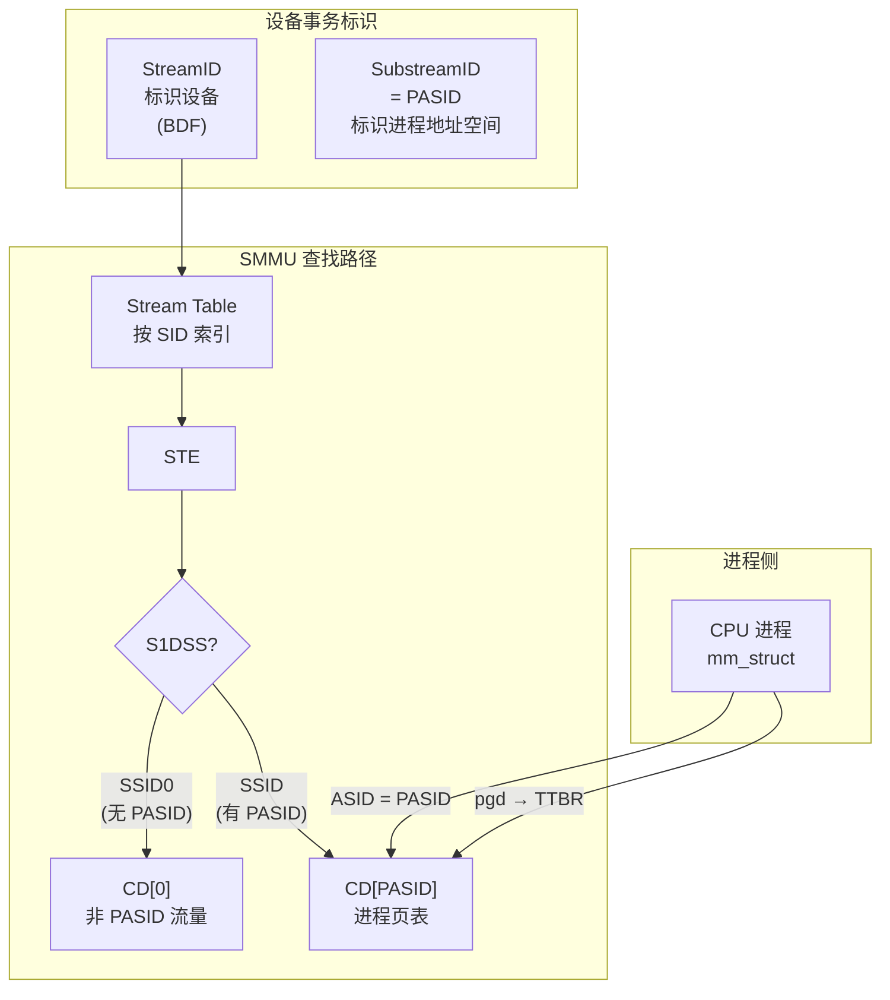
```mermaid
graph TB
    subgraph Transaction["设备事务标识"]
        SID["StreamID<br/>标识设备<br/>(BDF)"]
        SSID["SubstreamID<br/>= PASID<br/>标识进程地址空间"]
    end

    subgraph Lookup["SMMU 查找路径"]
        SID --> STRTAB["Stream Table<br/>按 SID 索引"]
        STRTAB --> STE["STE"]
        STE --> CD_SEL{"S1DSS?"}

        CD_SEL -->|"SSID0<br/>(无 PASID)"| CD0["CD[0]<br/>非 PASID 流量"]
        CD_SEL -->|"SSID<br/>(有 PASID)"| CD_N["CD[PASID]<br/>进程页表"]
    end

    subgraph Process["进程侧"]
        PROC["CPU 进程<br/>mm_struct"]
        PROC -->|"ASID = PASID"| CD_N
        PROC -->|"pgd → TTBR"| CD_N
    end
```

### 2.2 SSID 在 AXI5 总线上的传输

MMU-600AE/700 的 TBU 通过 AXI5 Untranslated_Transactions 扩展信号传递 SSID：

| 信号 | 说明 | 宽度 |
|------|------|------|
| `armmussid_s` | SubstreamID 值 (=PASID) | TBUCFG_SSID_WIDTH (1/8/20-bit) |
| `armmussidv_s` | SubstreamID 有效 | 1-bit |
| `armmusid_s` | StreamID | SID_WIDTH |
| `armmuatst_s` | ATS 已翻译标志 | 1-bit |

这些信号同时存在于 AR（读）和 AW（写）通道。

### 2.3 S1DSS 字段

STE 中的 `S1DSS` 字段控制 SubstreamID 的处理方式（`arm-smmu-v3.h:216-219`）：

| S1DSS 值 | 含义 | SVA 用途 |
|----------|------|----------|
| 0x0 (TERMINATE) | 终止带 SSID 的事务 | 安全隔离 |
| 0x1 (BYPASS) | 旁路 Stage 1，忽略 SSID | 调试 |
| **0x2 (SSID0)** | **SSID=0 使用 CD[0]，SSID>0 使用 CD[SSID]** | **SVA 核心配置** |

SVA 模式下，STE 的 S1DSS 设为 `SSID0`（`arm-smmu-v3.c:1335`），这意味着：
- **CD[0]**：保留给非 PASID 流量（普通 DMA，无进程绑定）
- **CD[1..N]**：按 PASID 索引，每个 PASID 对应一个进程的 CD

### 2.4 S1CDMax 与 CD 表格式

STE 的 `S1CDMax` 字段定义 CD 表的最大 PASID 范围（`arm-smmu-v3.h:214`）：

- **S1CDMax = 0**：STE.S1ContextPtr 指向单个 CD（不支持 PASID）
- **S1CDMax > 0**：STE.S1ContextPtr 指向 CD 表，支持 PASID

`S1Fmt` 字段决定 CD 表格式（`arm-smmu-v3.h:210-212`）：

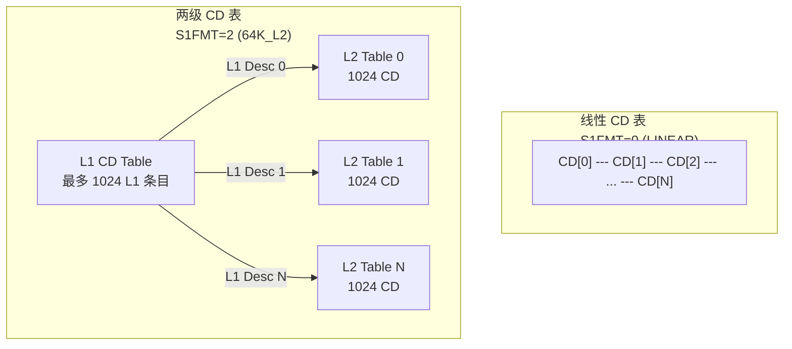
```mermaid
graph TB
    subgraph Linear["线性 CD 表<br/>S1FMT=0 (LINEAR)"]
        LCD["CD[0] --- CD[1] --- CD[2] --- ... --- CD[N]"]
    end

    subgraph TwoLevel["两级 CD 表<br/>S1FMT=2 (64K_L2)"]
        L1_CD["L1 CD Table<br/>最多 1024 L1 条目"]
        L2_0["L2 Table 0<br/>1024 CD"]
        L2_1["L2 Table 1<br/>1024 CD"]
        L2_N["L2 Table N<br/>1024 CD"]

        L1_CD -->|"L1 Desc 0"| L2_0
        L1_CD -->|"L1 Desc 1"| L2_1
        L1_CD -->|"L1 Desc N"| L2_N
    end
```

**Linux 驱动中的 CD 表分配**（`arm-smmu-v3.c:1117-1164`）：
- 当 `max_contexts <= 1024`（即 S1CDMax 较小）时使用**线性 CD 表**
- 当 `max_contexts > 1024` 且支持 `FEAT_2_LVL_CDTAB` 时使用**两级 CD 表**
- 两级 CD 表的 L2 表按需分配（lazy allocation）

---

## 3. ATS（Address Translation Service）

### 3.1 ATS 工作原理

ATS 允许 PCIe 设备在发起 DMA 之前预查询地址翻译结果，并将结果缓存到设备本地的 ATC（Address Translation Cache）中，从而减少 SMMU 翻译延迟。

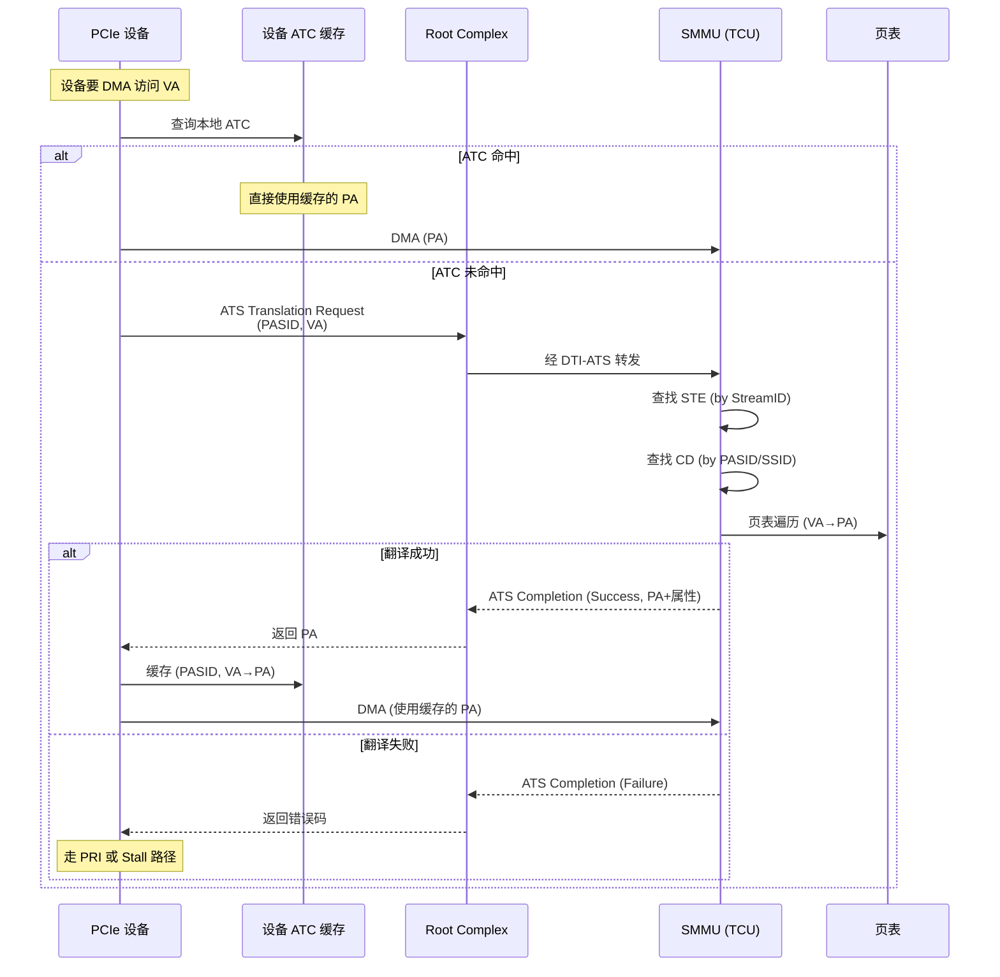
```mermaid
sequenceDiagram
    participant DEV as PCIe 设备
    participant ATC as 设备 ATC 缓存
    participant RC as Root Complex
    participant SMMU as SMMU (TCU)
    participant PT as 页表

    Note over DEV: 设备要 DMA 访问 VA

    DEV->>ATC: 查询本地 ATC

    alt ATC 命中
        Note over ATC: 直接使用缓存的 PA
        DEV->>SMMU: DMA (PA)
    else ATC 未命中
        DEV->>RC: ATS Translation Request<br/>(PASID, VA)
        RC->>SMMU: 经 DTI-ATS 转发

        SMMU->>SMMU: 查找 STE (by StreamID)
        SMMU->>SMMU: 查找 CD (by PASID/SSID)
        SMMU->>PT: 页表遍历 (VA→PA)

        alt 翻译成功
            SMMU-->>RC: ATS Completion (Success, PA+属性)
            RC-->>DEV: 返回 PA
            DEV->>ATC: 缓存 (PASID, VA→PA)
            DEV->>SMMU: DMA (使用缓存的 PA)
        else 翻译失败
            SMMU-->>RC: ATS Completion (Failure)
            RC-->>DEV: 返回错误码
            Note over DEV: 走 PRI 或 Stall 路径
        end
    end
```

### 3.2 ATC 无效化

当进程页表变更时，必须同步无效化设备 ATC 中的陈旧条目。Linux 驱动通过 `CMDQ_OP_ATC_INV` 命令实现（`arm-smmu-v3.c:1711-1792`）。

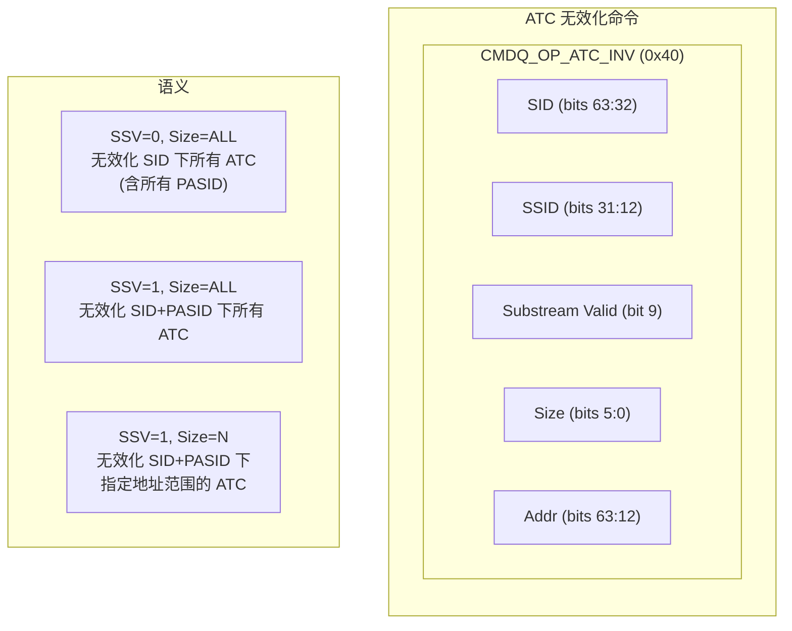
```mermaid
graph TB
    subgraph ATCInv["ATC 无效化命令"]
        direction TB
        subgraph CmdFormat["CMDQ_OP_ATC_INV (0x40)"]
            A_SID["SID (bits 63:32)"]
            A_SSID["SSID (bits 31:12)"]
            A_SSV["Substream Valid (bit 9)"]
            A_SIZE["Size (bits 5:0)"]
            A_ADDR["Addr (bits 63:12)"]
        end
    end

    subgraph Semantics["语义"]
        S_GLOBAL["SSV=0, Size=ALL<br/>无效化 SID 下所有 ATC<br/>(含所有 PASID)"]
        S_PASID_ALL["SSV=1, Size=ALL<br/>无效化 SID+PASID 下所有 ATC"]
        S_PASID_RANGE["SSV=1, Size=N<br/>无效化 SID+PASID 下<br/>指定地址范围的 ATC"]
    end
```

**ATS 与 PASID 的交互问题**（`arm-smmu-v3.c:1720-1733`）：

> 当 S1DSS=SSID0 时，非 PASID 流量（SSID 无效）使用 CD[0]，产生的 ATC 条目不带 PASID 标签。无效化时如果 SSV=0（不带 PASID），会同时清除该 SID 下所有 PASID 标签的 ATC 条目，存在过度无效化的问题。

### 3.3 ATC 无效化范围计算

Linux 驱动使用"向上取整到 2 的幂"策略计算无效化范围（`arm-smmu-v3.c:1746-1774`）：

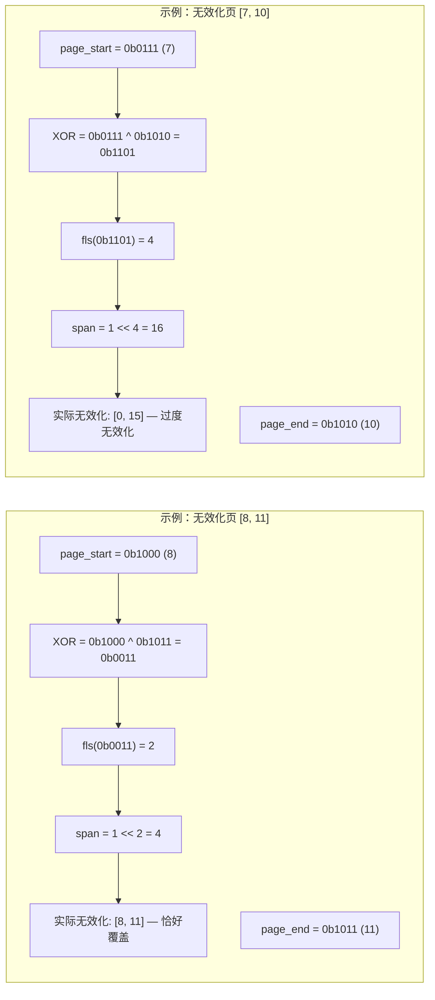
```mermaid
graph LR
    subgraph Example["示例：无效化页 [8, 11]"]
        START["page_start = 0b1000 (8)"]
        END["page_end = 0b1011 (11)"]
        XOR["XOR = 0b1000 ^ 0b1011 = 0b0011"]
        FLS["fls(0b0011) = 2"]
        SPAN["span = 1 << 2 = 4"]
        RESULT["实际无效化: [8, 11] — 恰好覆盖"]
        START --> XOR --> FLS --> SPAN --> RESULT
    end

    subgraph OverInval["示例：无效化页 [7, 10]"]
        START2["page_start = 0b0111 (7)"]
        END2["page_end = 0b1010 (10)"]
        XOR2["XOR = 0b0111 ^ 0b1010 = 0b1101"]
        FLS2["fls(0b1101) = 4"]
        SPAN2["span = 1 << 4 = 16"]
        RESULT2["实际无效化: [0, 15] — 过度无效化"]
        START2 --> XOR2 --> FLS2 --> SPAN2 --> RESULT2
    end
```

### 3.4 EATS（Endianness / ATS 控制）

STE 中的 `EATS` 字段控制 ATS 相关行为（`arm-smmu-v3.h:231-234`）：

| EATS 值 | 含义 | SVA 用途 |
|---------|------|----------|
| 0 (ABT) | 中止 ATS 事务 | 禁用 ATS |
| 1 (TRANS) | 执行 ATS 翻译 | **SVA 标准配置** |
| 2 (S1CHK) | 仅 S1 ATS 检查 | 调试 |

SVA 模式下 EATS 设为 `TRANS`（`arm-smmu-v3.c:1368-1369`）。

### 3.5 Split-Stage ATS（MMU-700 独有）

SMMUv3.2 支持分阶段 ATS，Guest 执行 S1 翻译，Host 执行 S2 翻译：

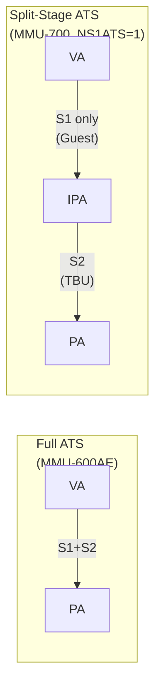
```mermaid
graph LR
    subgraph FullATS["Full ATS<br/>(MMU-600AE)"]
        FA_VA["VA"] -->|"S1+S2"| FA_PA["PA"]
    end

    subgraph SplitATS["Split-Stage ATS<br/>(MMU-700, NS1ATS=1)"]
        SA_VA["VA"] -->|"S1 only<br/>(Guest)"| SA_IPA["IPA"]
        SA_IPA -->|"S2<br/>(TBU)"| SA_PA["PA"]
    end
```

---

## 4. PRI（Page Request Interface）

### 4.1 PRI 工作原理

PRI 是 PCIe 协议定义的页面请求接口，允许设备在 ATC 未命中且翻译失败时向软件发起页面请求，实现按需分页（Demand Paging）。

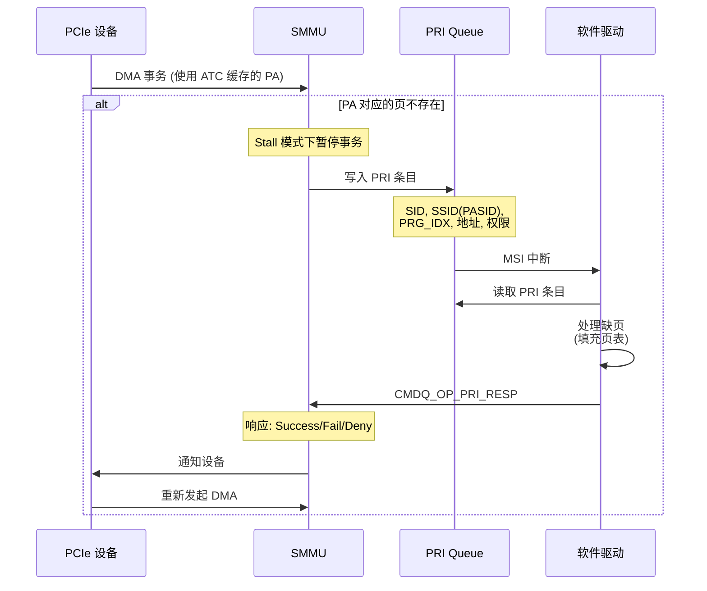
```mermaid
sequenceDiagram
    participant DEV as PCIe 设备
    participant SMMU as SMMU
    participant PRIQ as PRI Queue
    participant SW as 软件驱动

    DEV->>SMMU: DMA 事务 (使用 ATC 缓存的 PA)

    alt PA 对应的页不存在
        Note over SMMU: Stall 模式下暂停事务
        SMMU->>PRIQ: 写入 PRI 条目
        Note over PRIQ: SID, SSID(PASID),<br/>PRG_IDX, 地址, 权限
        PRIQ->>SW: MSI 中断

        SW->>PRIQ: 读取 PRI 条目
        SW->>SW: 处理缺页<br/>(填充页表)
        SW->>SMMU: CMDQ_OP_PRI_RESP
        Note over SMMU: 响应: Success/Fail/Deny
        SMMU->>DEV: 通知设备
        DEV->>SMMU: 重新发起 DMA
    end
```

### 4.2 PRI Queue 条目格式

Linux 驱动中定义的 PRIQ 字段（`arm-smmu-v3.h:399-414`）：

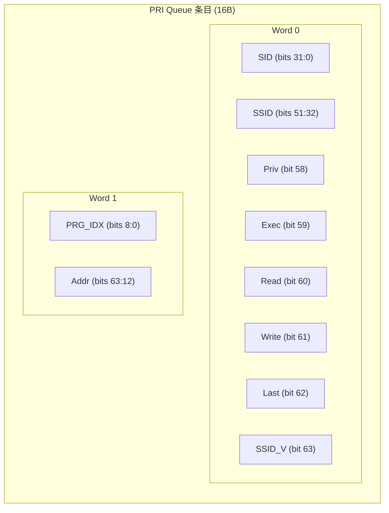
```mermaid
graph LR
    subgraph PRIEntry["PRI Queue 条目 (16B)"]
        direction TB
        subgraph Word0["Word 0"]
            P_SID["SID (bits 31:0)"]
            P_SSID["SSID (bits 51:32)"]
            P_PERM_PRIV["Priv (bit 58)"]
            P_PERM_EXEC["Exec (bit 59)"]
            P_PERM_READ["Read (bit 60)"]
            P_PERM_WRITE["Write (bit 61)"]
            P_PRG_LAST["Last (bit 62)"]
            P_SSID_V["SSID_V (bit 63)"]
        end
        subgraph Word1["Word 1"]
            P_PRG_IDX["PRG_IDX (bits 8:0)"]
            P_ADDR["Addr (bits 63:12)"]
        end
    end
```

### 4.3 PRI 响应码

定义于 `arm-smmu-v3.h:423-427`：

| 响应码 | 值 | 含义 |
|--------|---|------|
| `PRI_RESP_DENY` | 0 | 拒绝请求 |
| `PRI_RESP_FAIL` | 1 | 处理失败 |
| `PRI_RESP_SUCC` | 2 | 成功完成 |

### 4.4 Linux PRI 处理流程

当前驱动中的 PRI 处理（`arm-smmu-v3.c:1585-1643`）为**日志 + 拒绝**模式：

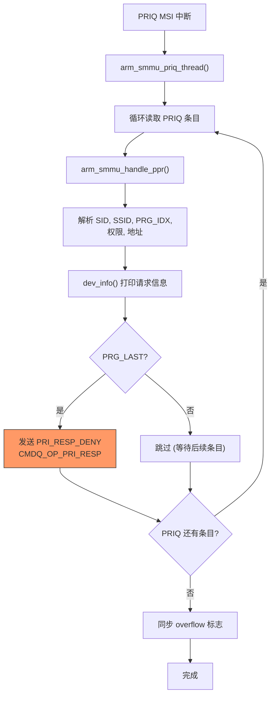
```mermaid
flowchart TD
    IRQ["PRIQ MSI 中断"]
    IRQ --> THREAD["arm_smmu_priq_thread()"]
    THREAD --> LOOP["循环读取 PRIQ 条目"]
    LOOP --> PPR["arm_smmu_handle_ppr()"]
    PPR --> PARSE["解析 SID, SSID, PRG_IDX,<br/>权限, 地址"]
    PARSE --> LOG["dev_info() 打印请求信息"]
    LOG --> LAST{"PRG_LAST?"}
    LAST -->|"是"| RESP["发送 PRI_RESP_DENY<br/>CMDQ_OP_PRI_RESP"]
    LAST -->|"否"| SKIP["跳过 (等待后续条目)"]
    RESP --> MORE{"PRIQ 还有条目?"}
    SKIP --> MORE
    MORE -->|"是"| LOOP
    MORE -->|"否"| SYNC["同步 overflow 标志"]
    SYNC --> DONE["完成"]

    style RESP fill:#f96,stroke:#333
```

> **注意**：当前驱动实现中，PRI 请求总是返回 `DENY`。完整的按需分页支持需要与 IOPF（I/O Page Fault）框架集成，通过 `iopf_queue` 机制将页面错误分发给设备驱动处理。

### 4.5 PRIQ 溢出处理

当 PRI Queue 溢出时（`arm-smmu-v3.c:1634-1635`）：

```c
if (queue_sync_prod_in(q) == -EOVERFLOW)
    dev_err(smmu->dev, "PRIQ overflow detected -- requests lost\n");
```

SMMU 硬件在 PRIQ 溢出时自动生成 PRI 响应（MMU-600AE/700 中 PPS=1，始终包含 PASID）。

---

## 5. Stall 模型

### 5.1 Stall vs Terminate

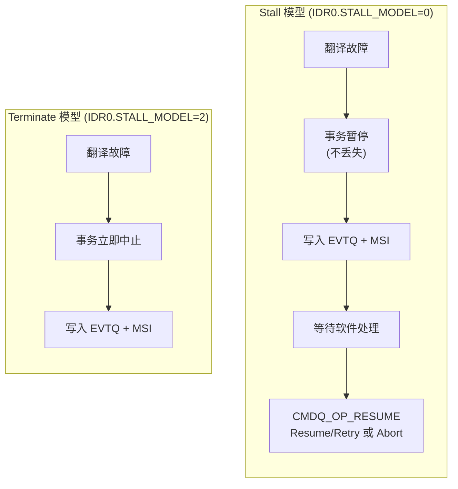
```mermaid
graph TB
    subgraph StallModel["Stall 模型 (IDR0.STALL_MODEL=0)"]
        direction TB
        S_FAULT["翻译故障"]
        S_PAUSE["事务暂停<br/>(不丢失)"]
        S_NOTIFY["写入 EVTQ + MSI"]
        S_WAIT["等待软件处理"]
        S_RESUME["CMDQ_OP_RESUME<br/>Resume/Retry 或 Abort"]
        S_FAULT --> S_PAUSE --> S_NOTIFY --> S_WAIT --> S_RESUME
    end

    subgraph TermModel["Terminate 模型 (IDR0.STALL_MODEL=2)"]
        direction TB
        T_FAULT["翻译故障"]
        T_ABRT["事务立即中止"]
        T_NOTIFY["写入 EVTQ + MSI"]
        T_FAULT --> T_ABRT --> T_NOTIFY
    end
```

### 5.2 Stall 模型对 SVA 的意义

Stall 模型是 SVA 按需分页的硬件基础：

1. **事务不丢失**：设备发出的 DMA 事务被暂停在 SMMU 中，不会丢失
2. **软件有机会修复**：软件可以处理缺页（分配页面、更新页表），然后恢复事务
3. **支持 Hit-Under-Miss**：同一设备上其他不冲突的事务可以继续处理

### 5.3 Stall 容量

SMMU 的 Stall 容量由 `IDR5.STALL_MAX` 定义（`arm-smmu-v3.h:57`），在 MMU-600AE/700 中为 `TCUCFG_XLATE_SLOTS`。超过容量时，新的事务将被终止。

### 5.4 CMD_RESUME 命令

软件通过 `CMDQ_OP_RESUME` 恢复 stalled 事务（`arm-smmu-v3.h:357-362`）：

| 响应值 | 含义 |
|--------|------|
| `RESUME_0_RESP_RETRY` (1) | 重新翻译（页表已修复） |
| `RESUME_0_RESP_ABORT` (2) | 中止事务 |
| `RESUME_0_RESP_TERM` (0) | 终止（同 Abort） |

---

## 6. CD（Context Descriptor）与进程绑定

### 6.1 CD 的 SVA 角色

SVA 模式下，每个绑定到设备的进程对应一个 CD，其中包含该进程的完整翻译上下文。

```mermaid
classDiagram
    class arm_smmu_ctx_desc {
        +asid : u16
        +ttbr : u64
        +tcr : u64
        +mair : u64
        +refs : refcount_t
        +mm : mm_struct*
    }

    class CPU_Context["CPU 上下文 (同一进程)"] {
        TTBR0_EL1 : pgd 物理地址
        TCR_EL1 : 翻译控制
        MAIR_EL1 : 内存属性
        ASID : 地址空间 ID
    }

    class CD_Mapping["CD 字段映射"]
        CD_ASID["CD.ASID = CPU.ASID = PASID"]
        CD_TTBR["CD.TTBR0 = CPU.TTBR0_EL1 = mm→pgd"]
        CD_TCR["CD.TCR = 从 CPU.TCR_EL1 提取"]
        CD_MAIR["CD.MAIR = 从 CPU.MAIR_EL1 读取"]
    end

    arm_smmu_ctx_desc --> CD_Mapping
    CPU_Context --> CD_Mapping
```

### 6.2 共享 CD 的创建流程

`arm_smmu_alloc_shared_cd()` 函数为 SVA 创建共享 CD（`arm-smmu-v3-sva.c:92-177`）：

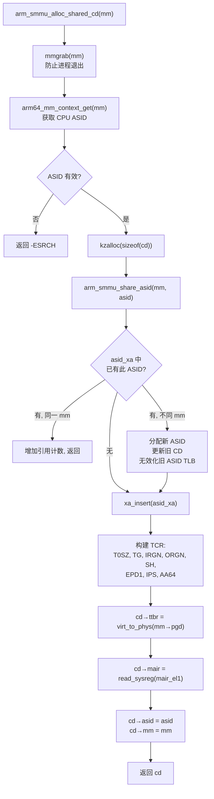
```mermaid
flowchart TD
    START["arm_smmu_alloc_shared_cd(mm)"]
    START --> GRAB["mmgrab(mm)<br/>防止进程退出"]
    GRAB --> GET_ASID["arm64_mm_context_get(mm)<br/>获取 CPU ASID"]
    GET_ASID --> CHECK_ASID{"ASID 有效?"}
    CHECK_ASID -->|"否"| ERR1["返回 -ESRCH"]
    CHECK_ASID -->|"是"| ALLOC_CD["kzalloc(sizeof(cd))"]
    ALLOC_CD --> SHARE["arm_smmu_share_asid(mm, asid)"]

    SHARE --> CHECK_XA{"asid_xa 中<br/>已有此 ASID?"}
    CHECK_XA -->|"无"| INSERT["xa_insert(asid_xa)"]
    CHECK_XA -->|"有, 同一 mm"| REUSE["增加引用计数, 返回"]
    CHECK_XA -->|"有, 不同 mm"| REPLACE["分配新 ASID<br/>更新旧 CD<br/>无效化旧 ASID TLB"]

    REPLACE --> INSERT
    INSERT --> BUILD_TCR["构建 TCR:<br/>T0SZ, TG, IRGN, ORGN, SH,<br/>EPD1, IPS, AA64"]
    BUILD_TCR --> SET_TTBR["cd→ttbr = virt_to_phys(mm→pgd)"]
    SET_TTBR --> SET_MAIR["cd→mair = read_sysreg(mair_el1)"]
    SET_MAIR --> SET_ASID["cd→asid = asid<br/>cd→mm = mm"]
    SET_ASID --> DONE["返回 cd"]
```

### 6.3 ASID 共享与冲突处理

当 CPU 分配的 ASID 在 SMMU 侧已被其他（非 SVA）Context Descriptor 使用时，需要替换（`arm-smmu-v3-sva.c:44-90`）：

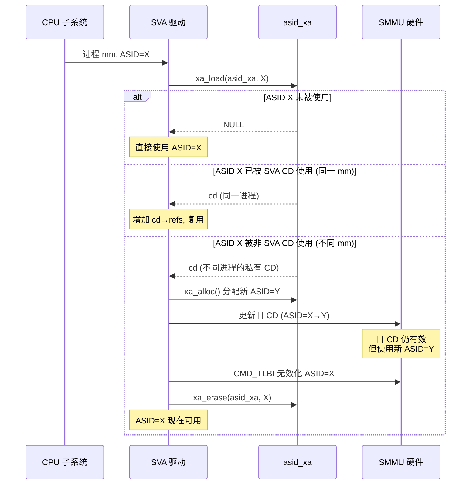
```mermaid
sequenceDiagram
    participant CPU as CPU 子系统
    participant SVA as SVA 驱动
    participant XA as asid_xa
    participant SMMU as SMMU 硬件

    CPU->>SVA: 进程 mm, ASID=X
    SVA->>XA: xa_load(asid_xa, X)

    alt ASID X 未被使用
        XA-->>SVA: NULL
        Note over SVA: 直接使用 ASID=X
    else ASID X 已被 SVA CD 使用 (同一 mm)
        XA-->>SVA: cd (同一进程)
        Note over SVA: 增加 cd→refs, 复用
    else ASID X 被非 SVA CD 使用 (不同 mm)
        XA-->>SVA: cd (不同进程的私有 CD)
        SVA->>XA: xa_alloc() 分配新 ASID=Y
        SVA->>SMMU: 更新旧 CD (ASID=X→Y)
        Note over SMMU: 旧 CD 仍有效<br/>但使用新 ASID=Y
        SVA->>SMMU: CMD_TLBI 无效化 ASID=X
        SVA->>XA: xa_erase(asid_xa, X)
        Note over SVA: ASID=X 现在可用
    end
```

### 6.4 CD 的五种写入场景

`arm_smmu_write_ctx_desc()` 处理五种 CD 写入场景（`arm-smmu-v3.c:1038-1115`）：

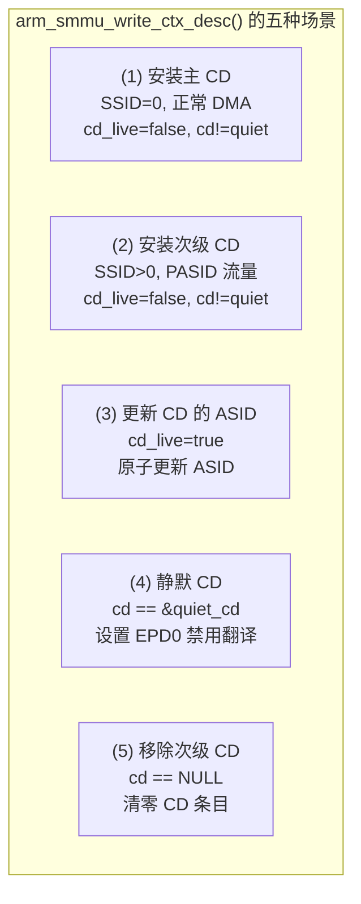
```mermaid
graph TB
    subgraph Cases["arm_smmu_write_ctx_desc() 的五种场景"]
        C1["(1) 安装主 CD<br/>SSID=0, 正常 DMA<br/>cd_live=false, cd!=quiet"]
        C2["(2) 安装次级 CD<br/>SSID>0, PASID 流量<br/>cd_live=false, cd!=quiet"]
        C3["(3) 更新 CD 的 ASID<br/>cd_live=true<br/>原子更新 ASID"]
        C4["(4) 静默 CD<br/>cd == &quiet_cd<br/>设置 EPD0 禁用翻译"]
        C5["(5) 移除次级 CD<br/>cd == NULL<br/>清零 CD 条目"]
    end
```

**quiet_cd 的特殊用途**（`arm-smmu-v3.c:77-81`）：

> `quiet_cd` 是一个全零的 `arm_smmu_ctx_desc`，用于进程退出时静默 CD。它不清除 V 位（避免 C_BAD_CD 事件），而是设置 `EPD0` 禁用翻译，使所有事务产生故障但不触发无效 CD 错误。

### 6.5 CD 的原子写入协议

SMMU 规范保证 64 位原子读取（`arm-smmu-v3.c:1103-1111`），Linux 驱动利用这一特性：

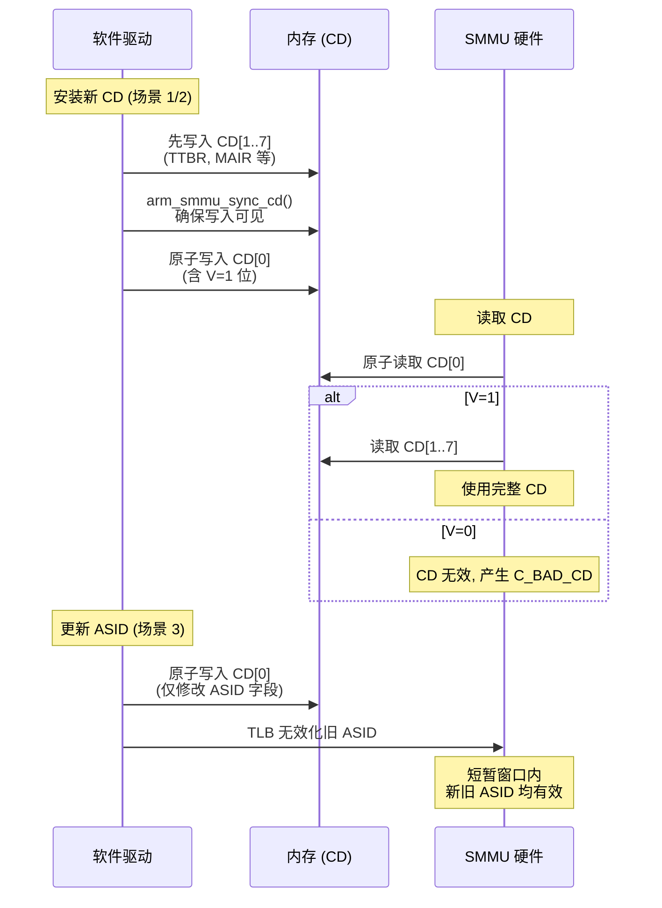
```mermaid
sequenceDiagram
    participant SW as 软件驱动
    participant MEM as 内存 (CD)
    participant HW as SMMU 硬件

    Note over SW: 安装新 CD (场景 1/2)
    SW->>MEM: 先写入 CD[1..7]<br/>(TTBR, MAIR 等)
    SW->>MEM: arm_smmu_sync_cd()<br/>确保写入可见
    SW->>MEM: 原子写入 CD[0]<br/>(含 V=1 位)

    Note over HW: 读取 CD
    HW->>MEM: 原子读取 CD[0]
    alt V=1
        HW->>MEM: 读取 CD[1..7]
        Note over HW: 使用完整 CD
    else V=0
        Note over HW: CD 无效, 产生 C_BAD_CD
    end

    Note over SW: 更新 ASID (场景 3)
    SW->>MEM: 原子写入 CD[0]<br/>(仅修改 ASID 字段)
    SW->>HW: TLB 无效化旧 ASID
    Note over HW: 短暂窗口内<br/>新旧 ASID 均有效
```

---

## 7. MMU Notifier 与地址空间同步

### 7.1 核心问题

当 CPU 进程修改自己的页表（如 `munmap`、`mprotect`、`mremap`）时，SMMU 侧的 TLB 和设备 ATC 中可能缓存了旧的翻译结果，需要同步更新。

### 7.2 MMU Notifier 机制

Linux 的 MMU Notifier 机制允许内核子系统（如 SMMU 驱动）注册回调，在进程地址空间发生变化时收到通知。

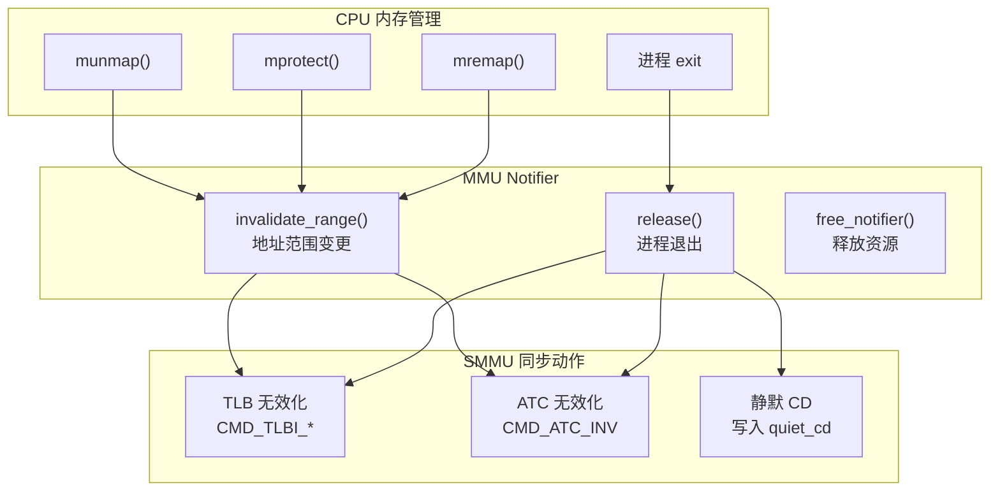
```mermaid
graph TB
    subgraph CPU_MM["CPU 内存管理"]
        MUNMAP["munmap()"]
        MPROTECT["mprotect()"]
        MREMAP["mremap()"]
        EXIT["进程 exit"]
    end

    subgraph Notifier["MMU Notifier"]
        INV_RANGE["invalidate_range()<br/>地址范围变更"]
        RELEASE["release()<br/>进程退出"]
        FREE["free_notifier()<br/>释放资源"]
    end

    subgraph SMMU_Action["SMMU 同步动作"]
        TLBI["TLB 无效化<br/>CMD_TLBI_*"]
        ATC_INV["ATC 无效化<br/>CMD_ATC_INV"]
        QUIET["静默 CD<br/>写入 quiet_cd"]
    end

    MUNMAP & MPROTECT & MREMAP --> INV_RANGE
    EXIT --> RELEASE
    INV_RANGE --> TLBI & ATC_INV
    RELEASE --> QUIET & TLBI & ATC_INV
```

### 7.3 arm_smmu_mmu_notifier 结构

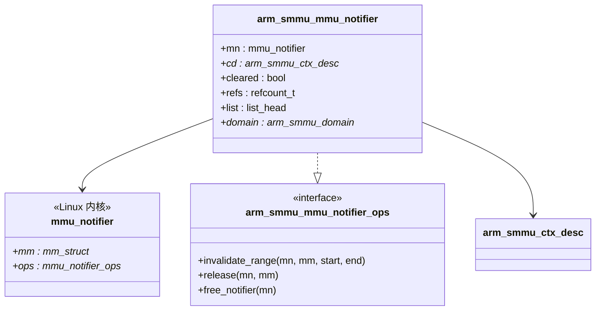
```mermaid
classDiagram
    class arm_smmu_mmu_notifier {
        +mn : mmu_notifier
        +cd : arm_smmu_ctx_desc*
        +cleared : bool
        +refs : refcount_t
        +list : list_head
        +domain : arm_smmu_domain*
    }

    class arm_smmu_mmu_notifier_ops {
        <<interface>>
        +invalidate_range(mn, mm, start, end)
        +release(mn, mm)
        +free_notifier(mn)
    }

    class mmu_notifier {
        <<Linux 内核>>
        +mm : mm_struct*
        +ops : mmu_notifier_ops*
    }

    arm_smmu_mmu_notifier --> mmu_notifier
    arm_smmu_mmu_notifier ..|> arm_smmu_mmu_notifier_ops
    arm_smmu_mmu_notifier --> arm_smmu_ctx_desc
```

### 7.4 invalidate_range 回调

当进程地址范围变更时（`arm-smmu-v3-sva.c:189-208`）：

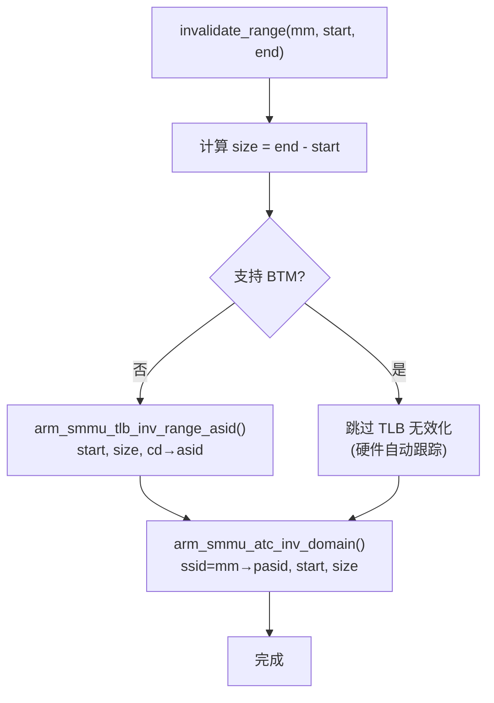
```mermaid
flowchart TD
    INV["invalidate_range(mm, start, end)"]
    INV --> CALC["计算 size = end - start"]
    CALC --> CHECK_BTM{"支持 BTM?"}

    CHECK_BTM -->|"否"| TLBI["arm_smmu_tlb_inv_range_asid()<br/>start, size, cd→asid"]
    CHECK_BTM -->|"是"| SKIP_TLBI["跳过 TLB 无效化<br/>(硬件自动跟踪)"]

    TLBI --> ATC["arm_smmu_atc_inv_domain()<br/>ssid=mm→pasid, start, size"]
    SKIP_TLBI --> ATC

    ATC --> DONE["完成"]
```

### 7.5 release 回调（进程退出）

当进程退出时（`arm-smmu-v3-sva.c:210-232`）：

```mermaid
sequenceDiagram
    participant MM as 内核 mm
    participant MN as arm_smmu_mmu_notifier
    participant SMMU as SMMU 驱动
    participant HW as SMMU 硬件

    MM->>MN: release(mm)
    MN->>SMMU: 获取 sva_lock

    alt 已 cleared
        Note over MN: 已处理过, 跳过
        MN->>SMMU: 释放锁
    else 未 cleared
        Note over SMMU: DMA 可能仍在运行
        Note over SMMU: 保持 CD 有效避免 C_BAD_CD
        Note over SMMU: 但禁用翻译

        SMMU->>HW: arm_smmu_write_ctx_desc()<br/>写入 quiet_cd<br/>(设置 EPD0, 禁用翻译)
        SMMU->>HW: arm_smmu_tlb_inv_asid()<br/>无效化 ASID
        SMMU->>HW: arm_smmu_atc_inv_domain()<br/>无效化 ATC

        MN->>MN: cleared = true
        MN->>SMMU: 释放锁
    end
```

### 7.6 MMU Notifier 的生命周期

```mermaid
flowchart TD
    subgraph Get["arm_smmu_mmu_notifier_get()"]
        G_CHECK["遍历 domain→mmu_notifiers<br/>查找已有 {domain, mm}"]
        G_CHECK --> FOUND{"找到?"}
        FOUND -->|"是"| G_REUSE["增加 refs, 返回"]
        FOUND -->|"否"| G_ALLOC_CD["arm_smmu_alloc_shared_cd(mm)"]
        G_ALLOC_CD --> G_ALLOC_MN["kzalloc(smmu_mn)"]
        G_ALLOC_MN --> G_REG["mmu_notifier_register(mn, mm)"]
        G_REG --> G_WRITE_CD["arm_smmu_write_ctx_desc(domain, pasid, cd)"]
        G_WRITE_CD --> G_ADD["list_add(&mn→list, &domain→mmu_notifiers)"]
        G_ADD --> G_DONE["返回 smmu_mn"]
    end

    subgraph Put["arm_smmu_mmu_notifier_put()"]
        P_DEC["refcount_dec_and_test()"]
        P_DEC --> P_LAST{"引用归零?"}
        P_LAST -->|"否"| P_KEEP["保留"]
        P_LAST -->|"是"| P_DEL["list_del()"]
        P_DEL --> P_RM_CD["arm_smmu_write_ctx_desc(domain, pasid, NULL)"]
        P_RM_CD --> P_CHECK{"已 cleared?"}
        P_CHECK -->|"是"| P_FREE_MN["mmu_notifier_put(mn)<br/>调用 free_notifier()"]
        P_CHECK -->|"否"| P_INV["TLB + ATC 无效化"]
        P_INV --> P_FREE_MN
        P_FREE_MN --> P_FREE_CD["arm_smmu_free_shared_cd(cd)"]
    end
```

---

## 8. SVA Bind/Unbind 流程

### 8.1 Bond 结构

```mermaid
classDiagram
    class arm_smmu_bond {
        +sva : iommu_sva
        +mm : mm_struct*
        +smmu_mn : arm_smmu_mmu_notifier*
        +list : list_head
        +refs : refcount_t
    }

    class arm_smmu_master {
        +sva_enabled : bool
        +iopf_enabled : bool
        +ssid_bits : unsigned int
        +bonds : list_head
    }

    class arm_smmu_mmu_notifier {
        +cd : arm_smmu_ctx_desc*
        +domain : arm_smmu_domain*
    }

    arm_smmu_bond --> arm_smmu_mmu_notifier
    arm_smmu_bond --> arm_smmu_mmu_notifier : "1:1 per {dev,mm}"
    arm_smmu_master "1" --> "*" arm_smmu_bond : "bonds list"
```

### 8.2 完整 Bind 流程

```mermaid
flowchart TD
    REQ["iommu_sva_bind(dev, mm)"]
    REQ --> WRAPPER["arm_smmu_sva_bind(dev, mm)"]

    WRAPPER --> CHECK_STAGE{"domain→stage == S1?"}
    CHECK_STAGE -->|"否"| ERR_INVAL["返回 -EINVAL<br/>(SVA 仅支持 S1)"]
    CHECK_STAGE -->|"是"| LOCK["mutex_lock(&sva_lock)"]

    LOCK --> INNER["__arm_smmu_sva_bind(dev, mm)"]
    INNER --> CHECK_EN{"master→sva_enabled?"}
    CHECK_EN -->|"否"| ERR_NODEV["返回 -ENODEV"]
    CHECK_EN -->|"是"| SEARCH["遍历 master→bonds"]

    SEARCH --> FOUND{"已有 {dev,mm} 绑定?"}
    FOUND -->|"是"| INC_REFS["增加 bond→refs<br/>返回已有 handle"]
    FOUND -->|"否"| ALLOC_BOND["kzalloc(bond)"]

    ALLOC_BOND --> ALLOC_PASID["iommu_sva_alloc_pasid(mm)<br/>为进程分配 PASID"]
    ALLOC_PASID --> GET_MN["arm_smmu_mmu_notifier_get(domain, mm)"]

    GET_MN --> GET_CD["→ arm_smmu_alloc_shared_cd(mm)"]
    GET_CD --> REG_MN["→ mmu_notifier_register(mn, mm)"]
    REG_MN --> WRITE_CD["→ arm_smmu_write_ctx_desc(pasid, cd)"]
    WRITE_CD --> ADD_LIST["list_add(&bond→list, &master→bonds)"]

    ADD_LIST --> UNLOCK["mutex_unlock(&sva_lock)"]
    INC_REFS --> UNLOCK
    UNLOCK --> DONE["返回 iommu_sva handle"]
```

### 8.3 Unbind 流程

```mermaid
flowchart TD
    REQ["iommu_sva_unbind(handle)"]
    REQ --> CONVERT["sva_to_bond(handle)"]
    CONVERT --> LOCK["mutex_lock(&sva_lock)"]
    LOCK --> DEC["refcount_dec_and_test(bond→refs)"]
    DEC --> LAST{"引用归零?"}
    LAST -->|"否"| UNLOCK["mutex_unlock(&sva_lock)"]
    LAST -->|"是"| DEL_LIST["list_del(&bond→list)"]
    DEL_LIST --> PUT_MN["arm_smmu_mmu_notifier_put(smmu_mn)"]
    PUT_MN --> UNLOCK
    UNLOCK --> FREE["kfree(bond)"]
```

### 8.4 SVA 使能与禁用

```mermaid
flowchart TD
    subgraph Enable["arm_smmu_master_enable_sva()"]
        E_LOCK["mutex_lock(&sva_lock)"]
        E_IOPF["arm_smmu_master_sva_enable_iopf()"]
        E_IOPF --> E_CHECK{"支持 IOPF?"}
        E_CHECK -->|"否"| E_OK["跳过"]
        E_CHECK -->|"是"| E_IOPF_EN{"iopf_enabled?"}
        E_IOPF_EN -->|"否"| E_IOPF_SKIP["返回 -EINVAL"]
        E_IOPF_EN -->|"是"| E_IOPF_ADD["iopf_queue_add_device()<br/>+ iommu_register_device_fault_handler()"]
        E_OK & E_IOPF_ADD --> E_SET["master→sva_enabled = true"]
        E_SET --> E_ULOCK["mutex_unlock(&sva_lock)"]
    end

    subgraph Disable["arm_smmu_master_disable_sva()"]
        D_LOCK["mutex_lock(&sva_lock)"]
        D_CHECK{"bonds 列表为空?"}
        D_CHECK -->|"否"| D_BUSY["返回 -EBUSY<br/>(仍有活跃绑定)"]
        D_CHECK -->|"是"| D_IOPF["arm_smmu_master_sva_disable_iopf()"]
        D_IOPF --> D_SET["master→sva_enabled = false"]
        D_SET --> D_ULOCK["mutex_unlock(&sva_lock)"]
    end
```

---

## 9. SVA 特性检测与前提条件

### 9.1 硬件特性检测

`arm_smmu_sva_supported()` 检查 SMMU 是否支持 SVA（`arm-smmu-v3-sva.c:406-449`）：

```mermaid
flowchart TD
    START["arm_smmu_sva_supported(smmu)"]
    START --> FEAT{"特性掩码匹配?"}

    FEAT --> COH["FEAT_COHERENCY 必需"]
    COH --> VAX{"vabits_actual == 52?"}
    VAX -->|"是"| VAX_FEAT["还需要 FEAT_VAX"]
    VAX -->|"否"| PG
    VAX_FEAT --> PG
    PG{"pgsize_bitmap<br/>包含 PAGE_SIZE?"}
    PG -->|"否"| FAIL1["返回 false"]
    PG -->|"是"| OAS

    OAS["获取 CPU PARANGE<br/>计算最小 OAS"]
    OAS --> OAS_CHECK{"smmu→oas >= CPU OAS?"}
    OAS_CHECK -->|"否"| FAIL2["返回 false<br/>(SMMU PA 不足)"]
    OAS_CHECK -->|"是"| ASID

    ASID["获取 CPU ASID 位宽"]
    ASID --> ASID_CHECK{"smmu→asid_bits >= CPU asid_bits?"}
    ASID_CHECK -->|"否"| FAIL3["返回 false<br/>(SMMU ASID 不足)"]
    ASID_CHECK -->|"是"| OK["返回 true"]
```

### 9.2 Master 级 SVA 支持

`arm_smmu_master_sva_supported()` 检查设备是否支持 SVA（`arm-smmu-v3-sva.c:460-467`）：

| 条件 | 说明 |
|------|------|
| `smmu→features & FEAT_SVA` | SMMU 必须支持 SVA |
| `master→ssid_bits > 0` | 设备必须有 SSID 支持（PASID 能力） |

### 9.3 IOPF 支持检测

`arm_smmu_master_iopf_supported()` 检查设备是否支持 I/O Page Fault（`arm-smmu-v3-sva.c:451-458`）：

| 条件 | 说明 |
|------|------|
| `master→num_streams == 1` | 当前驱动不跟踪多 Stream 设备的 SID |
| `master→stall_enabled` | 必须启用 Stall 模式 |

---

## 10. IOPF（I/O Page Fault）框架

### 10.1 IOPF 与 SVA 的关系

IOPF 框架是 Linux 内核的 I/O 页面错误处理基础设施，与 SVA 紧密配合：

```mermaid
graph TB
    subgraph IOPF_Framework["IOPF 框架"]
        IOPF_QUEUE["iopf_queue<br/>(per-SMMU)"]
        IOPF_HANDLER["iommu_queue_iopf()<br/>(设备 fault handler)"]
        IOPF_PROD["页面错误生产者"]
        IOPF_CONS["页面错误消费者<br/>(设备驱动)"]
    end

    subgraph SMMU_Side["SMMU 侧"]
        EVTQ["Event Queue<br/>stalled 事件"]
        EVTQ_IRQ["EVTQ MSI 中断"]
    end

    subgraph DeviceDriver["设备驱动"]
        FAULT_HANDLER["设备 fault handler<br/>(注册到 IOMMU)"]
        FAULT_WORK["处理缺页<br/>(填充页表)"]
    end

    EVTQ -->|"翻译故障"| EVTQ_IRQ --> IOPF_PROD
    IOPF_PROD --> IOPF_QUEUE
    IOPF_QUEUE --> IOPF_HANDLER
    IOPF_HANDLER --> FAULT_HANDLER
    FAULT_HANDLER --> FAULT_WORK
```

### 10.2 IOPF 注册流程

```mermaid
flowchart TD
    INIT["SMMU 初始化"]
    INIT --> ALLOC_Q["iopf_queue_alloc()<br/>per-SMMU 分配"]
    ALLOC_Q --> STORE["smmu→evtq→iopf = queue"]

    DEV_EN["设备启用 SVA"]
    DEV_EN --> CHECK{"master→iopf_supported?"}
    CHECK -->|"否"| SKIP["跳过 IOPF"]
    CHECK -->|"是"| ADD_DEV["iopf_queue_add_device(iopf, dev)"]
    ADD_DEV --> REG_HANDLER["iommu_register_device_fault_handler()<br/>dev, iommu_queue_iopf, dev"]
    REG_HANDLER --> READY["IOPF 就绪"]
```

### 10.3 LTI 接口的 LAFLOW（MMU-700）

MMU-700 的 LTI（Local Translation Interface）通过 `LAFLOW` 信号显式定义翻译流程类型：

| LAFLOW 值 | 含义 | SVA 关联 |
|-----------|------|----------|
| 0 (Stall) | 使用 SMMU Stall 故障流程 | **SVA 按需分页路径** |
| 1 (ATST) | 事务已通过 ATS 翻译 | ATS 缓存命中路径 |
| 2 (NoStall) | 即使启用 Stall 也不暂停 | 立即返回故障 |
| 3 (PRI) | 故障可通过 PRI 解决 | PCIe 端点 PRI 路径 |

---

## 11. HTTU（Hardware Translation Table Update）

### 11.1 HTTU 与 SVA 的关系

HTTU 允许 SMMU 硬件自动更新页表中的访问标志（Access Flag）和脏位（Dirty Bit），这对于 SVA 场景尤为重要，因为进程的页表由 CPU 和设备共享访问。

```mermaid
graph TB
    subgraph WithoutHTTU["无 HTTU"]
        W_CPU["CPU 写/读页面"]
        W_SW["软件扫描<br/>标记 Access/Dirty"]
        W_SW --> W_SYNC["同步到 SMMU"]
    end

    subgraph WithHTTU["有 HTTU (MMU-700)"]
        H_CPU["CPU 写/读页面"]
        H_DEV["设备 DMA 写/读<br/>(SVA 模式)"]
        H_HW["SMMU 硬件自动<br/>更新页表 AF/DB"]
        H_CPU --> H_HW
        H_DEV --> H_HW
    end
```

### 11.2 HTTU 实现

- MMU-600AE：**不支持** HTTU (`IDR0.HTTU = 0b00`)
- MMU-700：支持 HTTU（`sup_httu=1` 时，`IDR0.HTTU = 0b10`，支持 Access + Dirty）

HTTU 使用 **128-bit 原子写事务**更新页表条目，最大 2 个 outstanding HTTU 写操作。

### 11.3 S2AFFD（Stage 2 Access Flag Fault Disable）

MMU-600AE/700 支持 S2AFFD，允许在 Stage 2 禁用访问标志故障，这对于嵌套虚拟化中的 SVA 场景有用。

---

## 12. SVA 中的 TLB 管理

### 12.1 ASID 与 VMID 在 SVA 中的角色

```mermaid
graph TB
    subgraph Identifiers["SVA 地址空间标识"]
        ASID["ASID<br/>标识进程<br/>= PASID<br/>Stage 1 TLB 索引"]
        VMID["VMID<br/>标识虚拟机<br/>Stage 2 TLB 索引"]
        PASID_TAG["PASID<br/>= SSID<br/>设备事务携带<br/>选择 CD"]
    end

    ASID --- PASID_TAG
```

### 12.2 SVA TLB 无效化场景

```mermaid
flowchart TD
    TRIGGER["TLB 无效化触发"]
    TRIGGER --> SCENE{"场景?"}

    SCENE -->|"进程页表变更<br/>(munmap 等)"| RANGE["arm_smmu_tlb_inv_range_asid()<br/>按 ASID + 地址范围"]
    SCENE -->|"进程退出"| ALL_ASID["arm_smmu_tlb_inv_asid()<br/>按 ASID 全量"]
    SCENE -->|"CD 安装/更新"| SYNC_CD["arm_smmu_sync_cd()<br/>CMDQ_OP_CFGI_CD"]
    SCENE -->|"ASID 冲突替换"| INV_OLD["arm_smmu_tlb_inv_asid()<br/>无效化旧 ASID"]
    SCENE -->|"BTM 不支持时"| BTM_FALLBACK["按地址范围无效化"]

    RANGE --> ATC["同时: arm_smmu_atc_inv_domain()"]
    ALL_ASID --> ATC2["同时: arm_smmu_atc_inv_domain()"]
    INV_OLD --> ATC3["无效化旧 ASID 的 ATC"]
```

### 12.3 BTM（Broadcast TLB Maintenance）

当 SMMU 支持 BTM（`FEAT_BTM`）时，内核通过 DVM 广播机制自动同步 SMMU TLB，软件无需手动发送 TLBI 命令：

```mermaid
graph LR
    subgraph NoBTM["无 BTM"]
        CPU_INV["CPU TLB 无效化"]
        SMMU_INV["软件手动发送<br/>SMMU TLBI 命令"]
    end

    subgraph WithBTM["有 BTM"]
        CPU_INV2["CPU TLB 无效化"]
        DVM["DVM 广播<br/>自动同步 SMMU TLB"]
        CPU_INV2 --> DVM
    end
```

---

## 13. 端到端 SVA 数据流

### 13.1 正常 DMA（ATC 命中）

```mermaid
sequenceDiagram
    participant PROC as 进程
    participant DEV as 设备
    participant ATC as 设备 ATC
    participant TBU as TBU
    participant TCU as TCU

    PROC->>TCU: bind (安装 CD)
    DEV->>ATC: DMA 请求 (PASID, VA)
    ATC->>ATC: 查找缓存
    Note over ATC: 命中! PA 已缓存
    DEV->>TBU: DMA (PA)
    TBU->>TCU: 直接访问内存
```

### 13.2 DMA + ATS 查询（ATC 未命中）

```mermaid
sequenceDiagram
    participant DEV as 设备
    participant ATC as 设备 ATC
    participant SMMU as SMMU
    participant CD as Context Descriptor
    participant PT as 进程页表

    DEV->>ATC: DMA 请求 (PASID, VA)
    ATC->>ATC: 查找缓存
    Note over ATC: 未命中

    DEV->>SMMU: ATS Translation Request<br/>(PASID, VA)
    SMMU->>CD: 按 PASID 查找 CD
    CD-->>SMMU: TTBR, TCR, MAIR
    SMMU->>PT: 页表遍历
    PT-->>SMMU: PA + 属性
    SMMU-->>DEV: ATS Completion (PA)
    DEV->>ATC: 缓存 (PASID, VA→PA)
    DEV->>SMMU: DMA (PA)
```

### 13.3 DMA + 翻译故障（Stall + PRI）

```mermaid
sequenceDiagram
    participant DEV as 设备
    participant SMMU as SMMU
    participant EVTQ as Event Queue
    participant PRIQ as PRI Queue
    participant SW as 软件

    DEV->>SMMU: DMA (PASID, VA)
    Note over SMMU: 翻译失败
    Note over SMMU: Stall 事务

    par Stall 路径
        SMMU->>EVTQ: F_TRANSLATION 事件
        EVTQ->>SW: EVTQ MSI 中断
    and PRI 路径 (PCIe)
        SMMU->>PRIQ: PRI 条目
        PRIQ->>SW: PRIQ MSI 中断
    end

    SW->>SW: 处理缺页
    SW->>SMMU: 更新页表 + TLBI

    alt Stall 恢复
        SW->>SMMU: CMD_RESUME (Retry)
        SMMU->>DEV: 恢复事务
    else PRI 响应
        SW->>SMMU: CMD_PRI_RESP (Success)
        SMMU->>DEV: 通知设备重试
    end
```

### 13.4 进程退出清理

```mermaid
sequenceDiagram
    participant PROC as 进程
    participant MM as 内核 mm
    participant MN as MMU Notifier
    participant SMMU_DRV as SMMU 驱动
    participant SMMU as SMMU 硬件
    participant BOND as SVA Bond

    PROC->>MM: do_exit()
    MM->>MN: mmu_notifier→release()

    MN->>SMMU_DRV: arm_smmu_mm_release()
    Note over SMMU_DRV: DMA 可能仍在运行

    SMMU_DRV->>SMMU: 写入 quiet_cd<br/>(EPD0=1, V 保持)
    Note over SMMU: CD 仍有效, 但翻译已禁用

    SMMU_DRV->>SMMU: CMD_TLBI by ASID
    SMMU_DRV->>SMMU: CMD_ATC_INV

    Note over SMMU: 后续 DMA 产生故障<br/>但不触发 C_BAD_CD

    MN->>SMMU_DRV: arm_smmu_mmu_notifier_put()
    SMMU_DRV->>SMMU: 写入 NULL CD<br/>(清除 V 位)
    SMMU_DRV->>SMMU_DRV: arm_smmu_free_shared_cd(cd)
    SMMU_DRV->>BOND: kfree(bond)
```

---

## 14. SVA Linux 驱动源码结构

### 14.1 文件职责

```
arm-smmu-v3/
├── arm-smmu-v3.h           # SVA 相关定义
│   ├── PRIQ 寄存器/条目格式
│   ├── ATC_INV 命令定义
│   ├── CD 字段定义 (ASID, TTBR, TCR, MAIR)
│   ├── STE SVA 字段 (S1DSS, EATS, S1CDMax, S1Fmt)
│   ├── arm_smmu_ctx_desc 结构
│   ├── arm_smmu_master (sva_enabled, iopf_enabled, bonds)
│   ├── arm_smmu_domain (mmu_notifiers)
│   └── SVA API 原型/桩函数
│
├── arm-smmu-v3.c           # SVA 集成点
│   ├── asid_xa / asid_lock (全局 ASID 管理)
│   ├── quiet_cd (进程退出静默)
│   ├── arm_smmu_write_ctx_desc() (CD 写入, 5种场景)
│   ├── arm_smmu_alloc_cd_tables() (CD 表分配)
│   ├── arm_smmu_get_cd_ptr() (CD 指针查找, 支持两级)
│   ├── arm_smmu_free_asid() (ASID 释放)
│   ├── arm_smmu_tlb_inv_asid() (ASID TLBI, E2H 路由)
│   ├── arm_smmu_tlb_inv_range_asid() (范围 TLBI)
│   ├── arm_smmu_atc_inv_to_cmd() (ATC 无效化命令构建)
│   ├── arm_smmu_atc_inv_domain() (按域 ATC 无效化)
│   ├── arm_smmu_handle_ppr() (PRI 请求处理)
│   ├── arm_smmu_priq_thread() (PRIQ 中断线程)
│   ├── STE 编程 (S1DSS=SSID0, EATS=TRANS, S1CDMax)
│   ├── dev_feature_enable/disable (IOPF/SVA 特性)
│   ├── iommu_ops (sva_bind/unbind/get_pasid)
│   ├── SVA 特性检测与初始化
│   └── SVA 清理 (iopf_queue_free, notifier_synchronize)
│
└── arm-smmu-v3-sva.c       # SVA 核心实现
    ├── arm_smmu_share_asid() (ASID 冲突处理)
    ├── arm_smmu_alloc_shared_cd() (共享 CD 创建)
    ├── arm_smmu_free_shared_cd() (共享 CD 释放)
    ├── arm_smmu_mm_invalidate_range() (地址变更回调)
    ├── arm_smmu_mm_release() (进程退出回调)
    ├── arm_smmu_mmu_notifier_ops (回调函数表)
    ├── arm_smmu_mmu_notifier_get/put() (Notifier 生命周期)
    ├── __arm_smmu_sva_bind() (绑定核心逻辑)
    ├── arm_smmu_sva_bind/unbind() (绑定/解绑 API)
    ├── arm_smmu_sva_get_pasid() (获取 PASID)
    ├── arm_smmu_sva_supported() (SVA 特性检测)
    ├── arm_smmu_master_sva_supported/enabled() (设备级检测)
    ├── arm_smmu_master_enable/disable_sva() (SVA 使能/禁用)
    ├── arm_smmu_master_sva_enable/disable_iopf() (IOPF 管理)
    └── arm_smmu_sva_notifier_synchronize() (退出同步)
```

### 14.2 关键全局变量

| 变量 | 定义位置 | 说明 |
|------|----------|------|
| `arm_smmu_asid_xa` | `arm-smmu-v3.c:74` | 全局 ASID xarray，映射 ASID → ctx_desc |
| `arm_smmu_asid_lock` | `arm-smmu-v3.c:75` | ASID 操作互斥锁 |
| `quiet_cd` | `arm-smmu-v3.c:81` | 全零 CD，用于进程退出时静默 |
| `sva_lock` | `arm-smmu-v3-sva.c:38` | SVA bind/unbind 互斥锁 |

### 14.3 关键函数调用关系

```mermaid
graph TD
    subgraph API["IOMMU SVA API"]
        BIND["iommu_sva_bind()"]
        UNBIND["iommu_sva_unbind()"]
        GET_PASID["iommu_sva_get_pasid()"]
    end

    subgraph Core["SVA 核心 (arm-smmu-v3-sva.c)"]
        SVA_BIND["arm_smmu_sva_bind()"]
        SVA_UNBIND["arm_smmu_sva_unbind()"]
        SVA_PASID["arm_smmu_sva_get_pasid()"]
        __BIND["__arm_smmu_sva_bind()"]
        MN_GET["arm_smmu_mmu_notifier_get()"]
        MN_PUT["arm_smmu_mmu_notifier_put()"]
        ALLOC_CD["arm_smmu_alloc_shared_cd()"]
        FREE_CD["arm_smmu_free_shared_cd()"]
        SHARE_ASID["arm_smmu_share_asid()"]
        INV_RANGE["arm_smmu_mm_invalidate_range()"]
        MM_RELEASE["arm_smmu_mm_release()"]
    end

    subgraph Integration["SMMU 集成 (arm-smmu-v3.c)"]
        WRITE_CD["arm_smmu_write_ctx_desc()"]
        FREE_ASID["arm_smmu_free_asid()"]
        TLBI_ASID["arm_smmu_tlb_inv_asid()"]
        TLBI_RANGE["arm_smmu_tlb_inv_range_asid()"]
        ATC_INV["arm_smmu_atc_inv_domain()"]
        GET_CD_PTR["arm_smmu_get_cd_ptr()"]
    end

    BIND --> SVA_BIND --> __BIND
    __BIND --> MN_GET --> ALLOC_CD --> SHARE_ASID
    ALLOC_CD --> WRITE_CD
    MN_GET --> WRITE_CD

    UNBIND --> SVA_UNBIND
    SVA_UNBIND --> MN_PUT
    MN_PUT --> WRITE_CD
    MN_PUT --> FREE_CD --> FREE_ASID
    MN_PUT --> TLBI_ASID
    MN_PUT --> ATC_INV

    INV_RANGE --> TLBI_RANGE
    INV_RANGE --> ATC_INV
    MM_RELEASE --> WRITE_CD
    MM_RELEASE --> TLBI_ASID
    MM_RELEASE --> ATC_INV

    WRITE_CD --> GET_CD_PTR
    GET_PASID --> SVA_PASID
```

---

## 15. 总结

### 15.1 SVA 设计要点

```mermaid
mindmap
  root((SMMU SVA))
    核心理念
      设备直接使用进程 VA
      共享 CPU 页表
      消除 IOVA 映射维护
    技术基石
      PASID (SubstreamID)
      ATS (预翻译 + ATC)
      PRI (按需分页)
      Stall (故障暂停恢复)
    关键数据结构
      CD (进程翻译上下文)
      CD Table (PASID 索引)
      Bond (设备-进程绑定)
      MMU Notifier (地址同步)
    同步机制
      MMU Notifier 回调
      TLB 无效化 (按 ASID)
      ATC 无效化 (按 SID+PASID)
      BTM (DVM 广播)
    进程生命周期
      Bind: 分配 PASID + 安装 CD
      运行: MMU Notifier 同步
      退出: quiet_cd + 清理
    硬件要求
      COHERENCY (必需)
      SSID 支持 (必需)
      ATS (推荐)
      PRI + Stall (按需分页)
      HTTU (MMU-700, 推荐)
      E2H (虚拟化场景)
```

### 15.2 SVA 前提条件清单

| 层级 | 条件 | 说明 |
|------|------|------|
| SMMU 硬件 | `FEAT_COHERENCY` | 必须支持硬件缓存一致性 |
| SMMU 硬件 | `FEAT_SVA` | 通过 `arm_smmu_sva_supported()` 检测 |
| SMMU 硬件 | `ssid_bits > 0` | 必须支持 SubstreamID |
| SMMU 硬件 | `oas >= CPU PARANGE` | SMMU 输出地址不小于 CPU |
| SMMU 硬件 | `asid_bits >= CPU ASID bits` | SMMU ASID 不小于 CPU |
| SMMU 硬件 | `pgsize_bitmap & PAGE_SIZE` | 支持与 CPU 相同的页大小 |
| 设备 | ATS 能力 | PCIe ATS 扩展 |
| 设备 | PRI 能力 | PCIe PRI 扩展 (按需分页) |
| 设备 | PASID 能力 | PCIe PASID 扩展 |
| 驱动 | `CONFIG_ARM_SMMU_V3_SVA` | 内核编译选项 |
| 驱动 | Stage 1 Domain | SVA 仅支持 S1 阶段 |
| 驱动 | IOPF 注册 | Stall 模式下单 Stream 设备 |
