# ARM SMMU 虚拟化场景应用与设计

## 1. 概述

ARM SMMU 在虚拟化场景中扮演着关键角色，它通过两阶段地址翻译（Two-Stage Translation）机制，使 Hypervisor 能够隔离和控制 Guest OS 对物理内存的访问，同时支持设备直通（Passthrough）和半虚拟化等多种虚拟化模式。

### 1.1 虚拟化中的核心问题

在虚拟化环境中，Guest OS 使用的是**虚拟地址（VA）**，通过自己的页表翻译为**中间物理地址（IPA）**。Guest OS 以为 IPA 就是最终的物理地址（PA），但实际上 Hypervisor 通过第二阶段页表将 IPA 再次翻译为真正的**物理地址（PA）**。

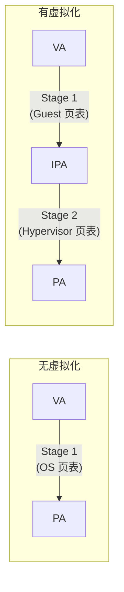

---

## 2. 两阶段翻译架构

### 2.1 翻译阶段定义

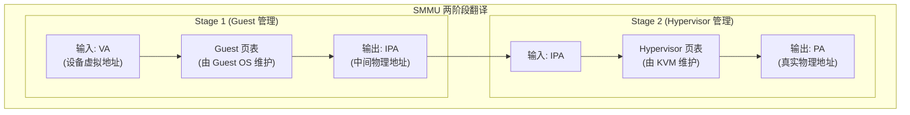

### 2.2 翻译模式分类

SMMU 支持四种翻译模式，由 STE 中的 `Config` 字段决定（`arm-smmu-v3.h:204-208`）：

| Config 值 | 模式 | 说明 | 典型用途 |
|-----------|------|------|----------|
| 0b000 | Abort | 中止所有事务 | 安全隔离 |
| 0b100 | S1+S2 Bypass | 两阶段均旁路 | 调试 |
| 0b101 | S1 Translation | 仅 Stage 1 | 非 virtual化 S1 域 |
| 0b110 | S2 Translation | 仅 Stage 2 | 设备直通 |
| 0b111 | S1+S2 Translation | 嵌套翻译 | vIOMMU / 嵌套虚拟化 |

### 2.3 Linux 驱动中的 Domain 类型

Linux 驱动定义了四种 Domain 阶段类型（`arm-smmu-v3.h:702-707`）：

| 类型 | 枚举值 | 说明 | 虚拟化场景 |
|------|--------|------|------------|
| Stage 1 | `ARM_SMMU_DOMAIN_S1` | VA → PA | 非虚拟化 / Host DMA |
| **Stage 2** | `ARM_SMMU_DOMAIN_S2` | **IPA → PA** | **设备直通** |
| **Nested** | `ARM_SMMU_DOMAIN_NESTED` | **VA → IPA → PA** | **vIOMMU** |
| Bypass | `ARM_SMMU_DOMAIN_BYPASS` | 直接透传 | 调试 |

---

## 3. 虚拟化场景详解

### 3.1 场景总览

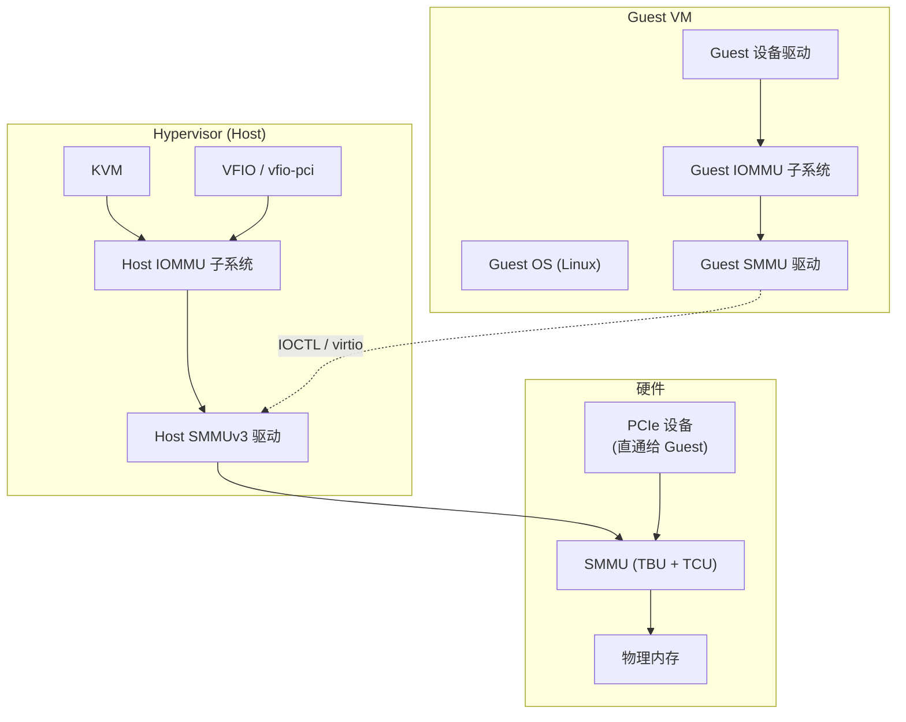

### 3.2 场景一：设备直通（Passthrough）

设备直通是将物理设备直接分配给 Guest VM 使用，Hypervisor 通过 Stage 2 翻译控制设备对物理内存的访问。

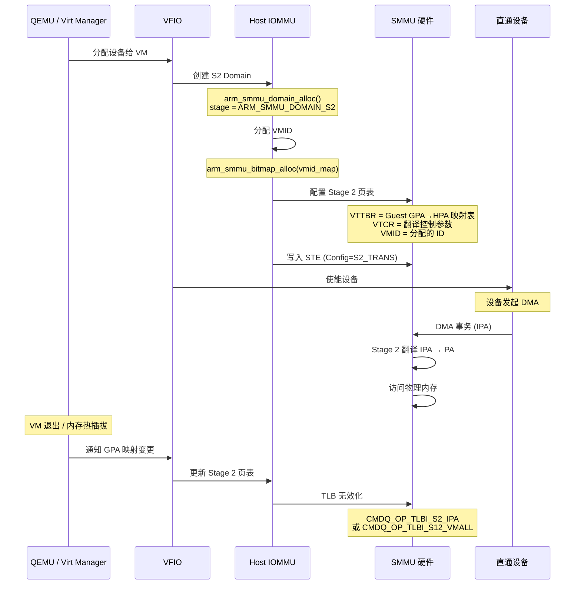

**Stage 2 配置数据结构**（`arm-smmu-v3.h:601-605`）：

```c
struct arm_smmu_s2_cfg {
    u16     vmid;      // 虚拟机标识符
    u64     vttbr;     // Stage 2 页表基址
    u64     vtcr;      // Stage 2 翻译控制寄存器
};
```

**Stage 2 页表初始化流程**（`arm-smmu-v3.c:2138-2161`）：

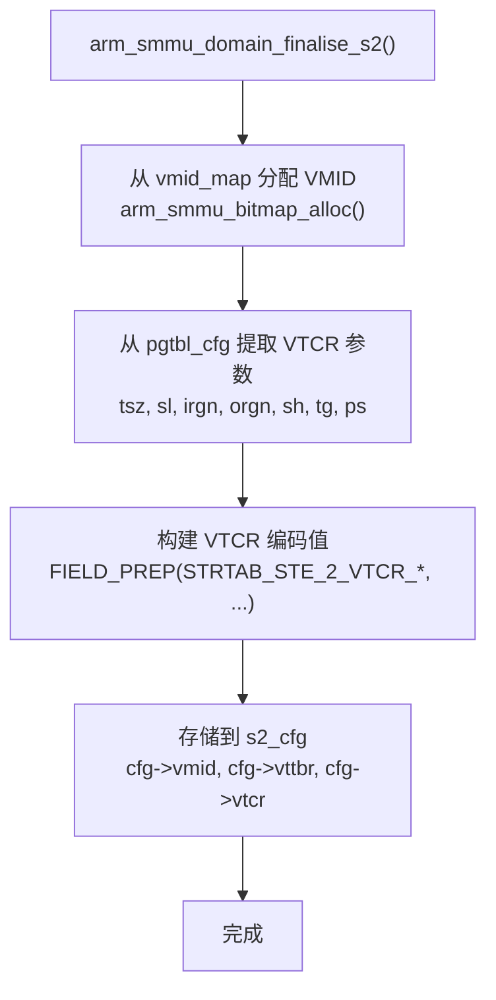

### 3.3 场景二：vIOMMU（嵌套翻译）

vIOMMU 允许 Guest OS 直接管理自己的 IOMMU（包括 Stage 1 翻译），同时 Hypervisor 通过 Stage 2 保证隔离。这是最完整的虚拟化 IOMMU 方案。

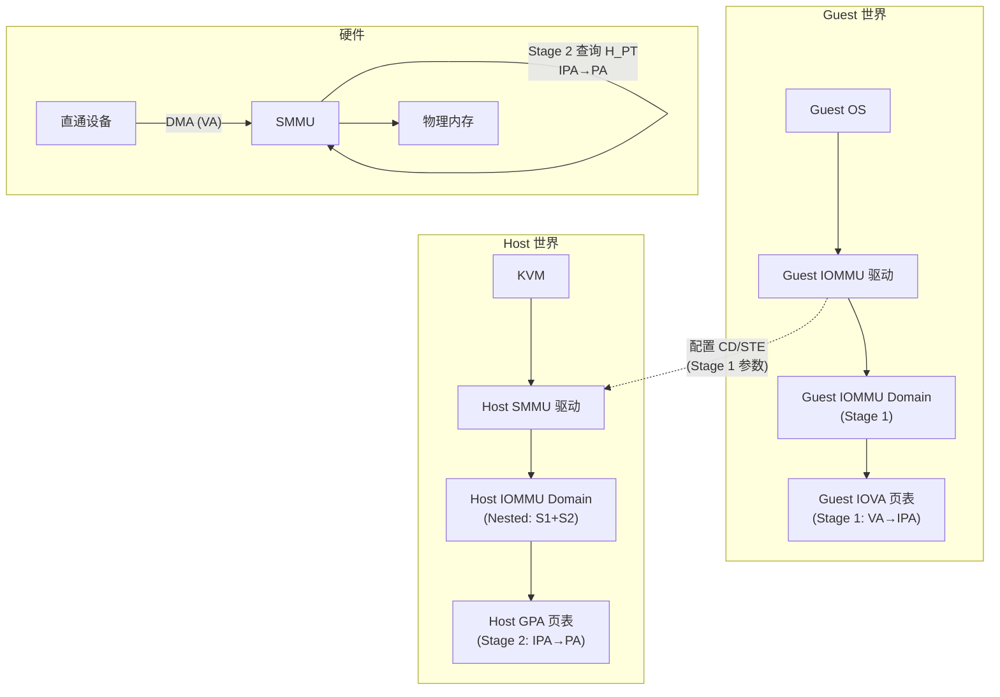

**嵌套域使能流程**（`arm-smmu-v3.c:2733-2746`）：

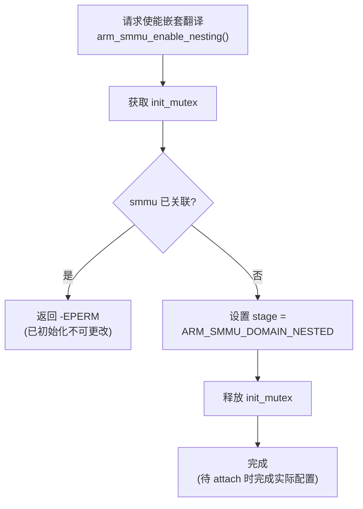

**嵌套模式下 STE 配置**（`arm-smmu-v3.c:1255-1378`）：

当 Domain 阶段为 `NESTED` 时，STE 同时配置 Stage 1 和 Stage 2 参数：

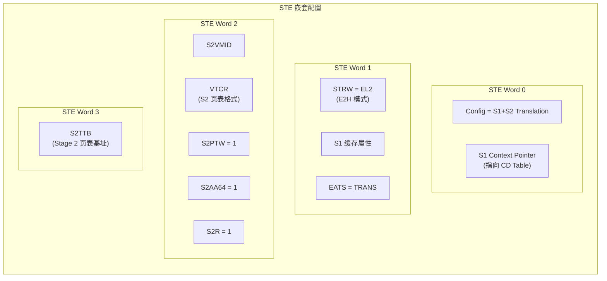

### 3.4 场景对比

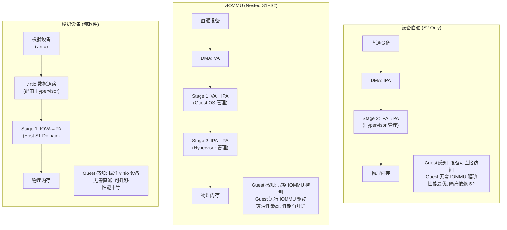

---

## 4. VMID 管理机制

### 4.1 VMID 在虚拟化中的角色

VMID（Virtual Machine Identifier）用于区分不同 Guest VM 的 Stage 2 地址空间。SMMU 使用 VMID 为每个 VM 维护独立的 TLB 条目，避免 VM 切换时的全局 TLB 刷新。

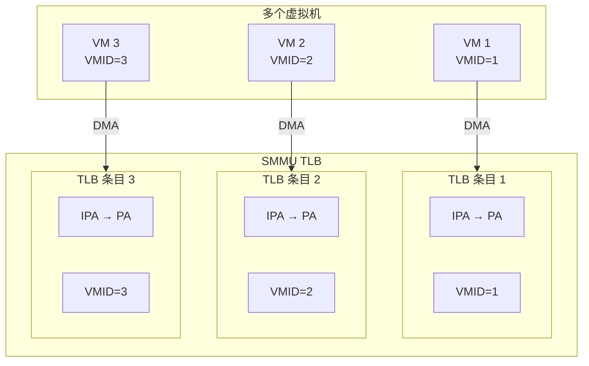

### 4.2 VMID 分配与释放

Linux 驱动使用位图管理 VMID（`arm-smmu-v3.h:664-665`）：

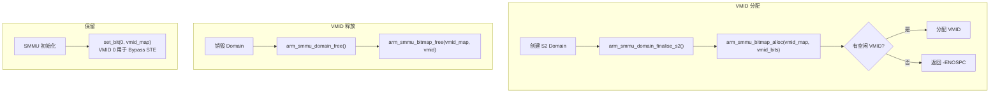

### 4.3 VMID 位宽

| 条件 | IDR0.VMID16 | VMID 位宽 | 可用 VMID 数量 |
|------|-------------|-----------|---------------|
| 基本配置 | 0 | 8-bit | 256 |
| 扩展配置 | 1 | 16-bit | 65536 |

**Linux 驱动特性检测**（`arm-smmu-v3.c:3513`）：
```c
smmu->vmid_bits = reg & IDR0_VMID16 ? 16 : 8;
```

### 4.4 VMID 与 TLB 无效化

VMID 是 TLB 无效化的关键索引参数：

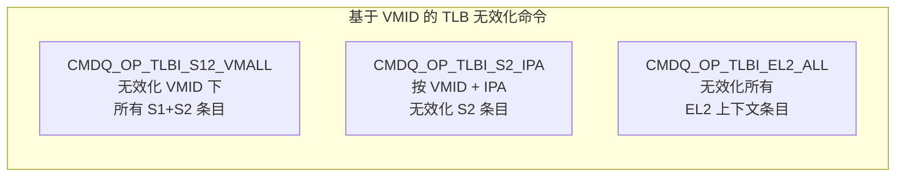

---

## 5. EL2 与 E2H 模式

### 5.1 HYP 特性

`IDR0.HYP` 标志表示 SMMU 支持 Hypervisor 模式（`arm-smmu-v3.h:35`）。当 CPU 运行在 EL2 并启用 E2H（EL2 Host Extension）时，SMMU 的行为会发生变化。

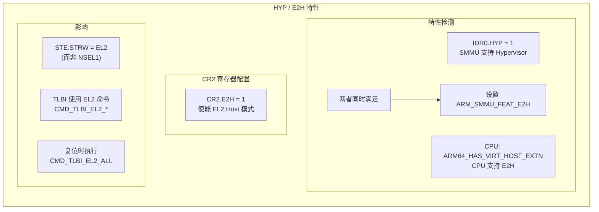

### 5.2 E2H 对 TLB 无效化的影响

当 `ARM_SMMU_FEAT_E2H` 置位时，Linux 驱动使用 EL2 特定的 TLBI 命令：

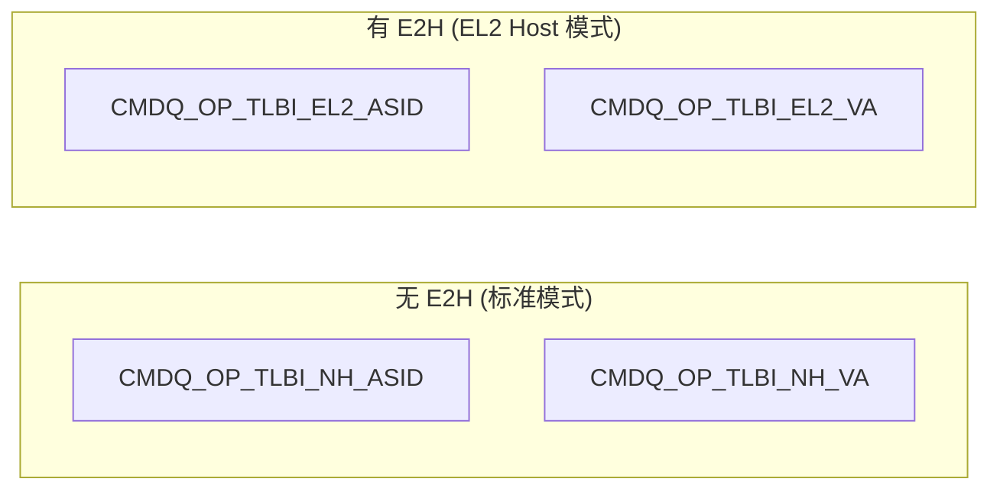

**Linux 驱动中的条件路由**（`arm-smmu-v3.c:944-954`）：

```c
// ASID 级别无效化
.opcode = smmu->features & ARM_SMMU_FEAT_E2H ?
    CMDQ_OP_TLBI_EL2_ASID : CMDQ_OP_TLBI_NH_ASID,

// VA 级别无效化
.opcode = smmu->features & ARM_SMMU_FEAT_E2H ?
    CMDQ_OP_TLBI_EL2_VA : CMDQ_OP_TLBI_NH_VA,
```

### 5.3 STRW（S2 Stage Reject Write）

STE 中的 STRW 字段控制 Stage 2 的属性交互（`arm-smmu-v3.h:236-238`）：

| STRW 值 | 含义 | 使用场景 |
|---------|------|----------|
| `NSEL1` (0) | Non-secure EL1 | 标准 Stage 1+S2 |
| `EL2` (2) | EL2 Host | E2H 模式 |

在 PCIe 模式下（MMU-600AE/700），无论 STRW 实际值如何，DTI 事务属性始终按 `EL1-S2` 计算。

---

## 6. Stage 2 地址翻译详解

### 6.1 Stage 2 页表格式

Stage 2 使用 ARM LPAE（Large Physical Address Extension）页表格式，由 `arm_64_lpae_s2_cfg` 结构描述：

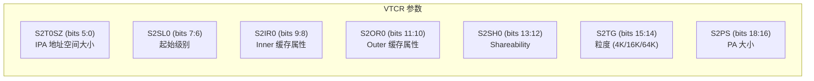

### 6.2 Stage 2 页表遍历

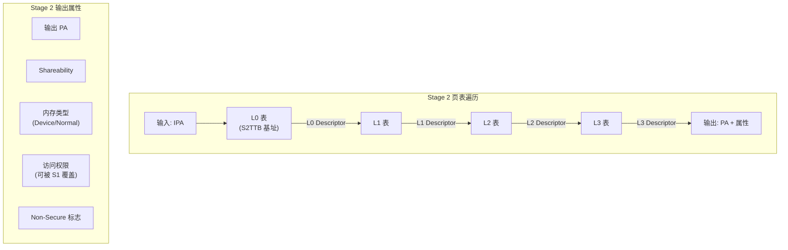

### 6.3 Stage 1 + Stage 2 属性合并

当两个阶段同时启用时，最终的事务属性由两个阶段的输出属性合并决定：

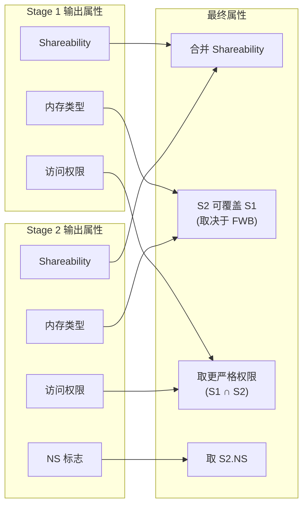

---

## 7. 虚拟化中的 TLB 管理

### 7.1 VM 切换时的 TLB 行为

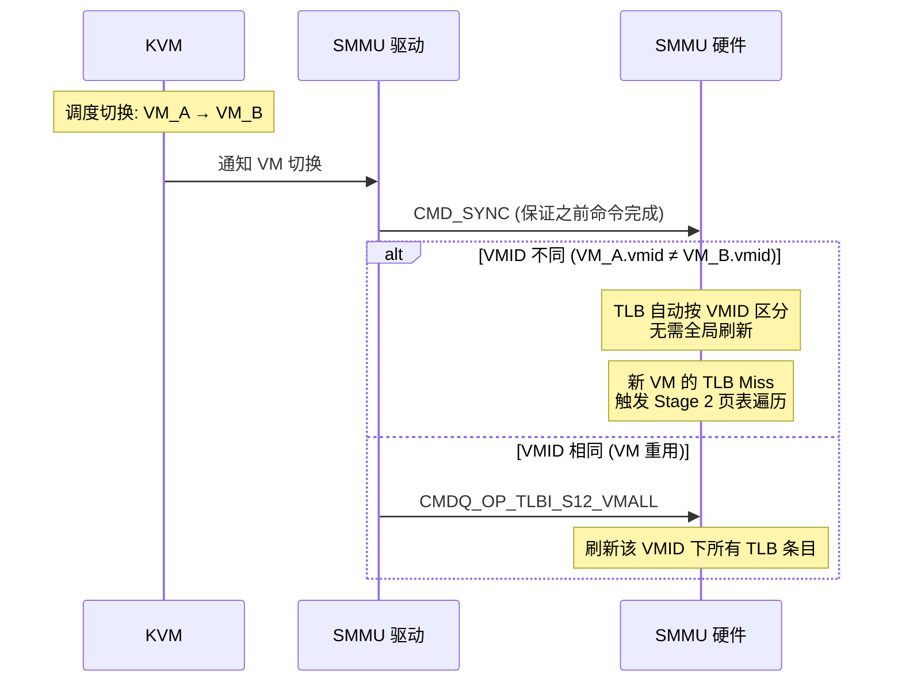

### 7.2 Stage 2 TLB 无效化命令路由

Linux 驱动根据 Domain 阶段选择不同的 TLBI 命令（`arm-smmu-v3.c:1856-1944`）：

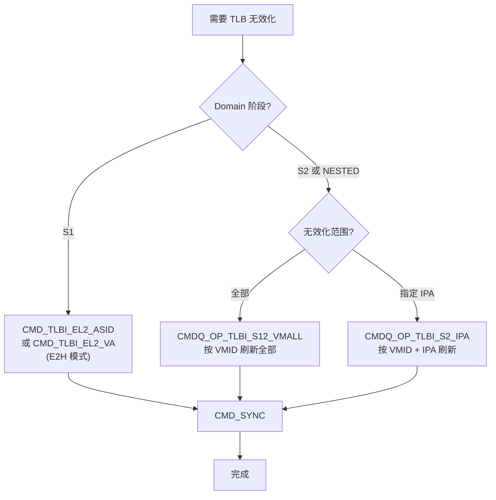

---

## 8. 虚拟化故障处理

### 8.1 Stage 2 故障

当 Stage 2 翻译失败时，SMMU 生成事件并写入 Event Queue。在当前 Linux 驱动中，Stage 2 故障被视为致命错误（`arm-smmu-v3.c:1479-1481`）：

```c
/* Stage-2 is always pinned at the moment */
if (evt[1] & EVTQ_1_S2)
    return -EFAULT;
```

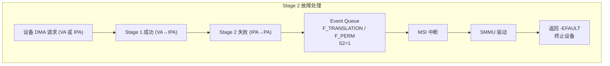

### 8.2 故障事件中的 Stage 标识

Event Queue 条目中 `EVTQ_1_S2` 位（bit 39）标识故障发生在 Stage 2：

| S2 位 | 含义 |
|-------|------|
| 0 | Stage 1 故障 |
| 1 | **Stage 2 故障** |

---

## 9. Secure-EL2 虚拟化

### 9.1 Secure-EL2 支持

MMU-700（SMMUv3.2）引入了 Secure-EL2 支持（`SEL2=1`），允许安全世界也运行 Hypervisor：

```mermaid
graph TB
    subgraph SecureWorld["安全世界"]
        S_EL3["EL3 (Secure Monitor)"]
        S_EL2["Secure EL2<br/>(Secure Hypervisor)"]
        S_EL1["Secure EL1/0<br/>(Secure Guest OS)"]
        S_TBU["Secure TBU"]
        S_TCU["Secure TCU"]
    end

    subgraph NonSecureWorld["非安全世界"]
        NS_EL2["Non-Secure EL2<br/>(Hypervisor)"]
        NS_EL1["Non-Secure EL1/0<br/>(Guest OS)"]
        NS_TBU["Non-Secure TBU"]
        NS_TCU["Non-Secure TCU"]
    end

    S_EL3 <-->|"安全状态切换"| S_EL2
    S_EL2 -->|"两阶段翻译"| S_EL1
    S_EL1 --> S_TBU <--> S_TCU

    NS_EL2 -->|"两阶段翻译"| NS_EL1
    NS_EL1 --> NS_TBU <--> NS_TCU

    S_TCU -.->|"隔离"| NS_TCU
    S_TBU -.->|"隔离"| NS_TBU
```

### 9.2 VMID 分区

| VMID 空间 | 说明 |
|-----------|------|
| Secure VMID | 安全世界使用，独立于 Non-Secure |
| Non-Secure VMID | 非安全世界使用 |
| 两者可以相同值 | 但在 SMMU 内部是独立管理的 |

---

## 10. 虚拟化扩展特性

### 10.1 与虚拟化相关的 SMMU 特性

```mermaid
graph TB
    subgraph Features["虚拟化相关特性"]
        direction TB

        subgraph Core["核心特性"]
            S2P["Stage 2 翻译<br/>(IDR0.S2P)"]
            HYP["Hypervisor 模式<br/>(IDR0.HYP)"]
            VMID16["16-bit VMID<br/>(IDR0.VMID16)"]
            E2H["EL2 Host 扩展<br/>(CR2.E2H)"]
        end

        subgraph Enhanced["增强特性"]
            PTM["Paired TLB Maint.<br/>(CR2.PTM)"]
            RECINVSID["Record Inv. SID<br/>(CR2.RECINVSID)"]
            RIL["Range Inv. (BTM)<br/>(IDR3.RIL)"]
            VMW["VMID Wildcard<br/>(IDR0.VMW)"]
            XNX["EL0/EL1 执行控制<br/>(IDR3.XNX)"]
        end

        subgraph S3P2["SMMUv3.2 独有"]
            SEL2["Secure-EL2<br/>(S_IDR1.SEL2)"]
            HTTU["HW 页表更新<br/>(访问/脏位)"]
            BBML["Break-Before-Make<br/>Level 2"]
        end
    end
```

### 10.2 特性说明

| 特性 | 说明 | 虚拟化价值 |
|------|------|------------|
| **PTM** (Paired TLB Maintenance) | 与 CPU TLB 维护操作配对执行，确保 CPU 侧和 SMMU 侧的 TLB 同步 | 避免 CPU 和 SMMU 的 TLB 不一致 |
| **RECINVSID** (Record Invalidation SID) | 记录触发无效化的 StreamID，帮助调试 | 便于追踪 VM 的 TLB 维护来源 |
| **VMW** (VMID Wildcard) | VMID 通配符匹配，一条命令可同时无效化多个 VMID 的 TLB | 加速 VM 批量切换 |
| **RIL** (Range Invalidaton) | 范围无效化，一次命令覆盖连续地址范围 | 减少大块内存变更时的无效化命令数量 |
| **XNX** (Execute-never at S2) | Stage 2 级别的执行权限控制 | 防止 Guest 设备在 S2 阶段执行非授权内存 |

### 10.3 跨版本虚拟化特性对比

| 特性 | SMMUv2 | MMU-600AE (v3.1) | MMU-700 (v3.2) |
|------|--------|-------------------|-----------------|
| Stage 2 翻译 | Yes | Yes | Yes |
| 嵌套 S1+S2 | Yes | Yes | Yes |
| 8-bit VMID | Yes | Yes | Yes |
| 16-bit VMID | Yes (opt) | Yes | Yes |
| Hyp (EL2) | Yes | Yes | Yes |
| E2H | Yes | Yes | Yes |
| PTM | No | Yes | Yes |
| RECINVSID | No | Yes | Yes |
| VMID Wildcard | No | Yes | Yes |
| Range Inv. (RIL) | No | No | Yes |
| XNX | No | Yes | Yes |
| Secure-EL2 | No | No | Yes |
| HTTU | No | No | Yes |
| DVM 版本 | N/A | DVMv8.1 | DVMv8.4 |

---

## 11. Hypervisor 上下文与 E2HC

### 11.1 SMMUv2 中的 Hypervisor 上下文

在 SMMUv2 中，有两种特殊的上下文 Bank（`arm-smmu-v3.h` 中相关继承）：

```mermaid
graph TB
    subgraph SMMUv2_Banks["SMMUv2 上下文 Bank"]
        direction TB
        STD_CB["标准 Context Bank<br/>(SMMU_CBn)<br/>Guest Stage 1<br/>或 Host Stage 1"]
        HYPC["HYPC Bank<br/>(Hypervisor Context)<br/>匹配 Non-secure EL2<br/>地址翻译体制"]
        E2HC["E2HC Bank<br/>(E2H Context)<br/>使用 CD 中的 ASID<br/>和关联上下文的 VMID"]
    end
```

### 11.2 SMMUv3 中的等效机制

在 SMMUv3 中，上下文 Bank 被 Context Descriptor 替代，Hypervisor 上下文通过以下方式实现：

- **STRW 字段**：设为 `EL2` 表示使用 Hypervisor 上下文
- **E2H 模式**：CR2.E2H=1 使 SMMU 在 EL2 Host 模式下运行
- **独立的 ASID/VMID**：CD 中的 ASID 与 STE 中的 VMID 配合

---

## 12. 虚拟化场景下的设备直通完整流程

### 12.1 端到端流程

```mermaid
flowchart TD
    subgraph Setup["设置阶段"]
        U1["QEMU 启动 VM<br/>配置 -device vfio-pci"]
        U2["VFIO 打开设备<br/>获取设备 FD"]
        U3["VFIO 创建容器<br/>IOMMU Group"]
        U4["VFIO 设置 IOMMU<br/>vfio_iommu_type1_attach_group()"]
        U5["Host IOMMU 创建 S2 Domain<br/>arm_smmu_domain_alloc(S2)"]
        U6["分配 VMID<br/>arm_smmu_bitmap_alloc()"]
        U7["KVM 设置 Stage 2 页表<br/>GPA→HPA 映射"]
        U8["配置 SMMU STE<br/>Config=S2_TRANS<br/>VTTBR/VTCR/VMID"]
        U9["映射设备 IRQ<br/>通过 GIC 直通"]

        U1 --> U2 --> U3 --> U4 --> U5 --> U6 --> U7 --> U8 --> U9
    end

    subgraph Runtime["运行阶段"]
        R1["Guest 设备驱动初始化"]
        R2["设备发起 DMA (GPA)"]
        R3["SMMU Stage 2 翻译<br/>GPA→PA"]
        R4["设备访问物理内存"]

        R1 --> R2 --> R3 --> R4
    end

    subgraph Teardown["销毁阶段"]
        T1["VM 关闭"]
        T2["VFIO 释放设备"]
        T3["Host IOMMU 释放 Domain<br/>TLB 无效化<br/>VMID 释放"]

        T1 --> T2 --> T3
    end
```

### 12.2 GPA 映射变更处理

当 Guest 内存布局发生变化（如内存分配、释放、 ballooning）时：

```mermaid
sequenceDiagram
    participant GOS as Guest OS
    participant KVM as KVM
    participant VFIO as VFIO / IOMMU
    participant SMMU as SMMU

    GOS->>KVM: 内存操作<br/>(alloc/free/balloon)
    KVM->>KVM: 更新 Stage 2 页表

    KVM->>VFIO: 通知 GPA 映射变更
    VFIO->>SMMU: 更新 Stage 2 IO 页表

    alt 部分更新
        SMMU->>SMMU: CMDQ_OP_TLBI_S2_IPA<br/>(按 IPA 范围无效化)
    else 全量更新
        SMMU->>SMMU: CMDQ_OP_TLBI_S12_VMALL<br/>(按 VMID 全量无效化)
    end

    SMMU->>SMMU: CMDQ_OP_CMD_SYNC<br/>(等待完成)
    SMMU-->>VFIO: 完成
    VFIO-->>KVM: 完成
```

---

## 13. SMMUv3 复位与虚拟化

### 13.1 初始化时的 EL2 TLB 清理

SMMU 初始化时，如果支持 HYP 特性，会先清理 EL2 相关的 TLB 条目（`arm-smmu-v3.c:3336-3343`）：

```c
if (smmu->features & ARM_SMMU_FEAT_HYP) {
    cmd.opcode = CMDQ_OP_TLBI_EL2_ALL;
    arm_smmu_cmdq_issue_cmd_with_sync(smmu, &cmd);
}
cmd.opcode = CMDQ_OP_TLBI_NSNH_ALL;
arm_smmu_cmdq_issue_cmd_with_sync(smmu, &cmd);
```

```mermaid
flowchart TD
    INIT["SMMU 初始化"]
    INIT --> CHECK_HYP{"支持 HYP?"}
    CHECK_HYP -->|"是"| EL2_INV["CMDQ_OP_TLBI_EL2_ALL<br/>清理所有 EL2 TLB 条目"]
    CHECK_HYP -->|"否"| NS_INV
    EL2_INV --> NS_INV["CMDQ_OP_TLBI_NSNH_ALL<br/>清理所有 Non-Secure TLB 条目"]
    NS_INV --> DONE["TLB 干净, 可安全使用"]
```

### 13.2 CR2 寄存器初始化

SMMU 初始化时配置 CR2 寄存器（`arm-smmu-v3.c:3305-3311`）：

```mermaid
graph LR
    subgraph CR2_Init["CR2 初始化"]
        PTM_BIT["CR2.PTM = 1<br/>Paired TLB Maint"]
        RECINVSID_BIT["CR2.RECINVSID = 1<br/>记录无效化 SID"]
        E2H_BIT["CR2.E2H = 1<br/>EL2 Host 模式<br/>(仅当 FEAT_E2H)"]
    end
```

---

## 14. 总结

### 14.1 SMMU 虚拟化核心要点

```mermaid
mindmap
  root((SMMU 虚拟化))
    两阶段翻译
      Stage 1: Guest 管理 VA→IPA
      Stage 2: Hypervisor 管理 IPA→PA
      嵌套模式: S1+S2 同时启用
    VMID 管理
      8/16-bit VMID
      位图分配/释放
      VMID 0 保留给 Bypass
      TLB 按 VMID 自动区分
    EL2 / E2H
      Hypervisor 上下文模式
      STRW 字段控制
      EL2 TLBI 命令
      PTM 配对 TLB 维护
    设备直通
      S2 Domain + VFIO
      GPA→HPA 映射
      中断直通 (GIC)
    vIOMMU
      Nested Domain
      Guest 管理自己的 IOMMU
      CD/STE 由 Guest 配置
    安全扩展
      Secure-EL2 (SMMUv3.2)
      安全/非安全 VMID 分区
      HTTU / BBML / FWB
```

### 14.2 关键数据结构汇总

| 数据结构 | 文件位置 | 虚拟化用途 |
|----------|----------|------------|
| `arm_smmu_s2_cfg` | `arm-smmu-v3.h:601` | Stage 2 配置 (VMID, VTTBR, VTCR) |
| `arm_smmu_domain.stage` | `arm-smmu-v3.h:717` | Domain 阶段 (S2/Nested) |
| `arm_smmu_domain.s2_cfg` | `arm-smmu-v3.h:720` | Domain 中的 S2 配置 |
| `vmid_map` | `arm-smmu-v3.h:665` | VMID 位图分配器 |
| `STRW` 字段 | `arm-smmu-v3.h:236` | EL2 上下文选择 |
| `S2VMID` 字段 | `arm-smmu-v3.h:243` | STE 中的 VMID |
| `VTCR` 字段 | `arm-smmu-v3.h:244` | STE 中的 S2 控制寄存器 |
| `S2TTB` 字段 | `arm-smmu-v3.h:257` | STE 中的 S2 页表基址 |
