# 主从异构 Die SMMUv3 SoC 架构设计

## 1. 系统概述

### 1.1 目标架构

本文档分析一种主从异构 Die 的 SoC 设计方案：

- **主 Die**：CPU 集群 + SMMU TCU + TBU + CMN (Coherent Mesh Network) + 主存控制器 + GIC
- **从 Die**：SMMU TCU + TBU + 设备端点（PCIe/加速器），**无 CMN、无 CPU、无本地内存控制器**

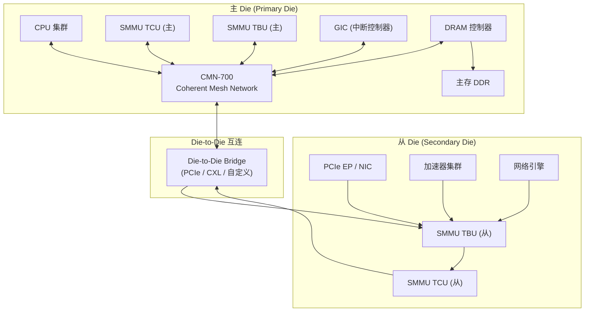

### 1.2 设计约束

| 约束 | 说明 |
|------|------|
| 从 Die 无 CMN | 无法直接参与 CMN coherence domain |
| 从 Die 无 CPU | 所有翻译配置必须由主 Die CPU 完成 |
| 从 Die 无本地内存 | 所有 DMA 最终访问主 Die 主存 |
| Die-to-Die 带宽有限 | D2D 互连带宽远低于片内互连 |
| Die-to-Die 延迟高 | D2D 互连延迟远高于片内（通常 10x~50x） |

---

## 2. 从 Die SoC 架构设计

### 2.1 问题一：从 Die TBU-TCU 互连拓扑

**问题**：从 Die 没有主 Die 的 CMN，TBUs 和 TCU 之间需要独立的互连方案。

**分析**：

SMMUv3 的 DTI (Distributed Translation Interface) 是基于 AXI4/AXI5-Stream 协议的点对点连接。在单 Die 内，DTI switch 可以将多个 TBU 聚合后连接到 TCU。但在从 Die 上，需要考虑 TCU 放置位置对性能的影响。

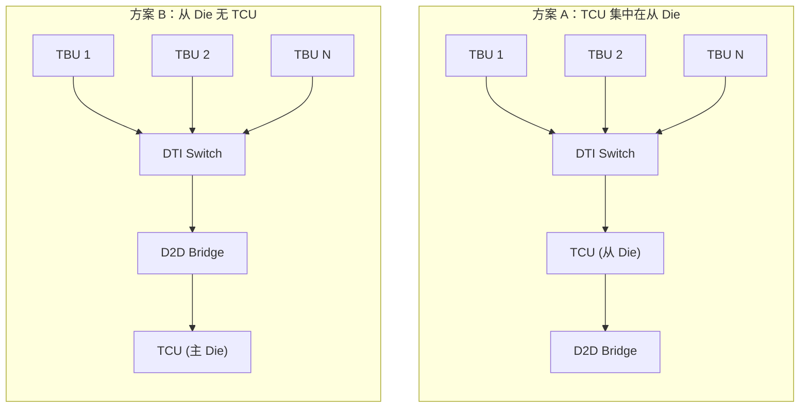

**方案对比**：

| 维度 | 方案 A（从 Die 有 TCU） | 方案 B（从 Die 无 TCU） |
|------|------------------------|------------------------|
| 翻译延迟 | TLB 命中时本地完成，无 D2D 开销 | 每次翻译都需跨 Die |
| D2D 带宽 | 仅页表遍历未命中时访问 D2D | 所有翻译请求都占用 D2D |
| 配置表访问 | CD/STE 可缓存在从 Die 配置缓存 | 配置缓存集中在主 Die |
| 硬件成本 | 从 Die 需要 TCU（面积/功耗） | 从 Die 仅需 TBU+DTI |
| DTI 互连 | 片内 DTI Switch（低延迟） | D2D 互连替代 DTI（需协议适配） |
| 可扩展性 | 从 Die 可独立工作 | 依赖主 Die TCU 容量 |

**推荐方案**：**方案 A**。从 Die 放置独立 TCU，理由：
1. 页表遍历是内存密集型操作，每次跨 Die 的代价太高
2. 配置缓存本地化可显著减少 D2D 事务
3. TCU 支持本地 PRIQ/EVTQ 处理，减少跨 Die 中断

### 2.2 问题二：从 Die 与主存的数据通路

**问题**：从 Die 设备 DMA 的最终目标是主 Die 主存，翻译后的物理地址访问需跨 Die。

**分析**：

SMMU 翻译完成后，设备发出的 DMA 事务携带的是物理地址（PA）。该 PA 访问的路径取决于内存系统拓扑。

```mermaid
graph TB
    subgraph Path1["路径 1：经 D2D 到主存"]
        P1_DEV["从 Die 设备"]
        P1_TBU["从 Die TBU"]
        P1_TCU["从 Die TCU<br/>翻译 VA→PA"]
        P1_D2D_OUT["D2D Bridge (出)"]
        P1_CMN["主 Die CMN"]
        P1_DRAM["主存"]

        P1_DEV --> P1_TBU --> P1_TCU
        P1_TCU -->|"DMA (PA)"| P1_D2D_OUT --> P1_CMN --> P1_DRAM
    end

    subgraph Path2["路径 2：D2D Bridge 集成 snoop"]
        P2_DEV["从 Die 设备"]
        P2_TBU["从 Die TBU"]
        P2_TCU["从 Die TCU<br/>翻译 VA→PA"]
        P2_D2D["D2D Bridge<br/>(带 cache coherent 接口)"]
        P2_CMN["主 Die CMN"]
        P2_DRAM["主存"]

        P2_DEV --> P2_TBU --> P2_TCU
        P2_TCU -->|"DMA (PA)"| P2_D2D --> P2_CMN --> P2_DRAM
    end
```

**方案**：D2D Bridge 需要支持将翻译后的 DMA 事务路由到主 Die 内存系统。D2D Bridge 可采用：
- **PCIe/CXL 协议**：翻译后 PA 作为 PCIe/CXL 地址，由主 Die RC 解析
- **自定义协议**：D2D Bridge 直接桥接到主 Die CMN 的 RN-F（Fully coherent Requesting Node）端口

### 2.3 问题三：从 Die 无 CMN 的缓存一致性

**问题**：从 Die 没有 CMN，无法直接参与主 Die 的 coherence domain。但 SMMUv3 硬件缓存一致性要求 TCU 页表遍历能观察到 CPU 对页表的修改。

**分析**：

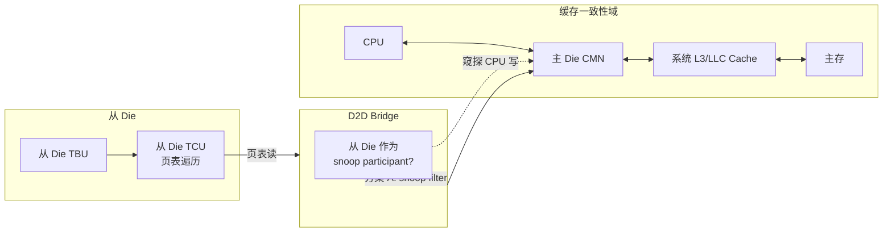

**方案矩阵**：

| 方案 | 说明 | 一致性 | 延迟 | 复杂度 |
|------|------|--------|------|--------|
| **A: D2D Bridge 作为 snoop participant** | 从 Die TCU 通过 D2D Bridge 加入 CMN snoop domain | 强一致 | 页表读需跨 Die 等待 snoop | 中 |
| **B: 非一致性 + 软件维护** | TCU 页表遍历不保证强一致，软件通过 CMD_TLBI + DVM 同步 | 最终一致（依赖软件） | 页表读直接读内存 | 低 |
| **C: D2D Bridge 带 local cache + snoop** | D2D Bridge 侧缓存页表条目，并参与 snoop | 强一致 | 缓存命中时低延迟 | 高 |

**推荐方案**：**方案 A**，从 Die TCU 的 QTW/DVM 接口通过 D2D Bridge 参与主 Die 的 coherence domain。理由：
1. SVA 等特性要求 FEAT_COHERENCY，TCU 必须看到 CPU 对页表的实时修改
2. DVM 同步需要 TCU 能接收 CPU 发出的 DVM 广播

### 2.4 问题四：DVM 跨 Die 传播

**问题**：CPU 在主 Die 发出的 DVM TLB 无效化广播需要到达从 Die 的 TBU。

**分析**：

DVM (Distributed Virtual Memory) 是 ARM 的 TLB 同步机制。在主 Die 中，CPU 的 DVM 事务通过 CMN 广播到所有 TBU。从 Die 的 TBU 需要也能接收到 DVM 事务。

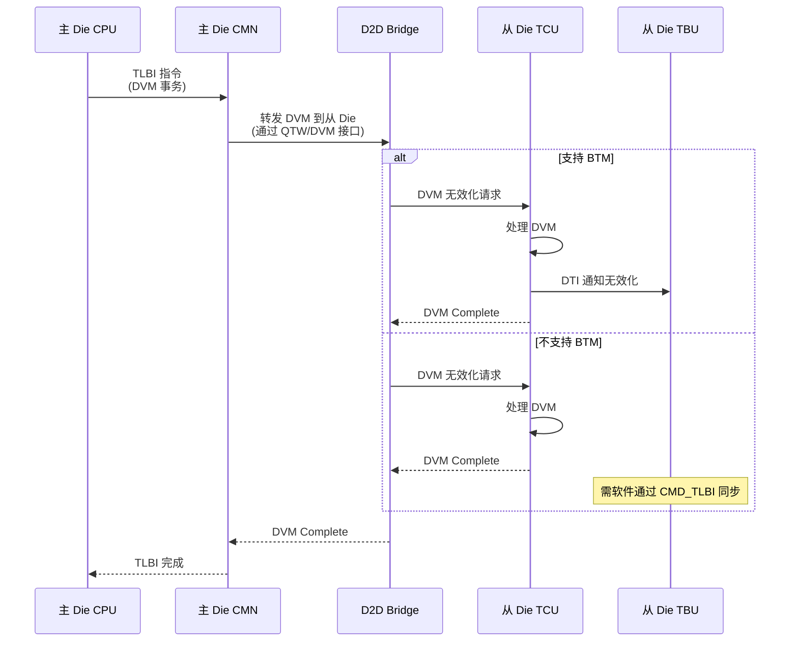

**方案**：
- **硬件路径**：D2D Bridge 的 QTW/DVM 接口连接从 Die TCU，使 CPU DVM 能跨 Die 传播
- **BTM 支持**：从 Die TCU 启用 `sup_btm`，接收 DVM 后自动无效化本地 TLB
- **后备方案**：若硬件不支持跨 Die DVM，驱动需要在 `arm_smmu_tlb_inv_asid()` 中额外发送跨 Die CMD_TLBI

### 2.5 问题五：从 Die 的中断路由

**问题**：从 Die 的 TBU/TCU 产生的中断（EVTQ/PRIQ/GERROR）和设备 MSI 需要路由到主 Die 的 GIC。

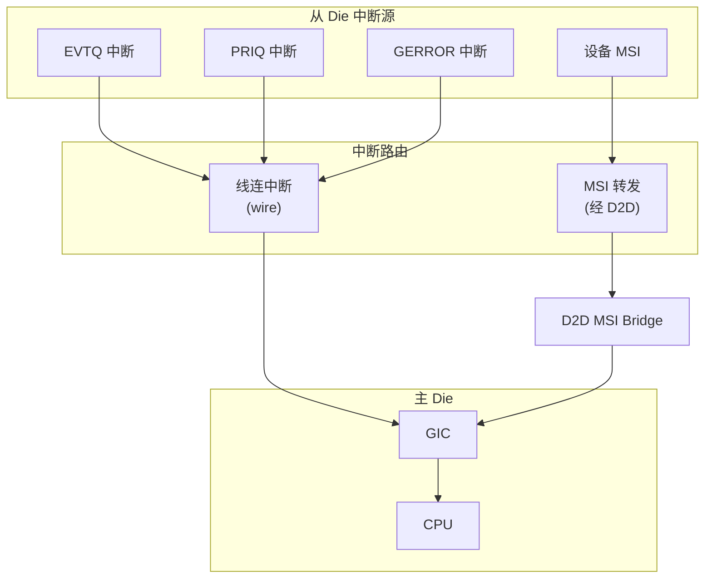

**方案**：
- **TCU 线连中断**：从 Die TCU 的 EVTQ/PRIQ/GERROR 中断信号通过专用线连直接连接到主 Die GIC（需要足够的 Die-to-Die 中断线）
- **设备 MSI 转发**：从 Die 设备的 MSI 通过 D2D Bridge 的 MSI 转发机制到达主 Die GIC
- **MMU-700 专用 MSI 接口**：若从 Die 使用 MMU-700，可利用 TCU 专用 MSI 接口通过 D2D 发送 MSI 数据包

### 2.6 问题六：从 Die 地址空间映射

**问题**：从 Die TCU/TBU 的 MMIO 寄存器和队列内存需要被主 Die CPU 访问。

**分析**：

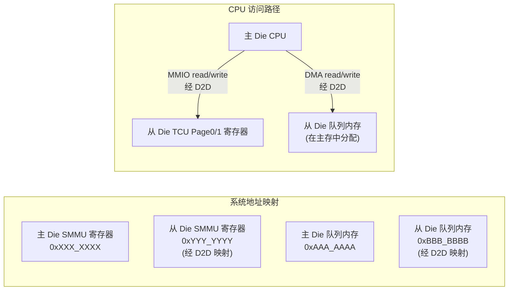

**方案**：
- **寄存器访问**：从 Die TCU 的 MMIO 寄存器通过 D2D Bridge 映射到主 Die 系统地址空间，CPU 可直接读写
- **队列内存**：从 Die TCU 的 CMDQ/EVTQ/PRIQ 内存分配在主 Die 主存中，从 Die TCU 通过 D2D DMA 访问这些队列。这是可行的，因为 SMMUv3 规范明确支持队列在任意可寻址内存位置
- **页表和配置表**：同理，Stream Table 和 CD Table 分配在主存中

### 2.7 问题七：从 Die Stream Table 与主 Die 的统一

**问题**：从 Die 的设备有独立的 StreamID 空间，需要与主 Die 的 IOMMU 子系统统一管理。

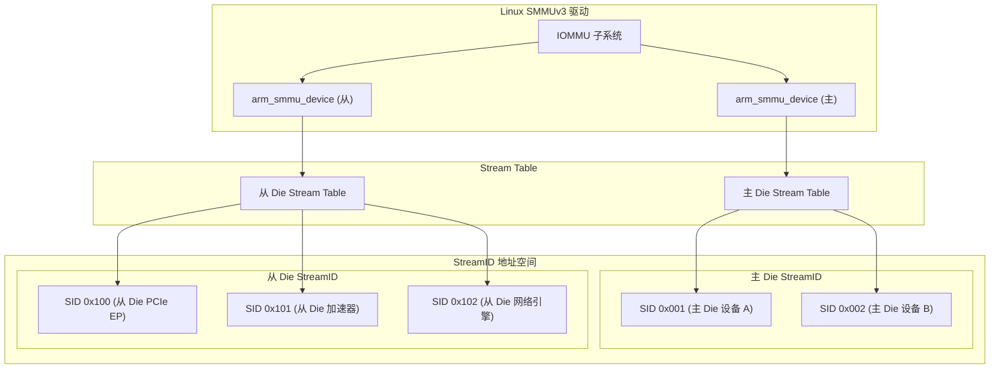

**方案**：
- 从 Die TCU 注册为独立的 `arm_smmu_device` 实例
- ACPI IORT 表或 Device Tree 中描述从 Die SMMU 及其 StreamID 范围
- Linux 驱动通过 `arm_smmu_device_probe()` 分别初始化主/从 Die SMMU
- 每个 `arm_smmu_device` 有独立的 Stream Table、CMDQ、EVTQ

---

## 3. 软件架构设计

### 3.1 问题八：SMMU 实例发现与初始化顺序

**问题**：从 Die SMMU 的发现方式、初始化依赖（D2D 就绪、主存访问通路）和启动顺序。

```mermaid
flowchart TD
    subgraph BootSeq["启动顺序"]
        B1["1. 主 Die CPU Boot"]
        B2["2. CMN 初始化"]
        B3["3. D2D Bridge 初始化<br/>建立主从 Die 链路"]
        B4["4. 主 Die TCU 探测与初始化"]
        B5["5. 从 Die TCU 探测<br/>(经 D2D 访问 MMIO)"]
        B6["6. 从 Die TBU 状态检查"]
        B7["7. 主 Die SMMU 驱动 probe"]
        B8["8. 从 Die SMMU 驱动 probe"]
        B9["9. 队列分配 (主存)"]
        B10["10. Stream Table 配置"]
        B11["11. CR0 使能 (先主后从)"]
        B12["12. 设备发现与附加"]

        B1 --> B2 --> B3 --> B4 --> B5
        B5 --> B6 --> B7 --> B8
        B8 --> B9 --> B10 --> B11 --> B12
    end
```

**方案**：
- **ACPI IORT**：在 IORT 表中添加从 Die SMMU 节点，包含其经 D2D 映射的 MMIO 基地址
- **Device Tree**：添加从 Die SMMU 的 `compatible = "arm,smmu-v3"` 节点
- **初始化依赖**：确保 D2D Bridge 在 SMMU probe 之前完成初始化
- **从 Die TCU 时钟/复位**：通过 D2D Bridge 的侧带信号或独立的复位控制器管理

### 3.2 问题九：队列内存分配与 DMA 一致性

**问题**：从 Die SMMU 的 CMDQ/EVTQ/PRIQ 分配在主存中，从 Die TCU 通过 D2D 访问，存在 DMA 一致性问题。

**分析**：

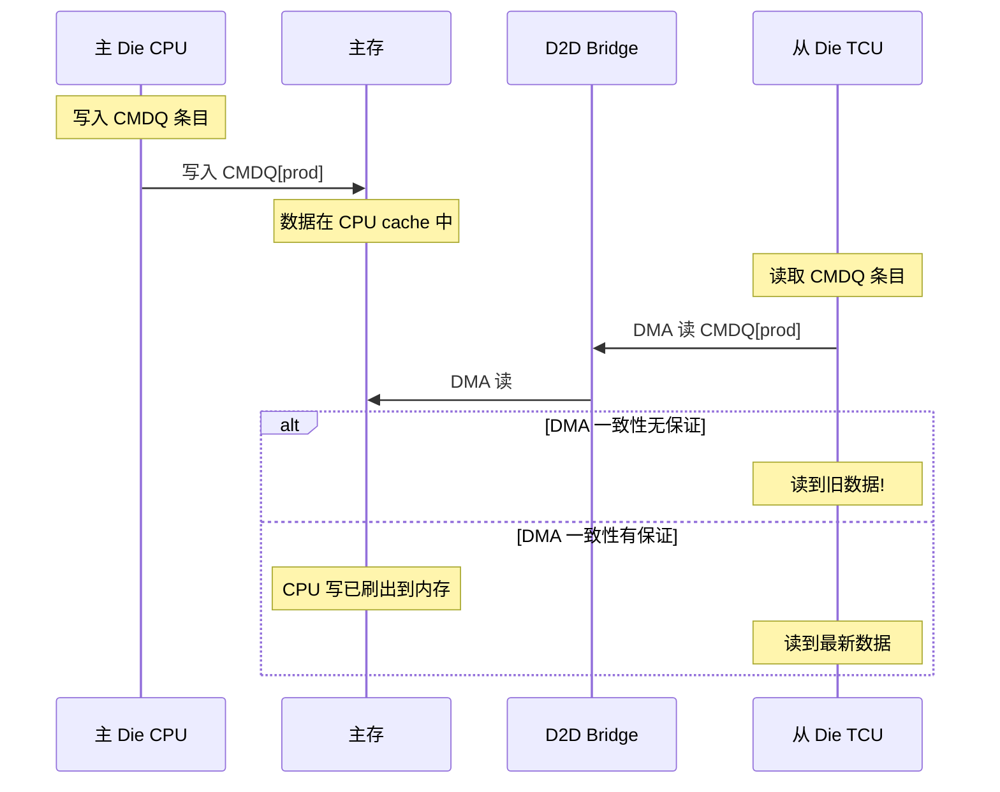

**方案**：

| 方案 | 说明 | 适用场景 |
|------|------|----------|
| **DMA coherent 内存分配** | 使用 `dmam_alloc_coherent()`，CPU 侧 uncached | 默认方案，性能有损失 |
| **DMA write combining** | 使用 `dma_alloc_writecombine()`，CPU 侧 buffered write | D2D Bridge 支持 WC 时可用 |
| **显式 cache 管理** | 普通分配 + `dma_sync_*()` 系列调用 | 性能最优但复杂度高 |
| **从 Die 侧本地 cache** | D2D Bridge 侧为队列内存维护 snoop filter | 需硬件支持 |

**关键代码路径**（`arm-smmu-v3.c`）：
```c
// 队列分配使用 DMA coherent API
cdcfg->cdtab = dmam_alloc_coherent(smmu->dev, l1size, &cdcfg->cdtab_dma, GFP_KERNEL);
```

若从 Die TCU 的内存接口不是 cache coherent 的，需要确保：
1. 驱动在 `arm_smmu_cmdq_issue_cmdlist()` 后调用 `dma_wmb()` 或 `dma_sync_single_for_device()`
2. TCU 读取队列前，D2D Bridge 需要发起 snoop 获取最新数据

### 3.3 问题十：跨 Die TLB 无效化策略

**问题**：Linux 驱动的 TLB 无效化逻辑需要覆盖从 Die 的 TBU。

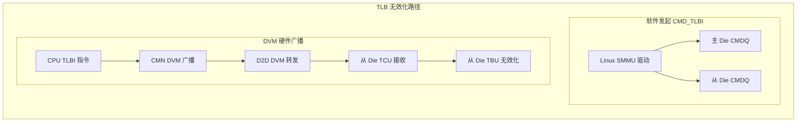

**方案矩阵**：

| 方案 | 机制 | 覆盖范围 | 软件改动 |
|------|------|----------|----------|
| **A: 双 CMDQ** | 驱动同时向主/从 Die CMDQ 发送 TLBI | 所有从 Die TBU | 需要维护两个 CMDQ |
| **B: 跨 Die DVM** | CPU DVM 经 CMN→D2D 传播到从 Die | 所有从 Die TBU (BTM) | 驱动无需改动 |
| **C: A + B 组合** | DVM 自动 + CMDQ 兜底 | 最完整 | D2D 不可用时 fallback |

**推荐**：**方案 C**。
- 正常路径：CPU DVM 自动传播，无需驱动干预（BTM 模式）
- 兜底路径：驱动在 `arm_smmu_tlb_inv_asid()` 中向从 Die CMDQ 发送额外 TLBI
- 从 Die TCU 的 `sup_btm` 必须为 HIGH

### 3.4 问题十一：SVA 在从 Die 的支持

**问题**：从 Die 设备是否支持 SVA，以及 MMU Notifier + ATC 无效化如何跨 Die 工作。

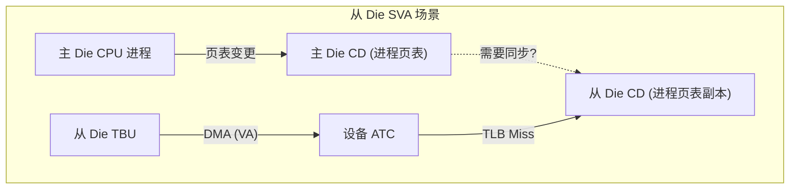

**问题分析**：

| 子问题 | 说明 |
|--------|------|
| CD 同步 | 从 Die TCU 的 CD 缓存需要与主 Die 保持一致 |
| MMU Notifier 回调 | `invalidate_range` 需要同时无效化从 Die 的 TLB 和 ATC |
| ATC 无效化 | CMD_ATC_INV 需要到达从 Die TBU（ATS 事务的 ATC 在设备本地） |
| PRI/Stall | 从 Die TCU 的 EVTQ/PRIQ 在主存中，主 Die CPU 可以处理 |

**方案**：
- **CD 配置缓存同步**：CD 缓存在从 Die TCU 中，当 CPU 更新 CD 时，驱动发送 `CMD_CFGI_CD` 到从 Die CMDQ
- **MMU Notifier 集成**：在 `arm_smmu_tlb_inv_range_asid()` 中同时向主/从 Die 发送 TLBI + ATC_INV
- **ATC 无效化**：`arm_smmu_atc_inv_domain()` 向从 Die TBU 所在 SID 发送 CMD_ATC_INV（ATC 无效化通过 SMMU 命令完成，ATS response 通知设备，无需跨 Die 直接操作设备 ATC）

### 3.5 问题十二：从 Die 故障处理

**问题**：从 Die 的 EVTQ 在主存中，但 PRIQ 和 Stall 模式的处理需要考虑 D2D 延迟。

```mermaid
sequenceDiagram
    participant DEV as 从 Die 设备
    participant TBU_S as 从 Die TBU
    participant TCU_S as 从 Die TCU
    participant D2D as D2D Bridge
    participant DRAM as 主存
    participant CPU as 主 Die CPU
    participant GIC as 主 Die GIC

    DEV->>TBU_S: DMA (VA)
    TBU_S->>TCU_S: 翻译请求
    TCU_S->>TCU_S: 翻译失败, Stall

    TCU_S->>DRAM: 写入 EVTQ 条目<br/>(经 D2D, 高延迟!)
    TCU_S->>GIC: EVTQ MSI 中断

    CPU->>CPU: MSI handler
    CPU->>DRAM: 读取 EVTQ

    Note over CPU: 处理故障
    CPU->>DRAM: 写入 CMD_RESUME 到 CMDQ<br/>(经 D2D)
    DRAM->>D2D->>TCU_S: TCU 读取 CMDQ
    TCU_S->>TBU_S: Resume 事务
```

**关键问题**：从 Die 故障处理的 **全路径延迟** 包括：
1. TCU 写 EVTQ 到主存（D2D 往返）
2. CPU 读 EVTQ（可能 cache miss）
3. CPU 处理 + 写 CMD_RESUME（D2D 往返）
4. TCU 读 CMDQ（D2D 往返）

**方案**：
- **增大 STALL_MAX**：从 Die TCU 的 `STALL_MAX` 应适当增大，容忍更长的故障处理延迟
- **优先使用 PRI**：对于支持 PRI 的 PCIe 设备，优先使用 PRI 路径而非 Stall（PRI 不阻塞事务，设备可以继续其他工作）
- **MSI 使用专用线连**：避免 EVTQ/PRIQ MSI 经 D2D 的额外延迟

### 3.6 问题十三：性能优化 — 从 Die 翻译缓存命中率

**问题**：从 Die TBU 的 TLB 命中率直接影响 DMA 性能，每次跨 Die 翻译代价很高。

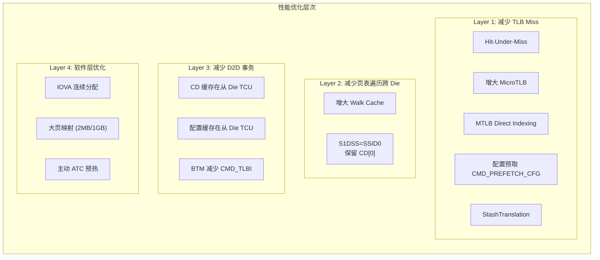

**详细优化方案**：

| 优化 | 层级 | 说明 | 效果 |
|------|------|------|------|
| 增大从 Die MicroTLB | L1 | 增加 TBU 本地 TLB 容量 | 减少 TCU 请求 |
| MTLB Direct Indexing | L1 | 外部直接管理 MTLB 条目 | 适用于固定映射 |
| StashTranslation | L1 | 预热 TBU 翻译缓存 | 消除冷启动 Miss |
| 增大从 Die Walk Cache | L2 | 增加 TCU 页表遍历缓存 | 减少主存访问 |
| 本地配置缓存 | L3 | 从 Die TCU 本地缓存 STE/CD | 避免每次跨 Die 读取 |
| BTM + DVM | L3 | 硬件自动同步 TLB | 减少跨 Die CMD_TLBI |
| IOVA 连续分配 | L4 | 驱动侧连续分配 IOVA | 提高 ATC/TLB 效率 |
| 大页映射 | L4 | 使用 2MB/1GB 大页 | 减少页表级数 |

### 3.7 问题十四：驱动架构改造

**问题**：Linux SMMUv3 驱动需要感知从 Die 的存在，并对跨 Die 操作做适配。

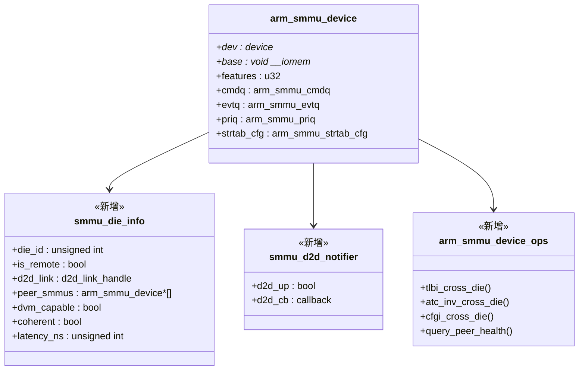

**关键驱动改造点**：

| 函数/模块 | 改造内容 |
|-----------|----------|
| `arm_smmu_device_probe()` | 增加 D2D 附属设备探测逻辑 |
| `arm_smmu_cmdq_issue_cmd()` | 对跨 Die CMDQ 操作增加超时容忍 |
| `arm_smmu_tlb_inv_asid()` | 向 peer SMMU 的 CMDQ 额外发送 TLBI |
| `arm_smmu_atc_inv_domain()` | 向 peer SMMU 的 CMDQ 额外发送 ATC_INV |
| `arm_smmu_write_ctx_desc()` | 向 peer SMMU 的 CMDQ 发送 CFGI_CD |
| `arm_smmu_evtq_thread()` | 处理从 Die TCU 写入的 EVTQ 条目 |
| `arm_smmu_priq_thread()` | 处理从 Die TCU 写入的 PRIQ 条目 |
| IORT/OF 解析 | 增加 from Die SMMU 节点的解析 |
| `arm_smmu_device_reset()` | 增加从 Die TCU 复位逻辑 |
| Device hotplug | 支持从 Die 设备热插拔 |

### 3.8 问题十五：错误恢复与容错

**问题**：D2D 链路故障时，从 Die SMMU 的行为和恢复策略。

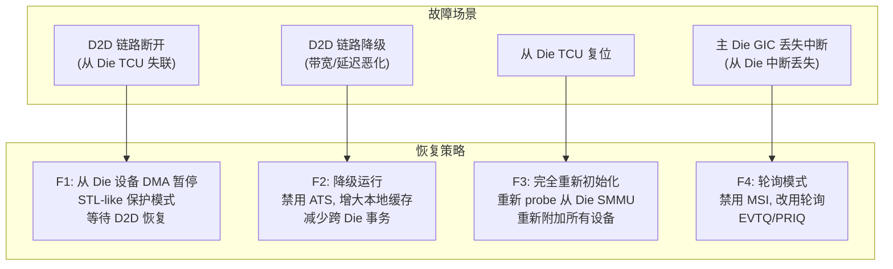

**详细容错方案**：

| 故障 | 检测方式 | 恢复动作 |
|------|----------|----------|
| D2D 完全断开 | GERROR.SFM_ERR / CMDQ 超时 | 将从 Die 设备置于 bypass/abort 模式 |
| D2D 间歇性故障 | CMDQ cons 不推进 / GERROR | 重试 + 增大超时 |
| 从 Die TCU 死锁 | CMD_SYNC 超时 | GERROR 处理 + TCU 复位 |
| 队列溢出 | EVTQ/PRIQ overflow 标志 | 增大队列 / 降低设备负载 |

---

## 4. 端到端数据通路分析

### 4.1 正常 DMA 写通路

```mermaid
sequenceDiagram
    participant DEV as 从 Die 设备
    participant TBU_S as 从 Die TBU
    participant TCU_S as 从 Die TCU
    participant D2D as D2D Bridge
    participant CMN as 主 Die CMN
    participant DRAM as 主存
    participant CPU as 主 Die CPU

    DEV->>TBU_S: DMA Write (VA)
    Note over TBU_S: MicroTLB Miss
    TBU_S->>TCU_S: DTI 翻译请求 (StreamID, VA)
    Note over TCU_S: 配置缓存命中 (STE/CD)

    alt Walk Cache 命中
        Note over TCU_S: Walk Cache 命中, 直接得到 PA
    else Walk Cache 未命中
        TCU_S->>D2D: 页表遍历读请求
        D2D->>CMN: Coherent 读请求
        CMN->>DRAM: 读页表
        DRAM-->>CMN-->>D2D-->>TCU_S: 页表条目
        Note over TCU_S: 缓存到 Walk Cache
    end

    TCU_S-->>TBU_S: 翻译结果 (PA + 属性)
    Note over TBU_S: 缓存到 MicroTLB
    TBU_S->>D2D: DMA Write (PA, data)
    D2D->>CMN: Coherent Write
    CMN->>DRAM: 写入数据

    Note over CPU: CPU 直接从 DRAM 读取<br/>(CMN 保证一致性)
```

### 4.2 翻译故障处理通路

```mermaid
sequenceDiagram
    participant DEV as 从 Die 设备
    participant TBU_S as 从 Die TBU
    participant TCU_S as 从 Die TCU
    participant D2D as D2D Bridge
    participant DRAM as 主存
    participant CPU as 主 Die CPU
    participant GIC as GIC

    DEV->>TBU_S: DMA (VA)
    TBU_S->>TCU_S: 翻译请求
    Note over TCU_S: 翻译失败!
    TCU_S->>TBU_S: Stall 事务

    par 写入 EVTQ (经 D2D)
        TCU_S->>D2D: DMA Write EVTQ 条目
        D2D->>DRAM: 写入主存 EVTQ
    and 发送 MSI (线连)
        TCU_S->>GIC: EVTQ MSI (专用线连)
    end

    GIC->>CPU: 中断
    CPU->>DRAM: 读 EVTQ
    Note over CPU: 处理缺页<br/>(填充页表)

    CPU->>DRAM: 写 CMD_RESUME 到 CMDQ
    Note over DRAM: 需要等待 TCU 从 CMDQ 读取

    TCU_S->>D2D: DMA Read CMDQ
    D2D->>DRAM: 读 CMDQ
    DRAM-->>D2D-->>TCU_S: CMD_RESUME (Retry)
    TCU_S->>TBU_S: 恢复事务
    TBU_S->>TCU_S: 重新翻译
    Note over TCU_S: 翻译成功
```

### 4.3 延迟分析

```mermaid
graph TB
    subgraph LatencyComp["DMA 延迟组成"]
        direction TB
        L1["L1: 设备→TBU (片内)"]
        L2["L2: TBU→TCU (片内 DTI)"]
        L3["L3: TCU 配置/Walk Cache"]
        L4["L4: 页表遍历 (跨 D2D 到主存)"]
        L5["L5: TCU→TBU (翻译结果回传)"]
        L6["L6: TBU→D2D→CMN→主存 (DMA 数据)"]

        L1 & L2 & L5 ~ L1ns["~1ns (片内)"]
        L4 ~ L4ns["~100ns (跨 Die)"]
        L6 ~ L6ns["~100ns (跨 Die)"]
    end
```

| 路径 | 典型延迟 | 优化后 | 占比 |
|------|----------|--------|------|
| 设备 → TBU（片内） | ~1ns | — | 低 |
| TBU → TCU（片内 DTI） | ~2-5ns | — | 低 |
| TCU 配置/Walk Cache | ~5-10ns | 增大缓存 | 低 |
| **页表遍历（跨 D2D）** | **~50-200ns** | **Walk Cache + Stash** | **高** |
| 翻译结果回传（片内） | ~2-5ns | — | 低 |
| **DMA 数据（跨 D2D）** | **~50-200ns** | **不可避免的瓶颈** | **高** |

**结论**：性能瓶颈在跨 Die 的页表遍历和 DMA 数据传输。优化重点是最大化从 Die 本地缓存命中率。

---

## 5. 总结

### 5.1 问题与方案汇总

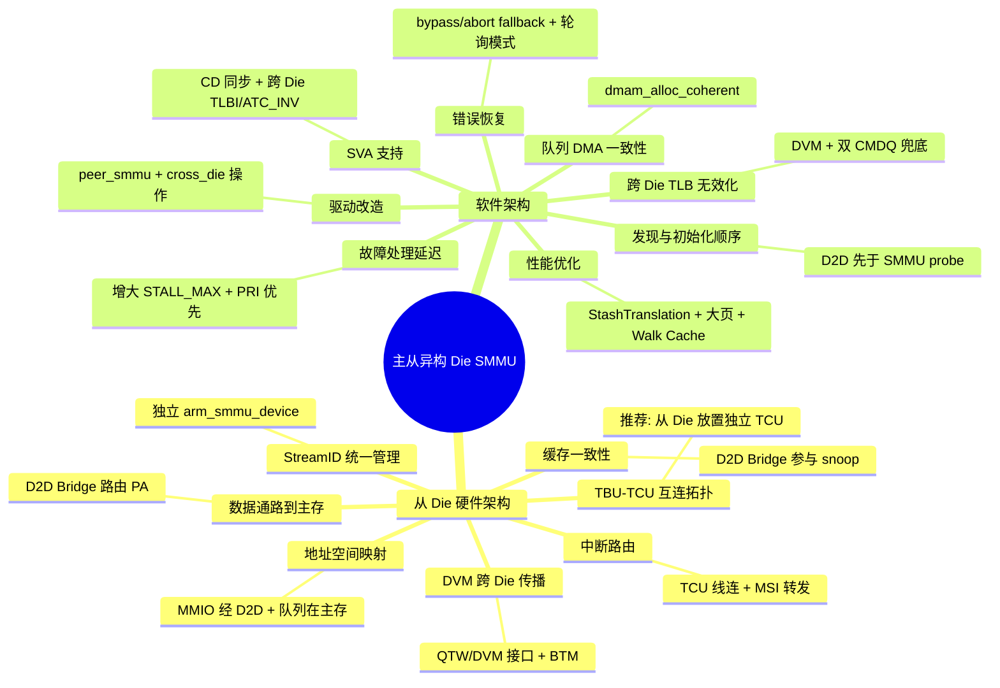

### 5.2 设计原则

| 原则 | 说明 |
|------|------|
| **最小化跨 Die 事务** | 每次跨 Die 都有高延迟代价，尽量在从 Die 本地完成 |
| **本地缓存最大化** | 增大从 Die TBU/TCU 的缓存容量，减少对主存和主 Die 的访问 |
| **一致性优先** | SMMUv3 的硬件缓存一致性是 SVA 等特性的前提，不可妥协 |
| **优雅降级** | D2D 故障时从 Die 设备应安全降级而非导致系统崩溃 |
| **驱动透明化** | 对设备驱动和 IOMMU 上层尽量透明，跨 Die 复杂性封装在 SMMU 驱动层 |
| **异步处理** | 利用 SMMUv3 的队列化架构，软件与硬件异步交互，容忍高延迟 |
